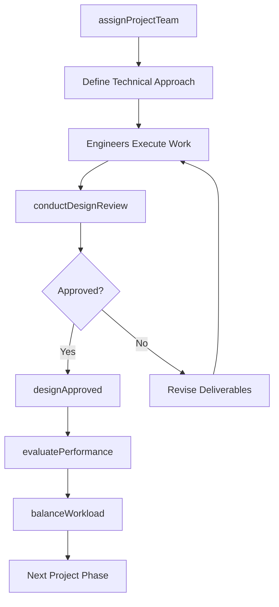
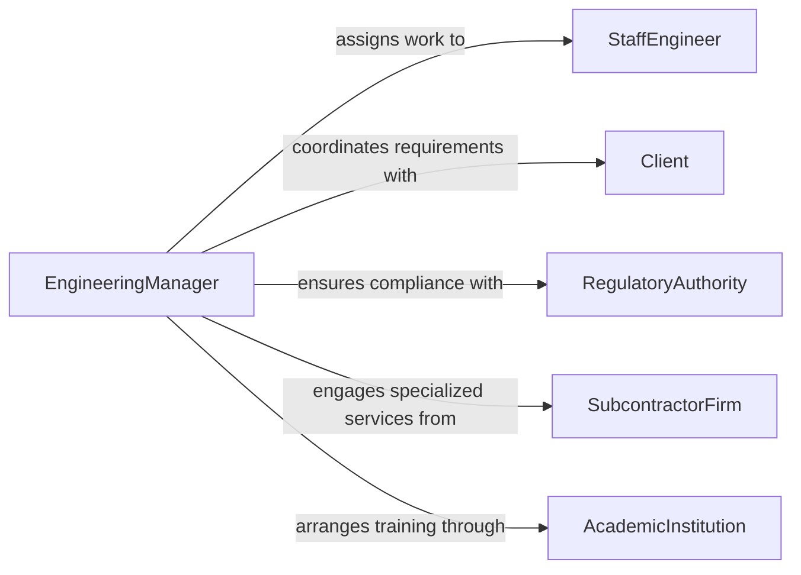

# Supervise Engineering Technical Personnel

> Business-as-Code definition for supervising engineering and technical personnel. Models the oversight of engineers, drafters, and technical specialists including project assignment, design review, technical mentorship, and professional development tracking.

## Overview

Supervising engineering and technical personnel involves directing engineers, designers, drafters, and technical specialists working on product development, infrastructure projects, and systems design. This definition covers project staffing, technical review processes, workload balancing, skills development, and standards compliance to ensure engineering deliverables meet quality, schedule, and budget requirements.

## Actors

| Actor | Description |
|-------|-------------|
| Client | External customer or internal stakeholder requesting engineering work |
| RegulatoryAuthority | Government or standards body enforcing engineering codes |
| SubcontractorFirm | External engineering firm providing specialized technical services |
| EquipmentSupplier | Vendor providing tools, instruments, or test equipment |
| ProfessionalBoard | Licensing body for professional engineers and technical certifications |
| AcademicInstitution | University or training provider for continuing education programs |

## Roles

| Role | Description |
|------|-------------|
| EngineeringManager | Oversees engineering teams and manages technical project portfolios |
| LeadEngineer | Senior engineer guiding technical direction on complex projects |
| StaffEngineer | Engineer executing design, analysis, and testing tasks |
| TechnicalDrafter | Prepares drawings, models, and documentation from engineering specifications |

## Entities

| Entity | Description |
|--------|-------------|
| ProjectAssignment | Allocation of engineering personnel to a specific project or task |
| DesignReview | Formal evaluation of engineering deliverables against requirements |
| TechnicalSpecification | Documented requirements and standards for an engineering deliverable |
| SkillMatrix | Mapping of team member competencies across technical disciplines |
| PerformanceReview | Periodic assessment of an engineer's technical output and growth |
| ChangeOrder | A formal modification to project scope or technical requirements |

## Actions

| Action | Description |
|--------|-------------|
| assignProjectTeam | Allocate engineers and technicians to a project based on skills |
| conductDesignReview | Organize and lead a formal review of engineering deliverables |
| balanceWorkload | Redistribute tasks across the team to optimize capacity |
| mentorEngineer | Provide technical guidance and career development to a team member |
| approveDesignChange | Authorize modifications to engineering specifications or drawings |
| evaluatePerformance | Conduct periodic performance assessment for technical staff |
| escalateTechnicalIssue | Raise a complex technical problem to senior leadership |

## Events

| Event | Description |
|-------|-------------|
| projectTeamAssigned | Engineers have been allocated to a new project |
| designReviewCompleted | A formal design review has concluded with documented findings |
| designApproved | Engineering deliverables have passed review and been approved |
| designRejected | Engineering deliverables require revision based on review findings |
| workloadRebalanced | Team assignments have been redistributed |
| performanceReviewCompleted | An engineer's performance assessment has been finalized |
| technicalIssueEscalated | A complex problem has been escalated beyond the team |

## Searches

| Search | Description |
|--------|-------------|
| findAvailableEngineers | List engineers with capacity and matching skill sets |
| getProjectAssignments | Retrieve current project allocations for team members |
| findPendingReviews | Identify design reviews awaiting completion or approval |
| getSkillGaps | Analyze team competency gaps against project requirements |

## Workflow



## Actor Relationships



## Usage

### Calling Actions

```typescript
import { superviseEngineeringTechnicalPersonnel } from '@headlessly/supervise-engineering-technical-personnel'

const engineering = superviseEngineeringTechnicalPersonnel()

// Assign a project team for a new bridge design
const team = await engineering.assignProjectTeam({
  projectId: 'PRJ-2026-0089',
  projectName: 'Highway Overpass Redesign',
  requiredSkills: ['structural-analysis', 'seismic-design', 'CAD'],
  members: [
    { engineerId: 'ENG-042', role: 'lead' },
    { engineerId: 'ENG-058', role: 'structural' },
    { engineerId: 'DFT-017', role: 'drafter' }
  ]
})

// Conduct a design review
const review = await engineering.conductDesignReview({
  projectId: 'PRJ-2026-0089',
  phase: 'preliminary-design',
  reviewers: ['ENG-012', 'ENG-042'],
  deliverables: ['structural-calculations', 'plan-drawings']
})

// Approve a design change
await engineering.approveDesignChange({
  changeOrderId: 'CO-0034',
  projectId: 'PRJ-2026-0089',
  description: 'Revised foundation depth per geotechnical report',
  approvedBy: 'ENG-012'
})
```

### Event-Driven Automation

```typescript
// Notify team when design review findings require action
engineering.designRejected(async ({ projectId, findings }) => {
  await notify({
    to: 'project-team',
    message: `Design review for ${projectId} requires revisions: ${findings.length} items`
  })
})

// Auto-balance workload when new project is assigned
engineering.projectTeamAssigned(async ({ projectId, members }) => {
  const overloaded = await engineering.findAvailableEngineers({
    maxUtilization: 100
  })
  if (overloaded.length > 0) {
    await engineering.balanceWorkload({
      engineers: overloaded.map(e => e.id),
      strategy: 'redistribute-by-deadline'
    })
  }
})
```
