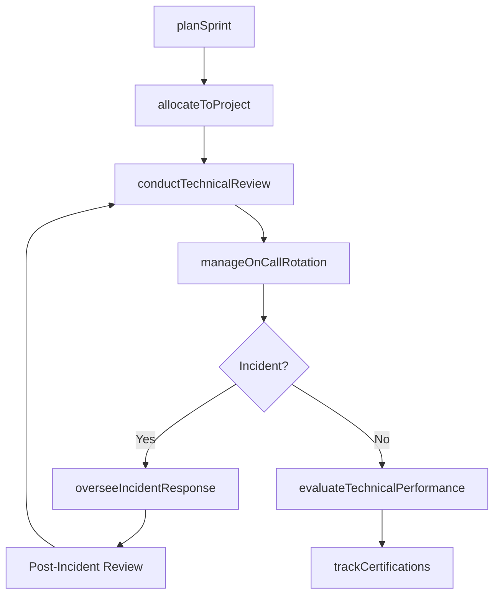
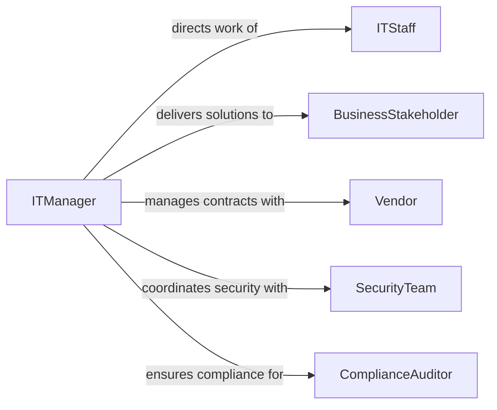

# Supervise Information Technology Personnel

> Business-as-Code definition for supervising IT staff including developers, system administrators, network engineers, and support technicians. Models sprint management, incident response oversight, and technical skill development.

## Overview

Supervising information technology personnel involves managing technical teams responsible for software development, infrastructure operations, cybersecurity, and IT support. Supervisors coordinate sprint planning, monitor system uptime and incident response, conduct code and architecture reviews, manage on-call rotations, and ensure staff maintain current certifications in rapidly evolving technology domains. This definition provides actions for IT workforce management across development and operations functions.

## Actors

| Actor | Description |
|-------|-------------|
| ITStaff | Developer, administrator, engineer, or technician performing technical work |
| BusinessStakeholder | Internal department or executive requiring IT services and solutions |
| Vendor | External provider of software licenses, hardware, or managed services |
| SecurityTeam | Specialized group responsible for cybersecurity policies and incident response |
| EndUser | Employee or customer who consumes IT services and reports issues |
| ComplianceAuditor | External or internal party verifying IT governance and regulatory adherence |

## Roles

| Role | Description |
|------|-------------|
| ITManager | Oversees IT staff, project delivery, and operational performance |
| TechLead | Provides technical direction and mentorship within a development team |
| IncidentCommander | Coordinates response activities during system outages or security events |
| CapacityPlanner | Forecasts resource needs and manages staffing for IT projects |

## Entities

| Entity | Description |
|--------|-------------|
| Sprint | A time-boxed development iteration with planned deliverables |
| Incident | An unplanned disruption to IT services requiring investigation and resolution |
| OnCallRotation | The schedule assigning IT staff to after-hours support responsibilities |
| TechnicalReview | An evaluation of code, architecture, or infrastructure changes |
| Certification | A professional credential in a technology domain or platform |
| ProjectAllocation | The assignment of IT staff hours to specific projects or initiatives |

## Actions

| Action | Description |
|--------|-------------|
| planSprint | Define sprint goals, assign stories, and allocate team capacity |
| conductTechnicalReview | Evaluate code, architecture, or infrastructure changes for quality |
| manageOnCallRotation | Schedule and adjust after-hours support assignments |
| overseeIncidentResponse | Coordinate team activities during system outages or security events |
| trackCertifications | Monitor staff credentials and schedule renewal or training activities |
| allocateToProject | Assign IT staff hours and roles to specific projects or initiatives |
| evaluateTechnicalPerformance | Assess individual contributions to delivery, quality, and collaboration |

## Events

| Event | Description |
|-------|-------------|
| sprintPlanned | A development iteration has been scoped and team capacity allocated |
| technicalReviewCompleted | A code or architecture evaluation has been finished |
| onCallRotationUpdated | After-hours support assignments have been modified |
| incidentEscalated | A system outage or security event has been raised to management |
| certificationExpiring | An IT staff member's credential is approaching its renewal deadline |
| projectAllocationChanged | Staff assignments to projects have been updated |
| technicalPerformanceEvaluated | An individual's technical contributions have been formally assessed |

## Searches

| Search | Description |
|--------|-------------|
| findSprintStatus | List sprint progress by team, velocity, or deliverable status |
| getIncidentHistory | Retrieve incidents by severity, team, resolution time, or date range |
| getCertificationStatus | Return certification records and expiration dates by staff member |
| getProjectAllocations | Retrieve current staff-to-project assignments and utilization rates |

## Workflow



## Actor Relationships



## Usage

### Calling Actions

```typescript
import { superviseInformationTechnologyPersonnel } from '@headlessly/supervise-information-technology-personnel'

const it = superviseInformationTechnologyPersonnel()

// Plan a sprint
const sprint = await it.planSprint({
  teamId: 'platform-engineering',
  sprintNumber: 14,
  startDate: '2026-02-10',
  endDate: '2026-02-21',
  goals: ['deploy-auth-service-v2', 'resolve-database-latency-issues'],
  capacity: { totalPoints: 42 }
})

// Allocate staff to projects
await it.allocateToProject({
  staffId: 'dev-2201',
  projectId: 'auth-service-migration',
  allocation: 0.8,
  role: 'backend-engineer',
  sprint: sprint.id
})

// Manage on-call rotation
await it.manageOnCallRotation({
  teamId: 'platform-engineering',
  week: '2026-W07',
  primary: 'dev-2201',
  secondary: 'dev-2205',
  escalation: 'tech-lead-1100'
})
```

### Event-Driven Automation

```typescript
// Alert on incident escalation
it.incidentEscalated(async ({ incidentId, severity, service, assignee }) => {
  if (severity === 'P1') {
    await notify({
      to: ['it-manager', 'incident-commander'],
      priority: 'critical',
      message: `P1 incident on ${service}: ${incidentId}`
    })
  }
})

// Auto-schedule training when certification expiring
it.certificationExpiring(async ({ staffId, certification, expirationDate }) => {
  await it.trackCertifications({
    staffId,
    action: 'schedule-renewal',
    certification,
    deadline: expirationDate
  })
})
```
