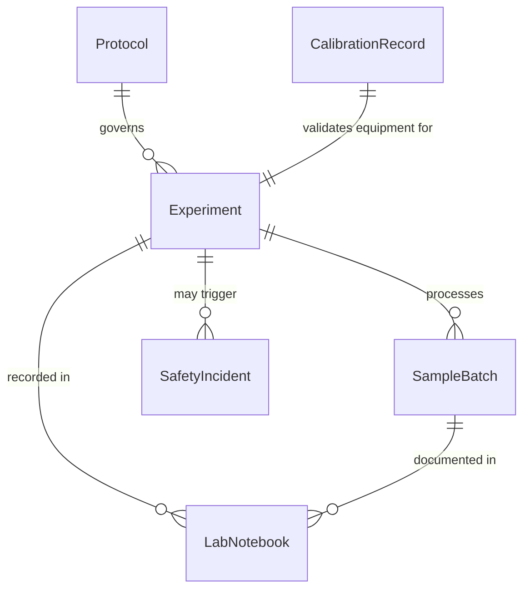
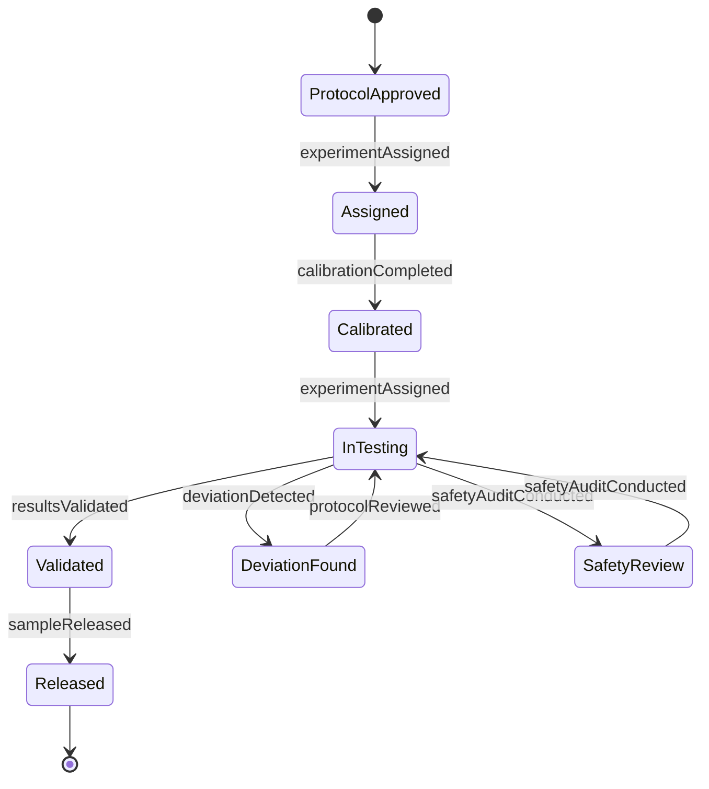
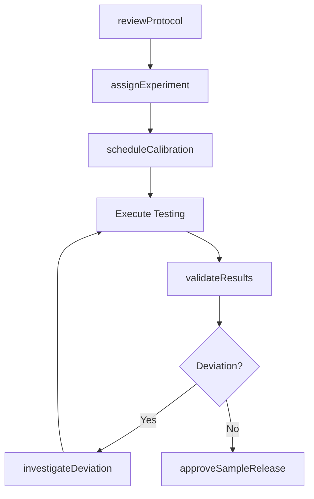
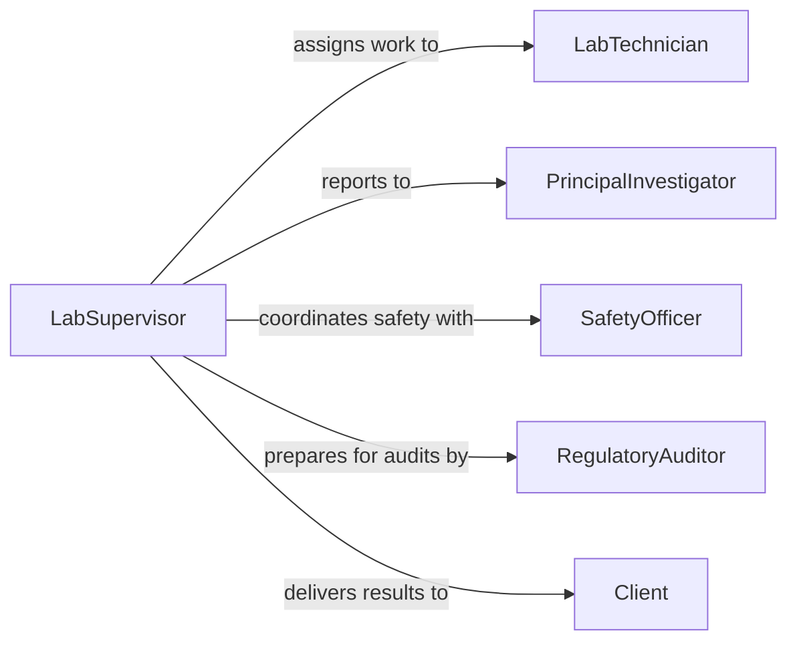

# Supervise Laboratory Work

> Business-as-Code definition for supervising laboratory operations including research experiments, quality control testing, and analytical procedures. Models protocol enforcement, equipment management, and results validation.

## Overview

Supervising laboratory work involves overseeing the daily operations of research, clinical, or industrial laboratories. Supervisors ensure that experiments and analyses follow established protocols, maintain equipment calibration schedules, validate results for accuracy and reproducibility, and enforce safety standards for hazardous materials handling. This definition provides actions for laboratory workflow management, quality control, and compliance with regulatory standards such as GLP, GMP, and ISO 17025.

## Actors

| Actor | Description |
|-------|-------------|
| LabTechnician | Performs experiments, tests, and analyses under supervision |
| PrincipalInvestigator | Defines research objectives and experimental design |
| SafetyOfficer | Enforces laboratory safety protocols and conducts inspections |
| RegulatoryAuditor | Evaluates laboratory compliance with accreditation standards |
| EquipmentSupplier | Provides instruments, reagents, and consumable materials |
| Client | External party commissioning analytical testing or research services |

## Roles

| Role | Description |
|------|-------------|
| LabSupervisor | Manages daily laboratory operations and staff assignments |
| QualityControlManager | Oversees testing accuracy, calibration, and validation procedures |
| SafetyCoordinator | Implements and monitors laboratory safety programs |
| DataReviewer | Validates experimental results and approves data for reporting |

## Entities

| Entity | Description |
|--------|-------------|
| Experiment | A structured test or investigation following a defined protocol |
| Protocol | Documented step-by-step procedure for performing a laboratory task |
| CalibrationRecord | Log of instrument validation and maintenance activities |
| SampleBatch | A group of specimens processed together for testing or analysis |
| LabNotebook | The official record of experimental procedures, observations, and results |
| SafetyIncident | Documentation of accidents, exposures, or near-miss events in the lab |

## Actions

| Action | Description |
|--------|-------------|
| assignExperiment | Delegate specific experiments or test procedures to lab staff |
| reviewProtocol | Evaluate and approve experimental protocols before execution |
| validateResults | Verify the accuracy and reproducibility of test outcomes |
| scheduleCalibration | Plan and track instrument maintenance and validation cycles |
| conductSafetyAudit | Inspect laboratory areas for compliance with safety standards |
| approveSampleRelease | Authorize the release of validated test results to clients |
| investigateDeviation | Review and document departures from established protocols |

## Events

| Event | Description |
|-------|-------------|
| experimentAssigned | A test or investigation has been delegated to lab staff |
| protocolReviewed | An experimental procedure has been evaluated and approved |
| resultsValidated | Test outcomes have been verified for accuracy |
| calibrationCompleted | An instrument has been validated and returned to service |
| safetyAuditConducted | A laboratory inspection has been completed |
| sampleReleased | Validated test results have been authorized for distribution |
| deviationDetected | A departure from an established protocol has been identified |

## Searches

| Search | Description |
|--------|-------------|
| findExperiments | List experiments by protocol, status, assigned technician, or date |
| getCalibrationSchedule | Retrieve upcoming and overdue instrument calibration records |
| getDeviations | Return protocol deviations by severity, experiment, or date range |
| getSampleStatus | Track sample batches through the testing workflow |

## Entity Relationships



## State Diagram



## Workflow



## Actor Relationships



## Usage

### Calling Actions

```typescript
import { superviseLaboratoryWork } from '@headlessly/supervise-laboratory-work'

const lab = superviseLaboratoryWork()

// Review and approve a protocol
await lab.reviewProtocol({
  protocolId: 'proto-2026-044',
  title: 'HPLC Analysis of Active Pharmaceutical Ingredients',
  version: '2.1',
  status: 'approved',
  reviewer: 'Dr. Chen'
})

// Assign experiment to lab technician
const experiment = await lab.assignExperiment({
  protocolId: 'proto-2026-044',
  technicianId: 'tech-305',
  sampleBatchId: 'batch-1182',
  scheduledDate: '2026-02-06'
})

// Validate completed results
await lab.validateResults({
  experimentId: experiment.id,
  controlsPassedQC: true,
  reproducibility: 0.98,
  status: 'validated'
})
```

### Event-Driven Automation

```typescript
// Alert on protocol deviation
lab.deviationDetected(async ({ experimentId, protocol, severity }) => {
  await notify({
    to: 'lab-supervisor',
    priority: severity === 'critical' ? 'urgent' : 'normal',
    message: `Protocol deviation in experiment ${experimentId}: ${protocol.description}`
  })
})

// Auto-notify client when results are released
lab.sampleReleased(async ({ sampleBatchId, clientId, results }) => {
  await notify({
    to: clientId,
    message: `Test results for batch ${sampleBatchId} are now available`,
    attachments: [results.reportUrl]
  })
})
```
