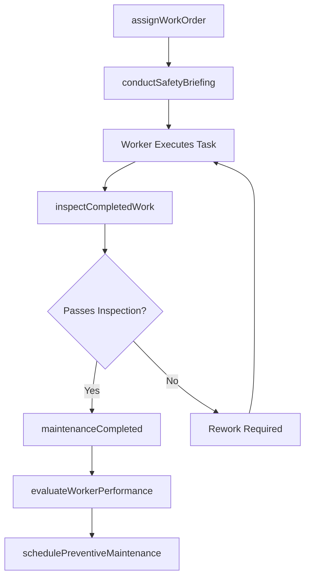
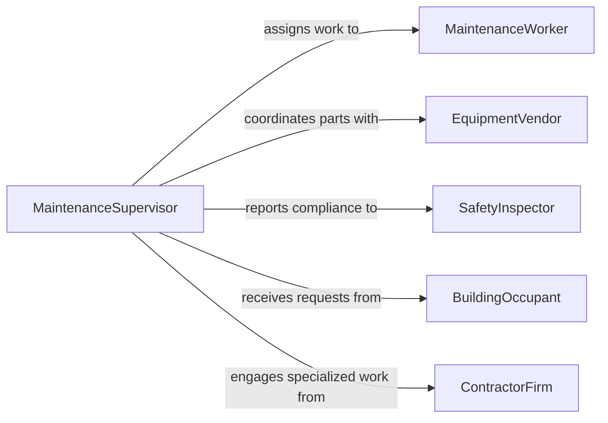

# Supervise Maintenance Workers

> Business-as-Code definition for supervising maintenance workers. Models the oversight of maintenance staff including work order assignment, performance tracking, safety compliance, and preventive maintenance scheduling.

## Overview

Supervising maintenance workers involves directing and coordinating the daily activities of technicians, custodians, and repair personnel responsible for maintaining facilities, equipment, and infrastructure. This definition covers work assignment, skill development, safety enforcement, quality inspections, and resource planning to ensure maintenance operations run efficiently and meet organizational standards.

## Actors

| Actor | Description |
|-------|-------------|
| FacilityOwner | Property or facility owner requesting maintenance services |
| EquipmentVendor | Supplier of parts, tools, and equipment for maintenance work |
| SafetyInspector | External inspector verifying workplace safety and code compliance |
| BuildingOccupant | Tenant or employee reporting maintenance issues |
| ContractorFirm | Third-party maintenance contractor providing specialized services |
| RegulatoryAgency | Government body enforcing building codes and safety regulations |

## Roles

| Role | Description |
|------|-------------|
| MaintenanceSupervisor | Oversees daily maintenance operations and worker assignments |
| LeadTechnician | Senior worker who mentors staff and handles complex repairs |
| MaintenanceWorker | Performs hands-on repair, inspection, and upkeep tasks |
| MaintenancePlanner | Schedules preventive maintenance and coordinates resources |

## Entities

| Entity | Description |
|--------|-------------|
| WorkOrder | A documented request for maintenance or repair work |
| MaintenanceSchedule | A calendar of planned preventive maintenance activities |
| CrewAssignment | Allocation of workers to specific tasks or shifts |
| InspectionReport | Documentation of completed quality or safety inspections |
| EquipmentLog | Record of maintenance history for a specific asset |
| SafetyIncident | A reported safety violation or workplace injury |

## Actions

| Action | Description |
|--------|-------------|
| assignWorkOrder | Assign a work order to a specific technician or crew |
| schedulePreventiveMaintenance | Plan recurring maintenance tasks for equipment and facilities |
| conductSafetyBriefing | Hold a safety meeting before beginning hazardous work |
| inspectCompletedWork | Review finished maintenance work for quality standards |
| evaluateWorkerPerformance | Assess a maintenance worker's productivity and skill level |
| approveOvertime | Authorize overtime hours for urgent maintenance tasks |
| orderParts | Request replacement parts or supplies from vendors |

## Events

| Event | Description |
|-------|-------------|
| workOrderAssigned | A work order has been assigned to a worker or crew |
| maintenanceCompleted | A maintenance task has been finished and logged |
| safetyViolationReported | A safety violation has been observed and documented |
| inspectionPassed | Completed work has passed quality inspection |
| inspectionFailed | Completed work did not meet quality standards |
| overtimeApproved | Overtime authorization has been granted |
| equipmentDowntimeExceeded | Equipment has been out of service beyond acceptable limits |

## Searches

| Search | Description |
|--------|-------------|
| findOpenWorkOrders | List pending work orders by priority, location, or trade |
| getWorkerAvailability | Retrieve current availability and skill sets of maintenance staff |
| getEquipmentHistory | Look up maintenance history for a specific asset |
| findOverdueInspections | Identify preventive maintenance inspections past their due date |

## Workflow



## Actor Relationships



## Usage

### Calling Actions

```typescript
import { superviseMaintenanceWorkers } from '@headlessly/supervise-maintenance-workers'

const maintenance = superviseMaintenanceWorkers()

// Assign a work order to a technician
const assignment = await maintenance.assignWorkOrder({
  workOrderId: 'WO-2026-0412',
  technicianId: 'TECH-087',
  priority: 'high',
  location: 'Building A - HVAC Unit 3',
  estimatedHours: 4
})

// Schedule preventive maintenance
await maintenance.schedulePreventiveMaintenance({
  equipmentId: 'EQ-1120',
  frequency: 'monthly',
  nextDueDate: '2026-03-01',
  assignedCrew: ['TECH-087', 'TECH-092']
})

// Inspect completed work
const inspection = await maintenance.inspectCompletedWork({
  workOrderId: 'WO-2026-0412',
  inspectorId: 'LEAD-005',
  checklistItems: ['functionality', 'cleanliness', 'safety']
})
```

### Event-Driven Automation

```typescript
// Notify supervisor when safety violations occur
maintenance.safetyViolationReported(async ({ workerId, location, description }) => {
  await notify({
    to: 'maintenance-supervisor',
    message: `Safety violation reported at ${location}: ${description}`
  })
  await maintenance.conductSafetyBriefing({
    location,
    attendees: [workerId],
    topic: description
  })
})

// Escalate when equipment downtime exceeds threshold
maintenance.equipmentDowntimeExceeded(async ({ equipmentId, hoursDown }) => {
  if (hoursDown > 24) {
    await escalate({
      to: 'facilities-director',
      message: `Equipment ${equipmentId} has been down for ${hoursDown} hours`
    })
  }
})
```
