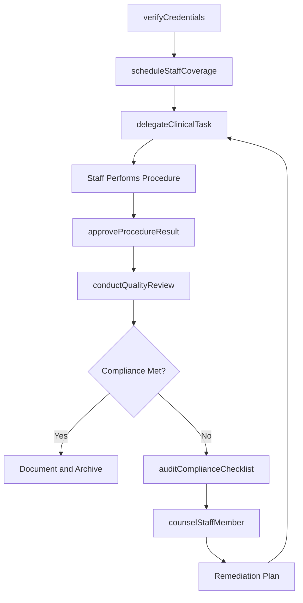
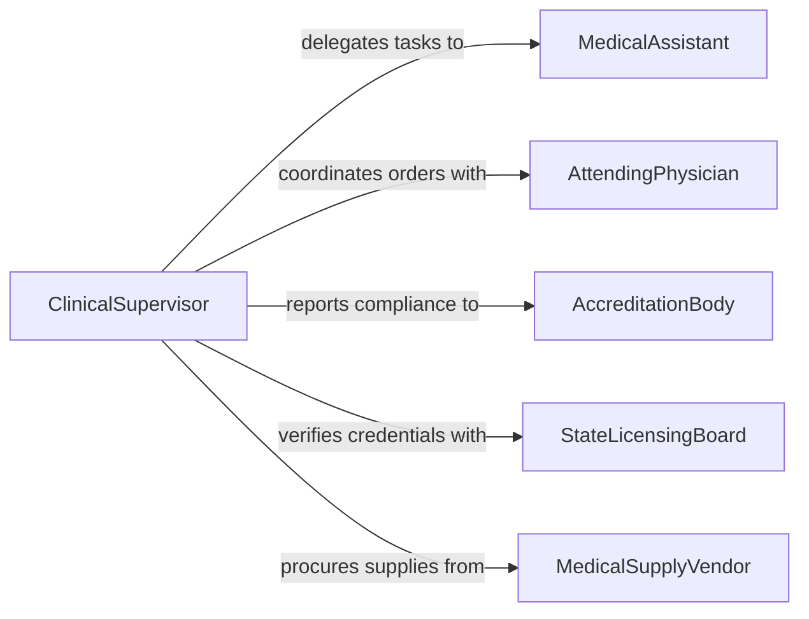

# Supervise Medical Support Personnel

> Business-as-Code definition for supervising medical support personnel. Models the oversight of medical assistants, lab technicians, pharmacy techs, and imaging staff including credentialing, task delegation, compliance monitoring, and workflow coordination.

## Overview

Supervising medical support personnel involves directing medical assistants, clinical laboratory technicians, pharmacy technicians, radiology technicians, and other allied health staff who perform diagnostic, therapeutic, and administrative support functions. This definition covers credentialing oversight, task delegation within scope of practice, quality assurance, compliance with clinical standards, and staffing coordination to ensure reliable and safe support services across healthcare operations.

## Actors

| Actor | Description |
|-------|-------------|
| Patient | Individual receiving diagnostic or therapeutic support services |
| AttendingPhysician | Doctor ordering tests, procedures, or treatments |
| AccreditationBody | Organization such as CAP or JCAHO verifying laboratory and clinical standards |
| MedicalSupplyVendor | Supplier of medical devices, reagents, and consumables |
| InsurancePayer | Health plan requiring documentation for reimbursement |
| StateLicensingBoard | Government authority issuing and monitoring medical support credentials |

## Roles

| Role | Description |
|------|-------------|
| ClinicalSupervisor | Oversees daily operations of medical support staff |
| LeadTechnologist | Senior technician mentoring staff and managing complex procedures |
| MedicalAssistant | Performs clinical intake, vital signs, and basic patient prep |
| LabTechnician | Conducts laboratory tests and processes specimens |

## Entities

| Entity | Description |
|--------|-------------|
| Credential | A license, certification, or registration held by a support staff member |
| TaskDelegation | Formal assignment of a clinical task within scope of practice |
| QualityMetric | A measurable indicator of support service performance |
| ComplianceChecklist | A documented set of regulatory requirements for periodic verification |
| StaffSchedule | Work assignments and coverage plans for medical support roles |
| ProcedureLog | Record of procedures performed by support staff with outcomes |

## Actions

| Action | Description |
|--------|-------------|
| delegateClinicalTask | Assign a specific clinical support task to a qualified staff member |
| verifyCredentials | Confirm that staff credentials are current and valid |
| conductQualityReview | Evaluate support service quality against established metrics |
| scheduleStaffCoverage | Build and adjust staffing schedules for support functions |
| counselStaffMember | Address performance, conduct, or development needs |
| auditComplianceChecklist | Verify adherence to regulatory and accreditation requirements |
| approveProcedureResult | Review and sign off on a completed support procedure |

## Events

| Event | Description |
|-------|-------------|
| taskDelegated | A clinical task has been assigned to a support staff member |
| credentialExpiring | A staff member's credential is approaching its expiration date |
| qualityReviewCompleted | A quality assessment of support services has been finalized |
| complianceGapIdentified | A regulatory or accreditation requirement has not been met |
| staffSchedulePublished | A new staffing schedule has been released |
| procedureResultApproved | A completed procedure result has been reviewed and accepted |
| staffCounselingDocumented | A performance or development counseling session has been recorded |

## Searches

| Search | Description |
|--------|-------------|
| findStaffByCredential | List support personnel holding specific certifications or licenses |
| getExpiringCredentials | Retrieve credentials nearing expiration within a given window |
| getQualityMetrics | Look up quality performance data by department or staff member |
| findComplianceGaps | Identify checklist items not yet satisfied for accreditation |

## Workflow



## Actor Relationships



## Usage

### Calling Actions

```typescript
import { superviseMedicalSupportPersonnel } from '@headlessly/supervise-medical-support-personnel'

const medSupport = superviseMedicalSupportPersonnel()

// Verify staff credentials before task assignment
const credCheck = await medSupport.verifyCredentials({
  staffId: 'MA-034',
  requiredCredentials: ['CMA', 'BLS', 'phlebotomy-cert'],
  asOfDate: '2026-03-15'
})

// Delegate a clinical task
await medSupport.delegateClinicalTask({
  taskType: 'phlebotomy',
  staffId: 'MA-034',
  patientId: 'PT-8821',
  orderingPhysician: 'DR-112',
  urgency: 'routine'
})

// Conduct a quality review
const review = await medSupport.conductQualityReview({
  department: 'clinical-lab',
  period: 'Q1-2026',
  metrics: ['turnaround-time', 'specimen-rejection-rate', 'critical-value-reporting']
})
```

### Event-Driven Automation

```typescript
// Alert supervisor when credentials are about to expire
medSupport.credentialExpiring(async ({ staffId, credential, expirationDate }) => {
  await notify({
    to: 'clinical-supervisor',
    message: `${credential} for staff ${staffId} expires on ${expirationDate}`
  })
})

// Trigger compliance audit when gaps are identified
medSupport.complianceGapIdentified(async ({ department, requirement, severity }) => {
  if (severity === 'critical') {
    await medSupport.auditComplianceChecklist({
      department,
      scope: 'full',
      dueDate: '2026-04-01'
    })
    await escalate({
      to: 'compliance-officer',
      message: `Critical compliance gap in ${department}: ${requirement}`
    })
  }
})
```
