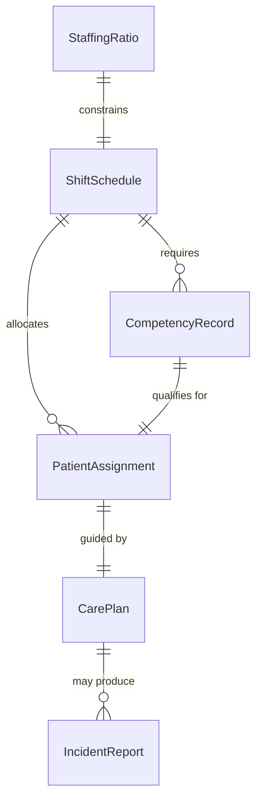
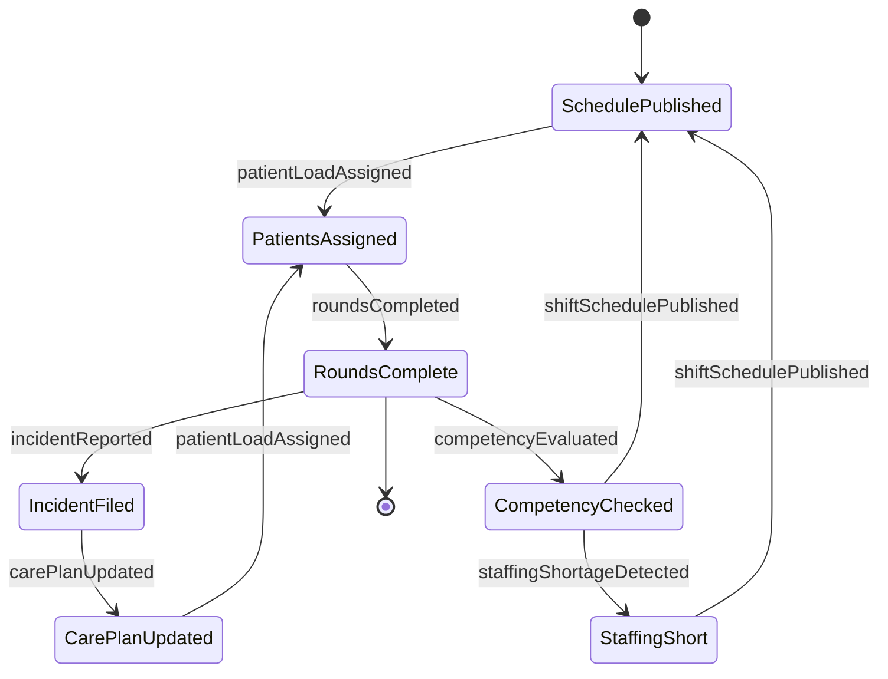
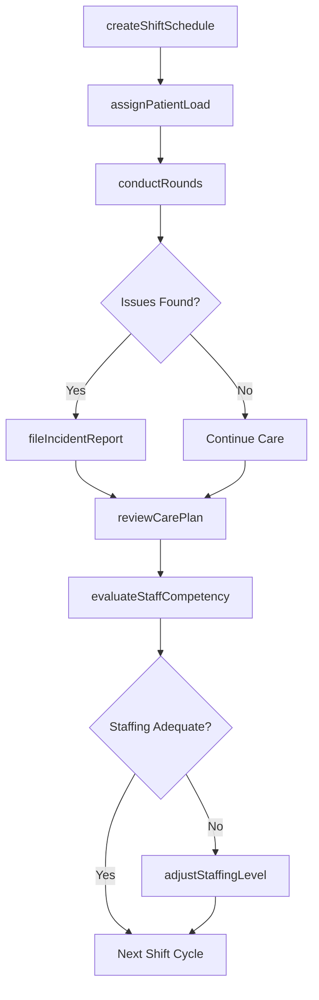
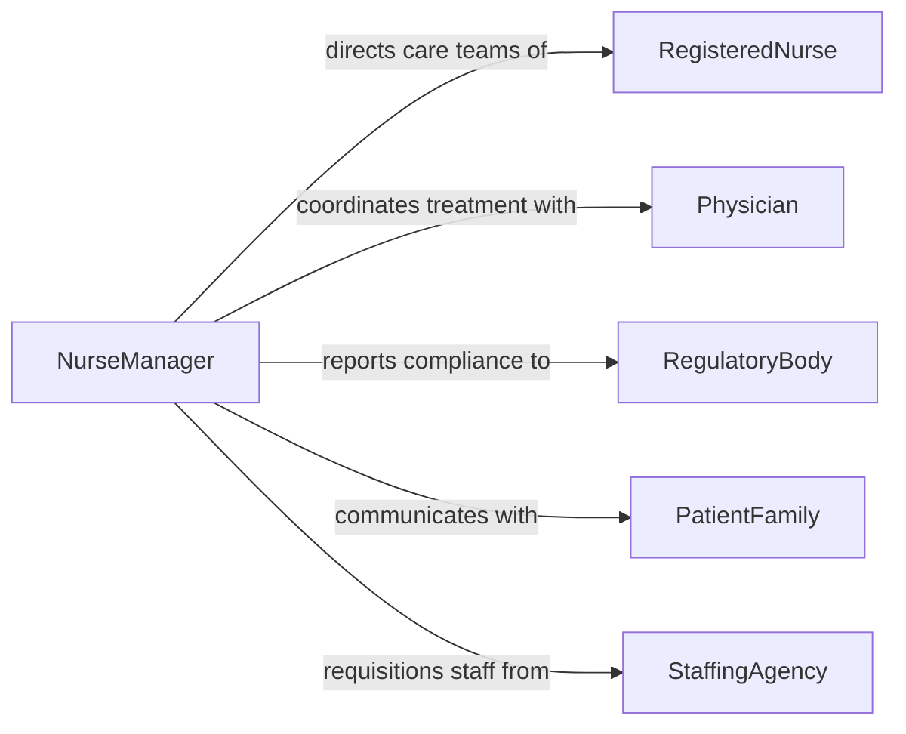

# Supervise Patient Care Personnel

> Business-as-Code definition for supervising patient care personnel. Models the oversight of nursing staff, clinical aides, and care teams including shift scheduling, care quality monitoring, and regulatory compliance.

## Overview

Supervising patient care personnel involves directing nurses, nursing assistants, therapists, and other clinical staff who deliver direct patient care. This definition covers shift scheduling, care plan oversight, competency evaluation, incident management, and compliance with healthcare regulations to ensure safe, effective, and compassionate patient care delivery.

## Actors

| Actor | Description |
|-------|-------------|
| Patient | Individual receiving care from supervised personnel |
| PatientFamily | Family members involved in care decisions and feedback |
| Physician | Attending doctor who prescribes treatment plans |
| RegulatoryBody | Healthcare accreditation and licensing agency |
| InsuranceProvider | Payer requiring documentation of care services rendered |
| StaffingAgency | External agency supplying temporary or contract clinical staff |

## Roles

| Role | Description |
|------|-------------|
| NurseManager | Supervises nursing staff and oversees unit operations |
| ChargeNurse | Leads shift operations and coordinates patient assignments |
| RegisteredNurse | Licensed nurse providing direct patient care |
| ClinicalAide | Support staff assisting with basic patient care tasks |

## Entities

| Entity | Description |
|--------|-------------|
| ShiftSchedule | Staff assignments across shifts for a care unit |
| PatientAssignment | Allocation of patients to specific care personnel |
| CarePlan | Documented plan of treatment and nursing interventions |
| CompetencyRecord | Record of a staff member's clinical skills and certifications |
| IncidentReport | Documentation of adverse events or near-misses in patient care |
| StaffingRatio | Nurse-to-patient ratio for a unit or shift |

## Actions

| Action | Description |
|--------|-------------|
| assignPatientLoad | Distribute patients among nursing staff for a shift |
| createShiftSchedule | Build staffing schedules based on census and acuity |
| conductRounds | Perform supervisory rounds to assess care delivery |
| reviewCarePlan | Evaluate and update patient care plans with clinical team |
| evaluateStaffCompetency | Assess clinical skills and identify training needs |
| fileIncidentReport | Document and investigate a patient safety incident |
| adjustStaffingLevel | Modify staffing ratios in response to census changes |

## Events

| Event | Description |
|-------|-------------|
| shiftSchedulePublished | A new shift schedule has been finalized and distributed |
| patientLoadAssigned | Patient assignments have been allocated for a shift |
| roundsCompleted | Supervisory rounds have been completed and documented |
| incidentReported | A patient safety incident has been filed |
| competencyEvaluated | A staff member's clinical competency has been assessed |
| staffingShortageDetected | Current staffing falls below required nurse-to-patient ratios |
| carePlanUpdated | A patient care plan has been revised |

## Searches

| Search | Description |
|--------|-------------|
| findStaffByShift | List personnel assigned to a specific shift and unit |
| getPatientAssignments | Retrieve current patient-to-nurse assignments |
| findExpiringCertifications | Identify staff with certifications nearing expiration |
| getIncidentHistory | Look up incident reports by unit, type, or date range |

## Entity Relationships



## State Diagram



## Workflow



## Actor Relationships



## Usage

### Calling Actions

```typescript
import { supervisePatientCarePersonnel } from '@headlessly/supervise-patient-care-personnel'

const patientCare = supervisePatientCarePersonnel()

// Create a shift schedule for the medical-surgical unit
const schedule = await patientCare.createShiftSchedule({
  unit: 'Med-Surg 3A',
  shiftDate: '2026-03-15',
  shifts: [
    { type: 'day', staff: ['RN-112', 'RN-118', 'CNA-045'] },
    { type: 'evening', staff: ['RN-103', 'RN-125', 'CNA-052'] },
    { type: 'night', staff: ['RN-109', 'CNA-061'] }
  ]
})

// Assign patient loads based on acuity
await patientCare.assignPatientLoad({
  shift: 'day',
  unit: 'Med-Surg 3A',
  assignments: [
    { nurseId: 'RN-112', patientIds: ['PT-4401', 'PT-4402', 'PT-4403'] },
    { nurseId: 'RN-118', patientIds: ['PT-4404', 'PT-4405', 'PT-4406'] }
  ]
})

// Conduct supervisory rounds
const rounds = await patientCare.conductRounds({
  unit: 'Med-Surg 3A',
  supervisorId: 'NM-008',
  checkpoints: ['medication-administration', 'fall-precautions', 'hand-hygiene']
})
```

### Event-Driven Automation

```typescript
// Alert when staffing falls below required ratios
patientCare.staffingShortageDetected(async ({ unit, currentRatio, requiredRatio }) => {
  await notify({
    to: 'nurse-manager',
    message: `Staffing shortage on ${unit}: ratio ${currentRatio} below required ${requiredRatio}`
  })
  await patientCare.adjustStaffingLevel({
    unit,
    requestType: 'float-pool',
    urgency: 'immediate'
  })
})

// Trigger review when incident is reported
patientCare.incidentReported(async ({ incidentId, unit, severity }) => {
  if (severity === 'critical') {
    await escalate({
      to: 'chief-nursing-officer',
      message: `Critical incident ${incidentId} reported on ${unit}`
    })
  }
})
```
