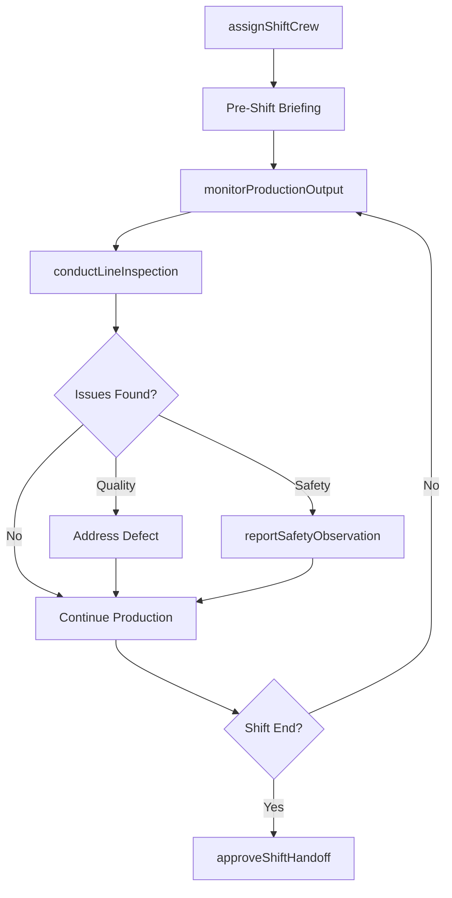
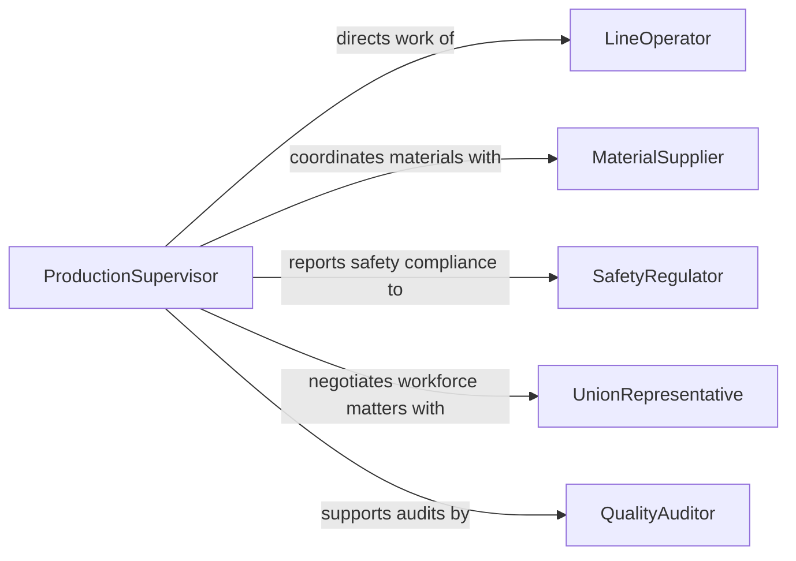

# Supervise Production Support Personnel

> Business-as-Code definition for supervising production and support personnel. Models the oversight of manufacturing operators, assemblers, and support staff including shift management, output tracking, safety enforcement, and continuous improvement.

## Overview

Supervising production and support personnel involves directing workers on manufacturing floors, assembly lines, warehouses, and related support functions. This definition covers shift scheduling, production target monitoring, quality adherence, safety compliance, cross-training, and performance management to maintain efficient throughput while meeting product quality and workplace safety standards.

## Actors

| Actor | Description |
|-------|-------------|
| CustomerAccount | Client organization placing production orders |
| MaterialSupplier | Vendor providing raw materials and components |
| SafetyRegulator | OSHA or equivalent body enforcing workplace safety standards |
| UnionRepresentative | Labor union delegate involved in workforce matters |
| QualityAuditor | External auditor assessing production quality systems |
| EquipmentManufacturer | OEM providing production machinery and technical support |

## Roles

| Role | Description |
|------|-------------|
| ProductionSupervisor | Oversees daily manufacturing operations and line personnel |
| ShiftLead | Coordinates activities during a specific production shift |
| LineOperator | Operates machinery and performs assembly tasks on the production floor |
| MaterialHandler | Manages movement and staging of materials for production |

## Entities

| Entity | Description |
|--------|-------------|
| ProductionOrder | A scheduled run of products to be manufactured |
| ShiftReport | Summary of output, downtime, and incidents for a shift |
| QualityCheckpoint | An inspection point in the production process |
| TrainingRecord | Documentation of a worker's completed training and certifications |
| SafetyObservation | A documented behavioral safety observation on the floor |
| DowntimeLog | Record of production stoppages and their root causes |

## Actions

| Action | Description |
|--------|-------------|
| assignShiftCrew | Allocate workers to stations and tasks for a production shift |
| monitorProductionOutput | Track actual output against planned targets in real time |
| conductLineInspection | Walk the production floor to verify quality and safety |
| addressPerformanceIssue | Counsel a worker on productivity or behavioral concerns |
| approveShiftHandoff | Confirm handoff of production status between outgoing and incoming shifts |
| initiateTraining | Enroll a worker in cross-training or skill development |
| reportSafetyObservation | Document a positive or at-risk safety behavior on the floor |

## Events

| Event | Description |
|-------|-------------|
| shiftCrewAssigned | Workers have been assigned to their stations for the shift |
| productionTargetMet | Shift output has reached the planned production goal |
| productionTargetMissed | Shift output has fallen short of the planned target |
| qualityDefectDetected | A quality issue has been identified during inspection |
| safetyObservationRecorded | A safety observation has been logged |
| shiftHandoffCompleted | Production status has been formally transferred between shifts |
| downtimeExceeded | Unplanned downtime has surpassed acceptable thresholds |

## Searches

| Search | Description |
|--------|-------------|
| findShiftPersonnel | List workers assigned to a specific shift and production line |
| getProductionMetrics | Retrieve output, scrap, and efficiency data by line or shift |
| findTrainingGaps | Identify workers lacking required certifications or cross-training |
| getDowntimeHistory | Look up downtime events by line, cause, or date range |

## Workflow



## Actor Relationships



## Usage

### Calling Actions

```typescript
import { superviseProductionSupportPersonnel } from '@headlessly/supervise-production-support-personnel'

const production = superviseProductionSupportPersonnel()

// Assign crew for the morning shift
const crew = await production.assignShiftCrew({
  line: 'Assembly Line 4',
  shift: 'morning',
  date: '2026-03-15',
  assignments: [
    { workerId: 'OP-210', station: 'weld-cell-1' },
    { workerId: 'OP-215', station: 'weld-cell-2' },
    { workerId: 'MH-044', station: 'material-staging' }
  ]
})

// Monitor production output
const metrics = await production.monitorProductionOutput({
  line: 'Assembly Line 4',
  shift: 'morning',
  targetUnits: 450,
  interval: 'hourly'
})

// Report a safety observation
await production.reportSafetyObservation({
  observerId: 'PS-008',
  workerId: 'OP-210',
  type: 'positive',
  description: 'Proper lockout-tagout procedure followed during tool change'
})
```

### Event-Driven Automation

```typescript
// Alert when production falls behind target
production.productionTargetMissed(async ({ line, shift, actualUnits, targetUnits }) => {
  await notify({
    to: 'production-manager',
    message: `${line} ${shift} shift produced ${actualUnits}/${targetUnits} units`
  })
})

// Trigger training when gaps are identified
production.qualityDefectDetected(async ({ line, defectType, workerId }) => {
  const gaps = await production.findTrainingGaps({ workerIds: [workerId] })
  if (gaps.length > 0) {
    await production.initiateTraining({
      workerId,
      modules: gaps.map(g => g.trainingModule)
    })
  }
})
```
