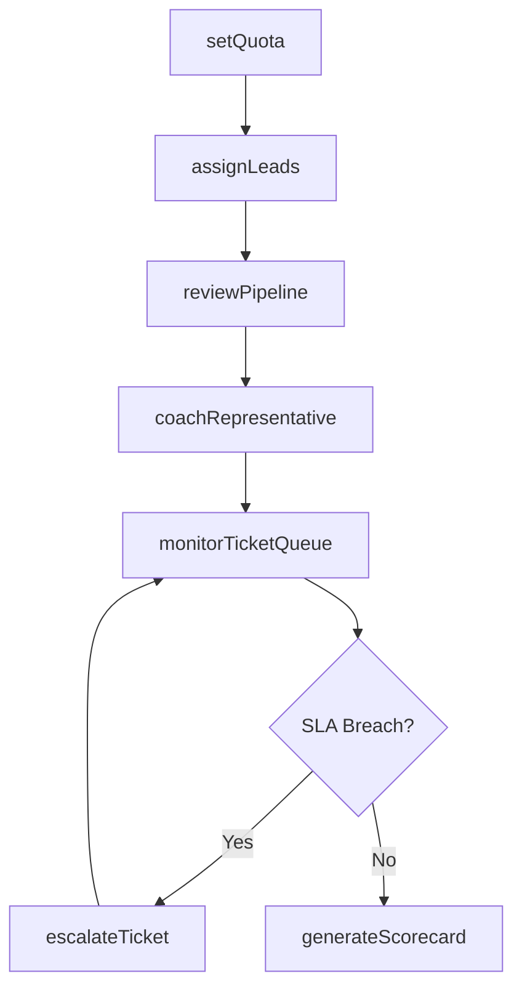
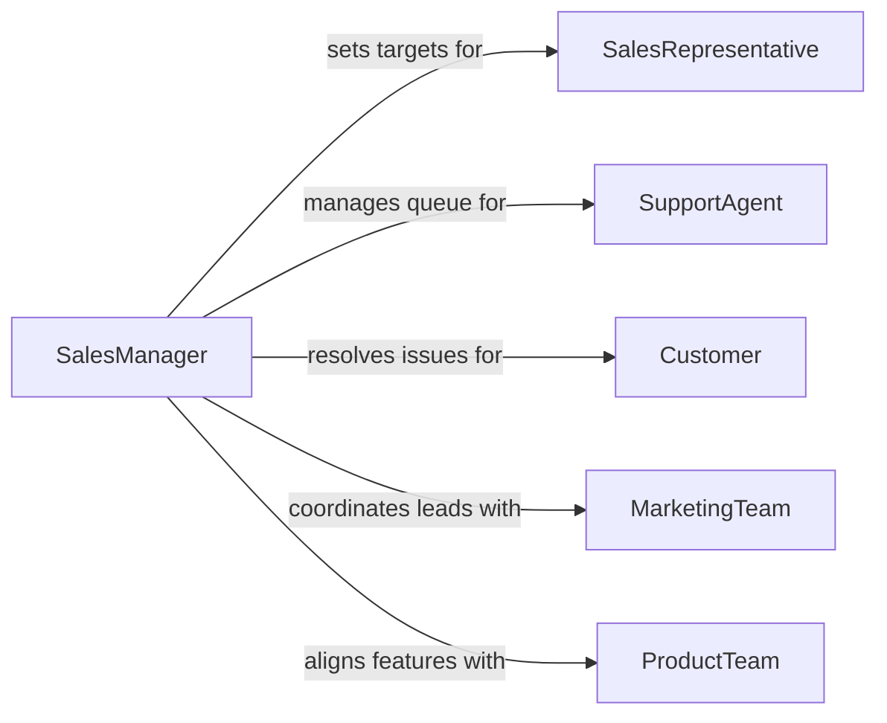

# Supervise Sales Support Personnel

> Business-as-Code definition for supervising sales representatives and customer support staff. Models quota management, pipeline oversight, support ticket escalation, and team performance tracking.

## Overview

Supervising sales and support personnel involves managing teams responsible for revenue generation and customer retention. Sales supervisors set quotas, monitor pipeline activity, coach representatives on closing techniques, and coordinate with marketing on lead quality. Support supervisors manage ticket queues, ensure service level agreements are met, and handle escalated customer issues. This definition provides actions for both sales and support oversight within a unified supervisory framework.

## Actors

| Actor | Description |
|-------|-------------|
| SalesRepresentative | Front-line staff responsible for prospecting, pitching, and closing deals |
| SupportAgent | Customer-facing staff handling inquiries, issues, and service requests |
| Customer | Buyer or subscriber whose experience drives revenue and retention |
| MarketingTeam | Generates leads and campaigns that feed the sales pipeline |
| ProductTeam | Provides technical product knowledge and handles feature requests |

## Roles

| Role | Description |
|------|-------------|
| SalesManager | Oversees sales team performance, quota attainment, and pipeline health |
| SupportSupervisor | Manages support queue operations and service level compliance |
| EnablementCoach | Provides training on sales techniques, product knowledge, and tools |
| RevenueAnalyst | Tracks sales metrics, forecasts, and compensation calculations |

## Entities

| Entity | Description |
|--------|-------------|
| SalesQuota | A revenue or unit target assigned to a representative for a period |
| Pipeline | The collection of active deals at various stages of the sales cycle |
| SupportTicket | A customer inquiry or issue requiring resolution |
| ServiceLevelAgreement | Contractual commitments for response and resolution times |
| PerformanceScorecard | A consolidated view of individual metrics against targets |
| LeadAssignment | The allocation of marketing-qualified leads to sales representatives |

## Actions

| Action | Description |
|--------|-------------|
| setQuota | Define revenue or activity targets for sales representatives |
| reviewPipeline | Analyze deal progress, stage conversion, and forecast accuracy |
| assignLeads | Distribute marketing-qualified leads to sales representatives |
| monitorTicketQueue | Track support ticket volume, response times, and resolution rates |
| escalateTicket | Elevate a customer issue to a higher support tier or management |
| coachRepresentative | Deliver targeted feedback on sales techniques or customer handling |
| generateScorecard | Compile individual and team performance metrics for a period |

## Events

| Event | Description |
|-------|-------------|
| quotaSet | Revenue or activity targets have been assigned to a representative |
| pipelineReviewed | A sales pipeline analysis has been completed |
| leadsAssigned | Marketing-qualified leads have been distributed to representatives |
| ticketEscalated | A customer issue has been elevated to a higher support tier |
| slaBreached | A support ticket has exceeded its service level agreement threshold |
| representativeCoached | A feedback session with a sales or support team member has been completed |
| scorecardGenerated | Individual or team performance metrics have been compiled |

## Searches

| Search | Description |
|--------|-------------|
| findPipelineDeals | List active deals by representative, stage, value, or close date |
| getTicketMetrics | Retrieve support ticket statistics by agent, queue, or SLA status |
| getQuotaAttainment | Return sales performance against quota by representative or team |
| getLeadConversion | Track lead-to-deal conversion rates by source or representative |

## Workflow



## Actor Relationships



## Usage

### Calling Actions

```typescript
import { superviseSalesSupportPersonnel } from '@headlessly/supervise-sales-support-personnel'

const sales = superviseSalesSupportPersonnel()

// Set quarterly quotas
await sales.setQuota({
  representativeId: 'rep-112',
  period: 'Q1-2026',
  target: { revenue: 250000, meetings: 40, closedDeals: 8 }
})

// Review team pipeline
const pipeline = await sales.reviewPipeline({
  teamId: 'enterprise-sales',
  stages: ['discovery', 'proposal', 'negotiation', 'closed-won'],
  period: 'Q1-2026'
})

// Monitor support ticket queue
const queue = await sales.monitorTicketQueue({
  queue: 'tier-1-support',
  slaThreshold: { responseMinutes: 30, resolutionHours: 4 }
})
```

### Event-Driven Automation

```typescript
// Alert on SLA breach
sales.slaBreached(async ({ ticketId, agent, metric, threshold }) => {
  await notify({
    to: 'support-supervisor',
    priority: 'high',
    message: `SLA breach on ticket ${ticketId}: ${metric} exceeded ${threshold}`
  })
  await sales.escalateTicket({ ticketId, reason: 'sla-breach' })
})

// Auto-generate weekly scorecards
sales.scorecardGenerated(async ({ teamId, period, results }) => {
  const underperformers = results.filter(r => r.attainment < 0.7)
  for (const rep of underperformers) {
    await sales.coachRepresentative({
      representativeId: rep.id,
      focus: 'quota-attainment',
      scheduledDate: nextBusinessDay()
    })
  }
})
```
