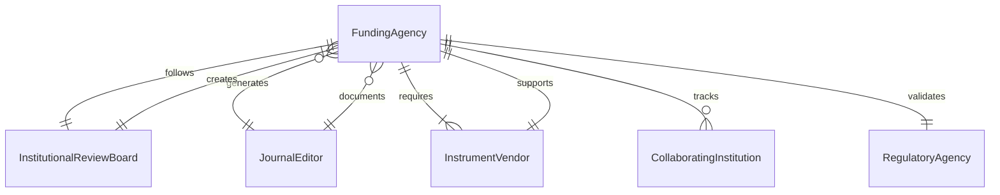
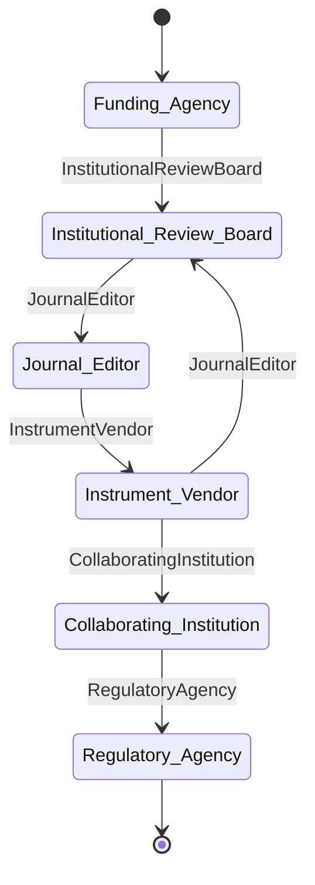
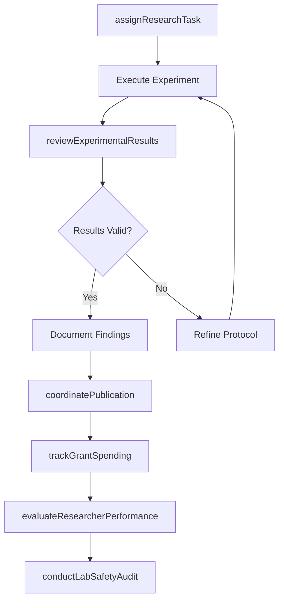
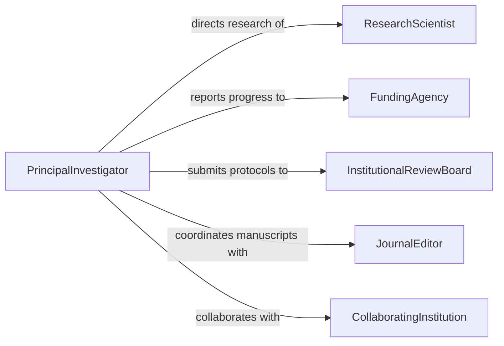

# Supervise Scientific Technical Personnel

> Business-as-Code definition for supervising scientific and technical personnel. Models the oversight of researchers, lab technicians, and scientific staff including research project management, lab safety, protocol compliance, and publication coordination.

## Overview

Supervising scientific and technical personnel involves directing researchers, laboratory technicians, data analysts, and field scientists who conduct experiments, analyze data, and produce research findings. This definition covers research project assignment, laboratory safety enforcement, protocol adherence, equipment management, grant compliance, and scientific output tracking to ensure rigorous, reproducible, and timely research outcomes.

## Actors

| Actor | Description |
|-------|-------------|
| FundingAgency | Government or private body providing research grants |
| InstitutionalReviewBoard | Ethics committee overseeing research involving human subjects |
| JournalEditor | Publication editor managing peer review of research manuscripts |
| InstrumentVendor | Supplier of scientific instruments, reagents, and lab consumables |
| CollaboratingInstitution | Partner university or research organization on joint projects |
| RegulatoryAgency | Government body enforcing laboratory safety and environmental regulations |

## Roles

| Role | Description |
|------|-------------|
| PrincipalInvestigator | Senior scientist directing research programs and supervising personnel |
| ResearchScientist | Experienced researcher designing and conducting experiments |
| LabTechnician | Technical staff operating instruments and preparing samples |
| ResearchAssistant | Entry-level researcher supporting data collection and analysis |

## Entities

| Entity | Description |
|--------|-------------|
| ResearchProject | A funded study with defined objectives, timeline, and deliverables |
| Experiment | A specific test or trial conducted as part of a research project |
| LabProtocol | Standardized procedure for performing laboratory work |
| GrantBudget | Financial allocation from a funding source for research activities |
| Publication | Manuscript or report documenting research findings |
| LabSafetyRecord | Documentation of safety training, incidents, and inspections |

## Actions

| Action | Description |
|--------|-------------|
| assignResearchTask | Allocate specific experiments or analysis work to team members |
| reviewExperimentalResults | Evaluate data quality and validity of experimental outcomes |
| conductLabSafetyAudit | Inspect laboratory for compliance with safety protocols |
| approveProtocol | Authorize a new or revised laboratory procedure |
| trackGrantSpending | Monitor expenditures against grant budget allocations |
| coordinatePublication | Manage the manuscript preparation and submission process |
| evaluateResearcherPerformance | Assess a researcher's scientific output and professional growth |

## Events

| Event | Description |
|-------|-------------|
| researchTaskAssigned | A team member has been assigned to a specific research task |
| experimentCompleted | An experiment has been finished and data recorded |
| resultsReviewed | Experimental results have been evaluated by the supervisor |
| protocolApproved | A laboratory protocol has been authorized for use |
| safetyAuditCompleted | A lab safety inspection has been documented |
| publicationSubmitted | A research manuscript has been submitted for peer review |
| grantMilestoneReached | A deliverable milestone for a funded project has been achieved |

## Searches

| Search | Description |
|--------|-------------|
| findActiveProjects | List research projects by status, funding source, or investigator |
| getExperimentLog | Retrieve experiment records by project, date, or personnel |
| findProtocolsByStatus | Identify protocols pending review or nearing expiration |
| getGrantBudgetStatus | Check remaining funds and spending rate for active grants |

## Entity Relationships




## State Diagram



## Workflow



## Actor Relationships



## Usage

### Calling Actions

```typescript
import { superviseScientificTechnicalPersonnel } from '@headlessly/supervise-scientific-technical-personnel'

const science = superviseScientificTechnicalPersonnel()

// Assign a research task to a team member
const task = await science.assignResearchTask({
  projectId: 'GRANT-NIH-2026-0412',
  researcherId: 'RS-023',
  taskDescription: 'Conduct dose-response assay on compound XR-7',
  protocol: 'PROT-042',
  deadline: '2026-04-30'
})

// Review experimental results
const review = await science.reviewExperimentalResults({
  experimentId: 'EXP-2026-1105',
  reviewerId: 'PI-005',
  criteria: ['statistical-significance', 'reproducibility', 'data-integrity']
})

// Track grant spending
const budget = await science.trackGrantSpending({
  grantId: 'GRANT-NIH-2026-0412',
  period: 'Q1-2026',
  categories: ['personnel', 'supplies', 'equipment', 'travel']
})
```

### Event-Driven Automation

```typescript
// Notify PI when experiment results are ready for review
science.experimentCompleted(async ({ experimentId, projectId, researcher }) => {
  await notify({
    to: 'principal-investigator',
    message: `Experiment ${experimentId} on project ${projectId} completed by ${researcher}`
  })
})

// Alert when grant spending approaches budget limits
science.grantMilestoneReached(async ({ grantId, milestone, remainingBudget }) => {
  if (remainingBudget.percentage < 20) {
    await notify({
      to: 'grants-office',
      message: `Grant ${grantId} has only ${remainingBudget.percentage}% budget remaining`
    })
  }
})
```
