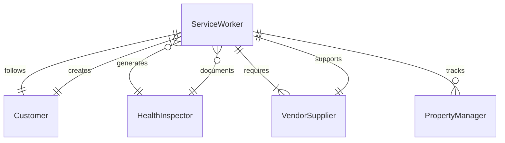
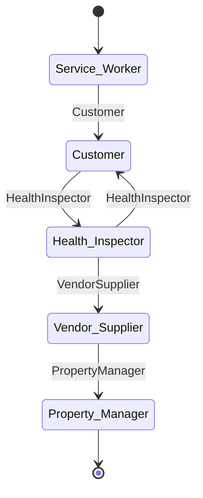
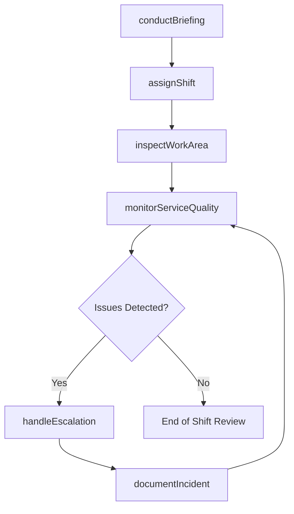
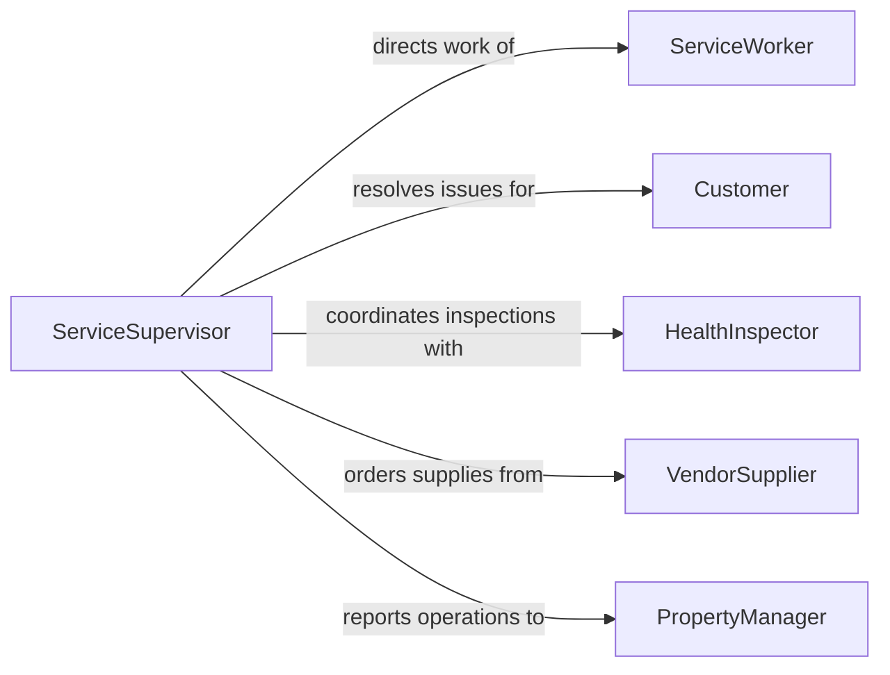

# Supervise Service Workers

> Business-as-Code definition for supervising service workers in hospitality, maintenance, food service, and customer-facing roles. Models scheduling, service quality monitoring, and workforce coordination.

## Overview

Supervising service workers involves managing front-line staff who deliver direct services to customers and clients in industries such as hospitality, food service, retail, and facility maintenance. Supervisors coordinate shift coverage, enforce service standards, handle customer escalations, and ensure compliance with health and safety regulations. This definition provides actions for daily operational oversight and events for real-time service management.

## Actors

| Actor | Description |
|-------|-------------|
| ServiceWorker | Front-line employee performing direct service delivery |
| Customer | Patron receiving services who may provide feedback or complaints |
| HealthInspector | Regulatory authority conducting safety and sanitation audits |
| VendorSupplier | External provider of supplies and materials for service operations |
| PropertyManager | Facility owner who sets operational standards and expectations |

## Roles

| Role | Description |
|------|-------------|
| ServiceSupervisor | Directly manages service workers and daily operations |
| ShiftManager | Oversees staffing and coverage during a specific shift |
| QualityCoordinator | Monitors service delivery standards and customer satisfaction |
| TrainingLead | Onboards new service workers and conducts skills refreshers |

## Entities

| Entity | Description |
|--------|-------------|
| ShiftRoster | The assignment of service workers to specific shifts and stations |
| ServiceStandard | Documented quality and procedural requirements for service delivery |
| CustomerComplaint | A formal record of customer dissatisfaction requiring resolution |
| InspectionReport | Results from a health, safety, or quality inspection |
| WorkOrder | A specific maintenance or service task assigned to a worker |
| SupplyInventory | Tracking of materials and supplies needed for service operations |

## Actions

| Action | Description |
|--------|-------------|
| assignShift | Schedule service workers to specific shifts and service areas |
| monitorServiceQuality | Observe and evaluate workers against service standards |
| handleEscalation | Intervene in customer complaints or operational issues |
| conductBriefing | Deliver pre-shift meetings to communicate priorities and updates |
| inspectWorkArea | Verify cleanliness, safety, and readiness of service areas |
| approveSupplyOrder | Review and authorize requisitions for service materials |
| documentIncident | Record workplace incidents, complaints, or safety observations |

## Events

| Event | Description |
|-------|-------------|
| shiftAssigned | A service worker has been scheduled to a shift and station |
| serviceQualityReviewed | An observation of service delivery has been documented |
| escalationHandled | A customer complaint or operational issue has been resolved |
| briefingConducted | A pre-shift meeting has been completed |
| workAreaInspected | A service area has passed or failed an inspection check |
| incidentDocumented | A workplace incident or complaint has been formally recorded |
| supplyOrderApproved | A requisition for service materials has been authorized |

## Searches

| Search | Description |
|--------|-------------|
| findShiftRosters | List shift assignments by date, area, or worker |
| getServiceMetrics | Retrieve quality scores and customer satisfaction data |
| getOpenComplaints | Return unresolved customer complaints by priority or area |
| getInspectionResults | Retrieve recent inspection reports by area or compliance status |

## Entity Relationships




## State Diagram



## Workflow



## Actor Relationships



## Usage

### Calling Actions

```typescript
import { superviseServiceWorkers } from '@headlessly/supervise-service-workers'

const services = superviseServiceWorkers()

// Conduct pre-shift briefing
await services.conductBriefing({
  shift: 'morning',
  location: 'Main Dining Hall',
  topics: ['new menu items', 'VIP reservation at 12:30', 'health inspection tomorrow'],
  attendees: ['sw-101', 'sw-102', 'sw-103', 'sw-104']
})

// Assign workers to stations
await services.assignShift({
  date: '2026-02-05',
  shift: 'morning',
  assignments: [
    { workerId: 'sw-101', station: 'front-counter' },
    { workerId: 'sw-102', station: 'kitchen-prep' },
    { workerId: 'sw-103', station: 'dining-floor' }
  ]
})

// Handle a customer escalation
await services.handleEscalation({
  complaintId: 'cmp-445',
  resolution: 'Replaced meal and applied discount',
  severity: 'medium'
})
```

### Event-Driven Automation

```typescript
// Alert supervisor on failed inspection
services.workAreaInspected(async ({ area, passed, findings }) => {
  if (!passed) {
    await notify({
      to: 'service-supervisor',
      priority: 'high',
      message: `${area} failed inspection: ${findings.join(', ')}`
    })
  }
})

// Auto-document pattern of complaints
services.escalationHandled(async ({ workerId, complaintType }) => {
  const recent = await services.getOpenComplaints({ workerId, days: 30 })
  if (recent.length >= 3) {
    await services.documentIncident({
      workerId,
      type: 'recurring-complaint-pattern',
      details: `${recent.length} complaints in 30 days for ${complaintType}`
    })
  }
})
```
