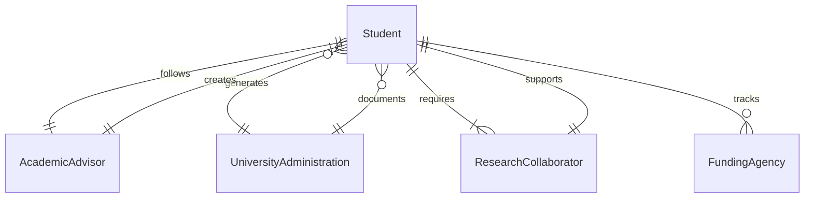
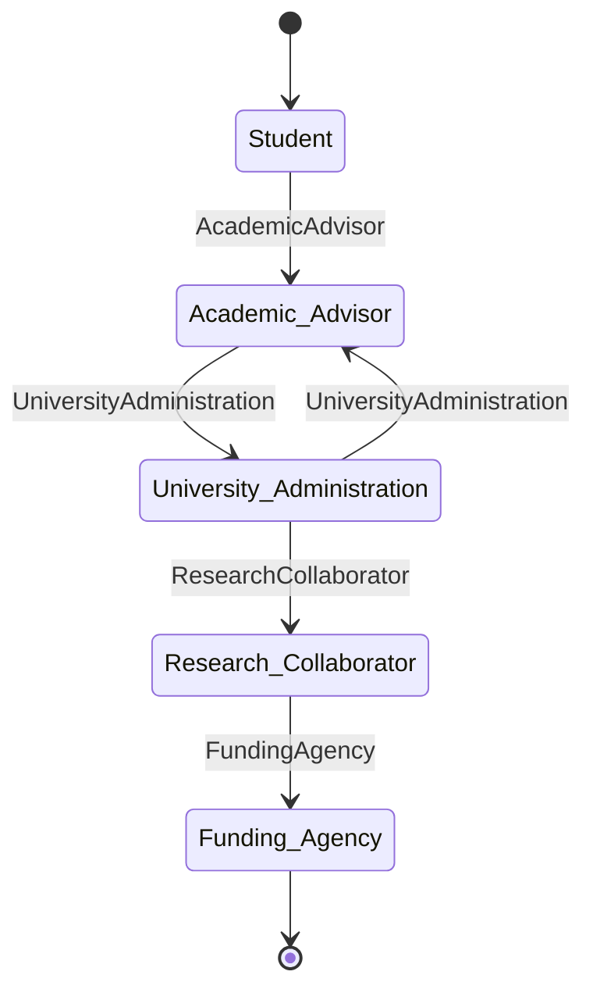
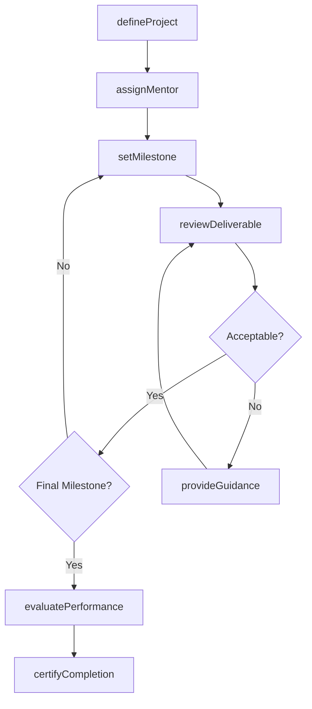
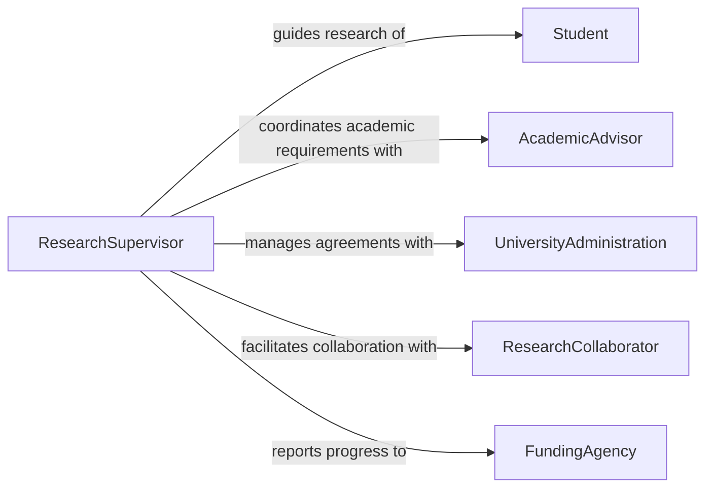

# Supervise Student Research Internship Work

> Business-as-Code definition for supervising student research projects and internship work within academic, corporate, or government settings. Models project assignment, milestone reviews, academic compliance, and final evaluation workflows.

## Overview

Supervising student research and internship work involves guiding undergraduate, graduate, or post-doctoral students through structured research projects or professional internship experiences. Supervisors define project scope, set milestones aligned with academic requirements, provide mentorship on research methodology, review deliverables, evaluate student performance, and coordinate with academic institutions to ensure credit and compliance requirements are met. This definition provides actions for managing the complete student engagement lifecycle.

## Actors

| Actor | Description |
|-------|-------------|
| Student | Undergraduate, graduate, or doctoral candidate performing research or internship work |
| AcademicAdvisor | University faculty member co-supervising the student's academic progress |
| UniversityAdministration | Institutional office managing internship agreements and credit approvals |
| ResearchCollaborator | Fellow researcher or lab member who works alongside the student |
| FundingAgency | Organization providing grants or stipends that support the student's work |

## Roles

| Role | Description |
|------|-------------|
| ResearchSupervisor | Directly oversees student research activities and deliverables |
| InternshipCoordinator | Manages logistics, scheduling, and institutional agreements |
| ProjectMentor | Provides day-to-day technical guidance and methodology support |
| EvaluationPanelist | Participates in formal assessments of student work such as defenses or presentations |

## Entities

| Entity | Description |
|--------|-------------|
| ResearchProject | A defined investigation with objectives, methodology, and expected outcomes |
| InternshipAgreement | A formal contract between the student, institution, and host organization |
| Milestone | A scheduled checkpoint requiring deliverables or progress review |
| Deliverable | A tangible output such as a report, dataset, publication, or presentation |
| EvaluationRubric | The criteria and scoring framework used to assess student performance |
| ProgressReport | A periodic summary of student activities, findings, and next steps |

## Actions

| Action | Description |
|--------|-------------|
| defineProject | Establish research objectives, scope, and methodology for a student project |
| assignMentor | Pair a student with a day-to-day technical guide or lab partner |
| setMilestone | Create scheduled checkpoints with deliverables and review criteria |
| reviewDeliverable | Evaluate a student's submitted work product against project standards |
| provideGuidance | Offer research methodology advice or redirect project approach |
| evaluatePerformance | Conduct a formal assessment of the student's overall contribution |
| certifyCompletion | Confirm that all project requirements have been fulfilled for academic credit |

## Events

| Event | Description |
|-------|-------------|
| projectDefined | A research or internship project has been scoped and approved |
| mentorAssigned | A student has been paired with a technical guide |
| milestoneReached | A scheduled checkpoint has been reached and requires review |
| deliverableReviewed | A student's work product has been evaluated |
| guidanceProvided | A mentoring or advisory session has been documented |
| performanceEvaluated | A formal assessment of the student's work has been completed |
| completionCertified | All project requirements have been met and academic credit confirmed |

## Searches

| Search | Description |
|--------|-------------|
| findStudentProjects | List projects by student, supervisor, status, or academic term |
| getMilestoneStatus | Retrieve checkpoint progress across all active student projects |
| getDeliverableHistory | Return submitted and reviewed deliverables for a specific student |
| getEvaluationRecords | Retrieve formal assessment results by student, project, or term |
## Entity Relationships




## State Diagram




## Workflow



## Actor Relationships



## Usage

### Calling Actions

```typescript
import { superviseStudentResearchInternshipWork } from '@headlessly/supervise-student-research-internship-work'

const research = superviseStudentResearchInternshipWork()

// Define a research project
const project = await research.defineProject({
  studentId: 'stu-2026-0415',
  title: 'Machine Learning Approaches to Protein Folding Prediction',
  objectives: ['replicate-baseline', 'implement-novel-architecture', 'benchmark-results'],
  term: 'Spring-2026',
  institution: 'MIT Department of Biological Engineering'
})

// Assign a lab mentor
await research.assignMentor({
  projectId: project.id,
  mentorId: 'researcher-812',
  role: 'day-to-day technical guidance on ML pipeline development'
})

// Set milestones with deliverables
await research.setMilestone({
  projectId: project.id,
  milestones: [
    { name: 'Literature Review', dueDate: '2026-03-01', deliverable: 'annotated-bibliography' },
    { name: 'Baseline Replication', dueDate: '2026-04-01', deliverable: 'technical-report' },
    { name: 'Final Defense', dueDate: '2026-05-15', deliverable: 'thesis-presentation' }
  ]
})
```

### Event-Driven Automation

```typescript
// Notify academic advisor on milestone completion
research.milestoneReached(async ({ projectId, studentId, milestone }) => {
  await notify({
    to: 'academic-advisor',
    message: `Student ${studentId} reached milestone: ${milestone.name} for project ${projectId}`
  })
})

// Auto-schedule guidance when deliverable needs revision
research.deliverableReviewed(async ({ studentId, deliverable, status }) => {
  if (status === 'revision-required') {
    await research.provideGuidance({
      studentId,
      topic: deliverable.name,
      type: 'revision-meeting',
      scheduledDate: addDays(new Date(), 3)
    })
  }
})
```
