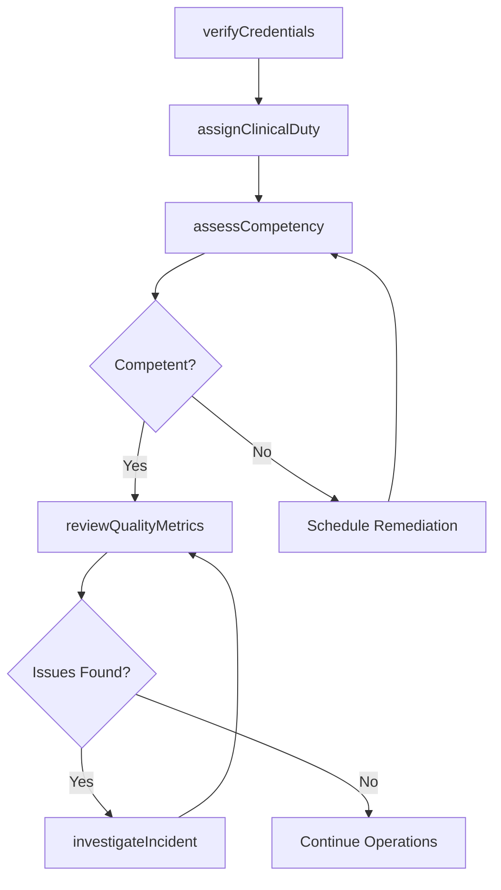
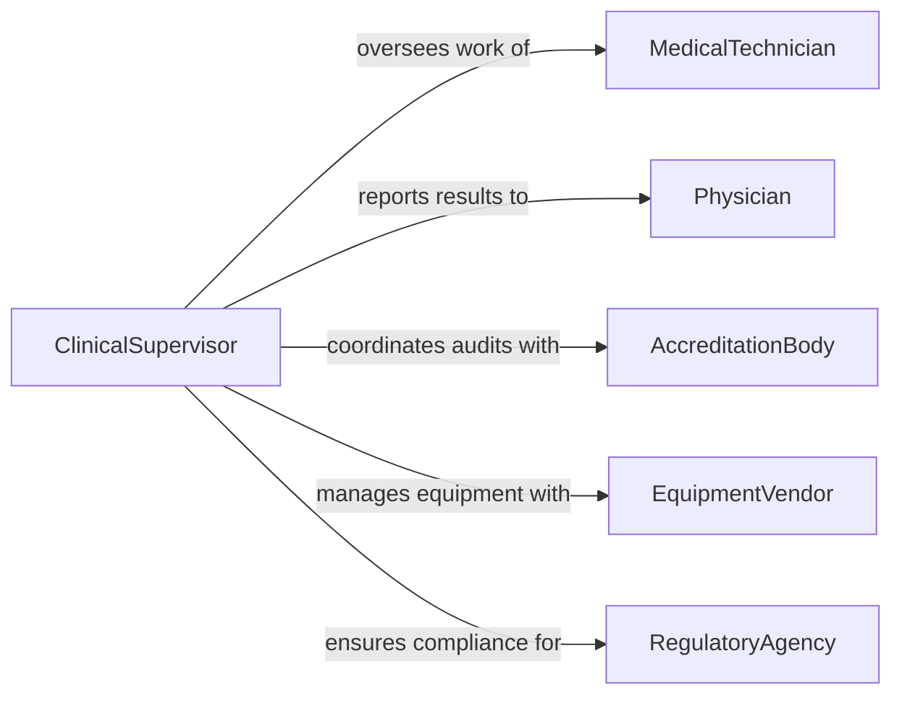

# Supervise Technical Medical Personnel

> Business-as-Code definition for supervising technical medical staff such as lab technicians, radiology technicians, and medical technologists. Models clinical oversight, credentialing, and quality assurance workflows.

## Overview

Supervising technical medical personnel involves overseeing staff who operate diagnostic equipment, perform laboratory analyses, and support clinical procedures in hospitals, clinics, and diagnostic laboratories. Supervisors ensure adherence to clinical protocols, manage credentialing and continuing education requirements, and maintain quality assurance standards mandated by regulatory bodies such as CLIA and JCAHO. This definition provides actions for clinical oversight and workforce competency management.

## Actors

| Actor | Description |
|-------|-------------|
| MedicalTechnician | Clinical staff member performing diagnostic or laboratory procedures |
| Physician | Ordering provider who relies on technical results for patient care |
| AccreditationBody | External agency that certifies facility compliance with clinical standards |
| EquipmentVendor | Supplier of medical devices and diagnostic instruments |
| Patient | Individual receiving diagnostic or treatment services |
| RegulatoryAgency | Government authority enforcing healthcare safety and quality standards |

## Roles

| Role | Description |
|------|-------------|
| ClinicalSupervisor | Oversees daily technical operations and staff assignments |
| QualityAssuranceManager | Monitors compliance with clinical protocols and accreditation requirements |
| CredentialingCoordinator | Tracks certifications, licenses, and continuing education for staff |
| LabDirector | Holds ultimate responsibility for laboratory accuracy and compliance |

## Entities

| Entity | Description |
|--------|-------------|
| Credential | A professional license, certification, or competency record |
| QualityMetric | A measurable standard for clinical accuracy and turnaround time |
| ClinicalProtocol | Documented procedure for performing a diagnostic or technical task |
| CompetencyAssessment | An evaluation of a technician's proficiency in a specific procedure |
| EquipmentCalibration | Record of instrument maintenance and validation activities |
| IncidentReport | Documentation of errors, near-misses, or adverse events |

## Actions

| Action | Description |
|--------|-------------|
| assignClinicalDuty | Schedule technical staff to specific departments and procedures |
| assessCompetency | Evaluate a technician's proficiency for a clinical procedure |
| reviewQualityMetrics | Analyze turnaround times, error rates, and accuracy benchmarks |
| verifyCredentials | Confirm that staff certifications and licenses are current |
| approveProtocolChange | Authorize updates to clinical procedures or testing methodologies |
| investigateIncident | Review and document clinical errors or near-miss events |
| scheduleCalibration | Plan equipment maintenance and validation cycles |

## Events

| Event | Description |
|-------|-------------|
| clinicalDutyAssigned | A technician has been scheduled to a department or procedure |
| competencyAssessed | A proficiency evaluation has been completed for a staff member |
| qualityMetricsReviewed | Performance benchmarks have been analyzed and documented |
| credentialVerified | A staff member's certification or license has been confirmed current |
| protocolChangeApproved | A clinical procedure update has been authorized |
| incidentInvestigated | A clinical error or near-miss has been reviewed and documented |
| credentialExpiring | A staff member's certification is approaching its expiration date |

## Searches

| Search | Description |
|--------|-------------|
| findStaffByCredential | List technical personnel by certification type or expiration status |
| getQualityDashboard | Retrieve current quality metrics by department or procedure type |
| getCompetencyRecords | Return assessment history for a specific technician |
| getIncidentLog | Retrieve incident reports by severity, department, or date range |

## Workflow



## Actor Relationships



## Usage

### Calling Actions

```typescript
import { superviseTechnicalMedicalPersonnel } from '@headlessly/supervise-technical-medical-personnel'

const clinical = superviseTechnicalMedicalPersonnel()

// Verify credentials before assignment
const credential = await clinical.verifyCredentials({
  technicianId: 'tech-1192',
  requiredCertifications: ['ASCP-MLS', 'BLS']
})

// Assign to laboratory duties
await clinical.assignClinicalDuty({
  technicianId: 'tech-1192',
  department: 'Clinical Chemistry',
  shift: 'day',
  procedures: ['blood-gas-analysis', 'metabolic-panel']
})

// Review department quality metrics
const metrics = await clinical.reviewQualityMetrics({
  department: 'Clinical Chemistry',
  period: 'Q1-2026',
  benchmarks: ['turnaround-time', 'error-rate', 'specimen-rejection-rate']
})
```

### Event-Driven Automation

```typescript
// Alert when credential is expiring
clinical.credentialExpiring(async ({ technicianId, certification, expirationDate }) => {
  await notify({
    to: 'credentialing-coordinator',
    message: `${certification} for technician ${technicianId} expires on ${expirationDate}`
  })
})

// Auto-trigger investigation on quality threshold breach
clinical.qualityMetricsReviewed(async ({ department, metrics }) => {
  const failures = metrics.filter(m => m.value > m.threshold)
  if (failures.length > 0) {
    await clinical.investigateIncident({
      department,
      type: 'quality-threshold-breach',
      metrics: failures
    })
  }
})
```
