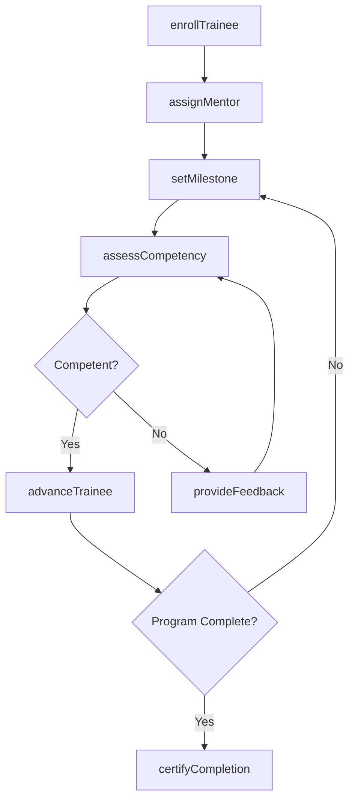
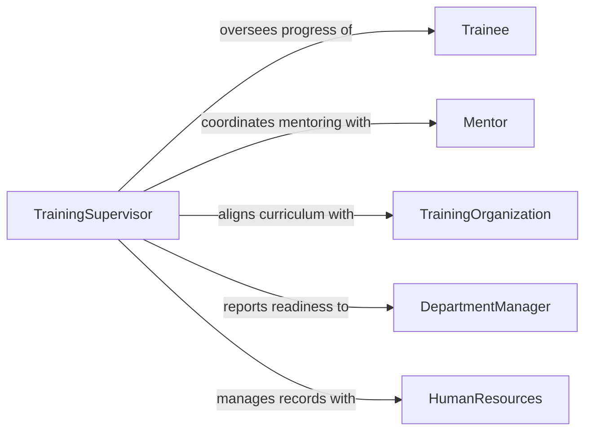

# Supervise Trainees

> Business-as-Code definition for supervising trainees during onboarding, apprenticeships, and professional development programs. Models competency tracking, mentoring assignments, and training milestone management.

## Overview

Supervising trainees involves guiding individuals who are learning new skills, completing apprenticeships, or undergoing professional development programs. Supervisors assign mentors, define learning objectives, monitor progress through structured milestones, evaluate competency demonstrations, and make recommendations on readiness for independent work. This definition provides actions for managing the full training lifecycle from onboarding through certification or graduation.

## Actors

| Actor | Description |
|-------|-------------|
| Trainee | Individual undergoing training or professional development |
| Mentor | Experienced practitioner providing hands-on guidance and coaching |
| TrainingOrganization | External institution providing curriculum, certification, or accreditation |
| DepartmentManager | Receives trained personnel and defines skill requirements |
| HumanResources | Administers training program policies and employment documentation |

## Roles

| Role | Description |
|------|-------------|
| TrainingSupervisor | Oversees trainee progress and manages the training program |
| CompetencyAssessor | Evaluates trainee skill demonstrations against defined standards |
| CurriculumDesigner | Develops training materials, schedules, and learning objectives |
| ProgramCoordinator | Manages logistics, scheduling, and trainee assignments across cohorts |

## Entities

| Entity | Description |
|--------|-------------|
| TrainingPlan | A structured program of learning objectives, milestones, and timelines |
| Competency | A defined skill or knowledge area that a trainee must demonstrate |
| Milestone | A checkpoint in the training program requiring evaluation |
| Assessment | A formal evaluation of trainee proficiency at a specific competency |
| MentorAssignment | The pairing of a trainee with an experienced mentor |
| TrainingRecord | The cumulative log of a trainee's progress, assessments, and certifications |

## Actions

| Action | Description |
|--------|-------------|
| enrollTrainee | Register a new trainee in a training program with a defined plan |
| assignMentor | Pair a trainee with an experienced practitioner for guided learning |
| setMilestone | Define a checkpoint with evaluation criteria and target date |
| assessCompetency | Evaluate a trainee's proficiency through observation or examination |
| provideFeedback | Deliver constructive performance feedback to a trainee |
| advanceTrainee | Promote a trainee to the next phase of the training program |
| certifyCompletion | Confirm that a trainee has met all program requirements |

## Events

| Event | Description |
|-------|-------------|
| traineeEnrolled | A new trainee has been registered in a training program |
| mentorAssigned | A trainee has been paired with an experienced mentor |
| milestoneReached | A trainee has arrived at a program checkpoint for evaluation |
| competencyAssessed | A formal proficiency evaluation has been completed |
| feedbackProvided | A coaching or feedback session has been documented |
| traineeAdvanced | A trainee has been promoted to the next program phase |
| trainingCompleted | A trainee has met all program requirements and been certified |

## Searches

| Search | Description |
|--------|-------------|
| findTrainees | List trainees by program, phase, mentor, or enrollment date |
| getCompetencyStatus | Retrieve assessed competencies and gaps for a trainee |
| getMilestoneProgress | Return milestone completion status across a cohort or program |
| getTrainingRecords | Retrieve cumulative training history for a specific trainee |

## Workflow



## Actor Relationships



## Usage

### Calling Actions

```typescript
import { superviseTrainees } from '@headlessly/supervise-trainees'

const training = superviseTrainees()

// Enroll a new trainee
const trainee = await training.enrollTrainee({
  name: 'Jordan Mitchell',
  program: 'Electrical Apprenticeship - Level 1',
  startDate: '2026-02-10',
  expectedDuration: { months: 12 }
})

// Assign a mentor
await training.assignMentor({
  traineeId: trainee.id,
  mentorId: 'emp-4410',
  focus: ['conduit-installation', 'circuit-testing', 'safety-protocols']
})

// Assess competency at a milestone
await training.assessCompetency({
  traineeId: trainee.id,
  competency: 'residential-wiring',
  method: 'practical-demonstration',
  result: 'proficient',
  assessor: 'emp-4410'
})
```

### Event-Driven Automation

```typescript
// Notify department when trainee completes program
training.trainingCompleted(async ({ traineeId, program, certificationDate }) => {
  await notify({
    to: 'department-manager',
    message: `Trainee ${traineeId} completed ${program} on ${certificationDate}`
  })
})

// Auto-schedule feedback when competency assessment fails
training.competencyAssessed(async ({ traineeId, competency, result }) => {
  if (result === 'not-yet-competent') {
    await training.provideFeedback({
      traineeId,
      topic: competency,
      type: 'remediation-plan',
      scheduledDate: addDays(new Date(), 7)
    })
  }
})
```
