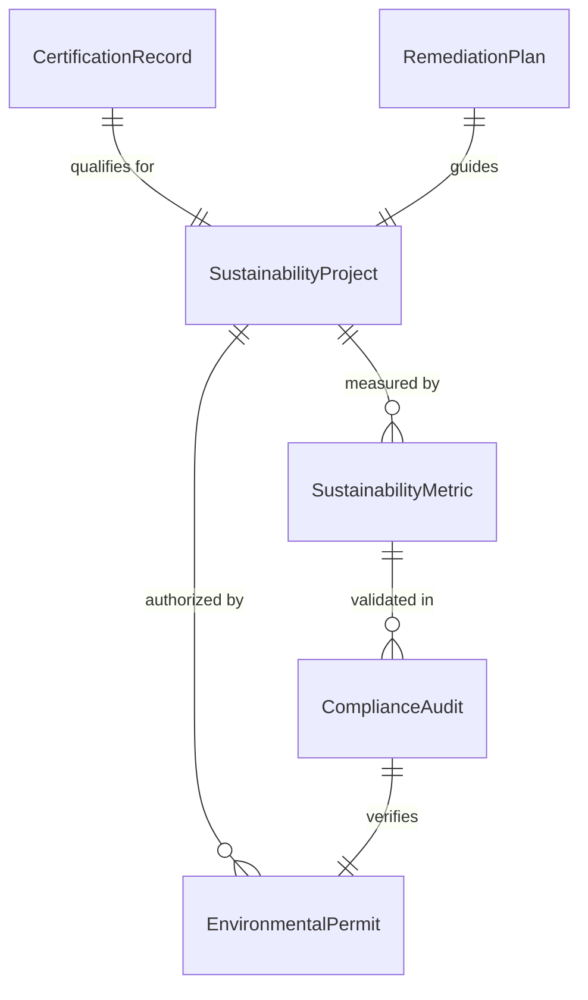
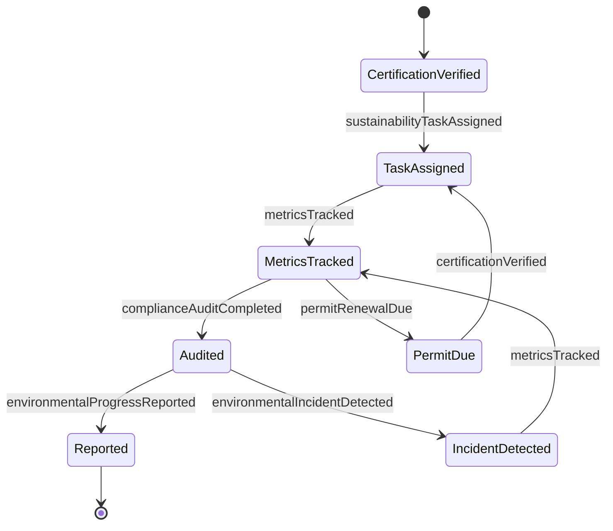
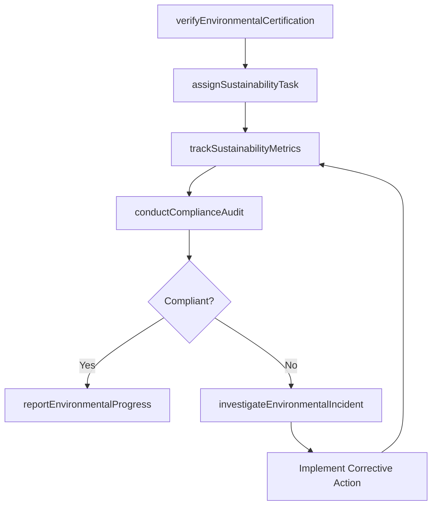
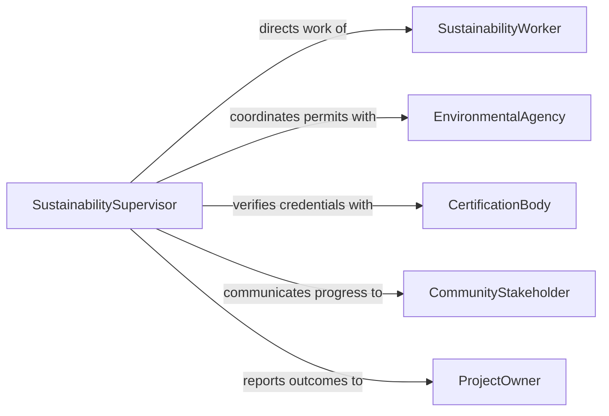

# Supervise Workers Performing Environmentally Sustainab

> Business-as-Code definition for supervising workers engaged in environmentally sustainable activities such as renewable energy installation, waste reduction, remediation, and green building practices. Models compliance tracking, sustainability metrics, and environmental certification workflows.

## Overview

Supervising workers performing environmentally sustainable activities involves overseeing staff engaged in renewable energy projects, waste management, environmental remediation, green construction, and sustainability compliance programs. Supervisors ensure that work meets environmental regulations, track sustainability metrics against organizational targets, coordinate with environmental agencies, and verify that workers hold required environmental certifications. This definition provides actions for managing green workforce operations and events for monitoring environmental compliance.

## Actors

| Actor | Description |
|-------|-------------|
| SustainabilityWorker | Staff member performing green or environmental work activities |
| EnvironmentalAgency | Regulatory body enforcing environmental laws and issuing permits |
| CertificationBody | Organization that grants environmental and sustainability certifications |
| CommunityStakeholder | Local residents or groups affected by environmental activities |
| MaterialSupplier | Provider of sustainable, recycled, or environmentally certified materials |
| ProjectOwner | Client or internal sponsor commissioning sustainability initiatives |

## Roles

| Role | Description |
|------|-------------|
| SustainabilitySupervisor | Oversees daily operations of environmental work crews |
| ComplianceOfficer | Monitors adherence to environmental regulations and permit conditions |
| MetricsAnalyst | Tracks and reports sustainability performance indicators |
| SafetyLead | Ensures worker safety during hazardous environmental operations |

## Entities

| Entity | Description |
|--------|-------------|
| SustainabilityProject | A defined initiative with environmental objectives and deliverables |
| EnvironmentalPermit | A regulatory authorization required for specific environmental activities |
| ComplianceAudit | A formal review of adherence to environmental regulations |
| SustainabilityMetric | A quantifiable measure such as carbon reduction, waste diversion, or energy savings |
| CertificationRecord | Documentation of worker or facility environmental certifications |
| RemediationPlan | A structured approach to cleaning up contaminated sites |

## Actions

| Action | Description |
|--------|-------------|
| assignSustainabilityTask | Delegate specific environmental work activities to qualified workers |
| verifyEnvironmentalCertification | Confirm that workers hold required green certifications |
| trackSustainabilityMetrics | Monitor carbon, waste, energy, and water performance indicators |
| conductComplianceAudit | Perform inspections to verify adherence to environmental regulations |
| reportEnvironmentalProgress | Generate sustainability performance reports for stakeholders |
| coordinatePermitRequirements | Manage environmental permit applications and renewal schedules |
| investigateEnvironmentalIncident | Review and document spills, emissions, or regulatory violations |

## Events

| Event | Description |
|-------|-------------|
| sustainabilityTaskAssigned | An environmental work activity has been delegated to a worker |
| certificationVerified | A worker's environmental certification has been confirmed current |
| metricsTracked | Sustainability performance indicators have been updated |
| complianceAuditCompleted | An environmental regulation inspection has been finished |
| environmentalProgressReported | A sustainability performance report has been distributed |
| permitRenewalDue | An environmental permit is approaching its expiration date |
| environmentalIncidentDetected | A spill, emission, or regulatory violation has been identified |

## Searches

| Search | Description |
|--------|-------------|
| findSustainabilityProjects | List projects by type, status, worker, or environmental objective |
| getComplianceStatus | Retrieve current regulatory compliance standing by project or facility |
| getMetricsDashboard | Return sustainability KPIs by period, project, or facility |
| getPermitSchedule | Retrieve upcoming permit renewals and application deadlines |
## Entity Relationships



## State Diagram




## Workflow



## Actor Relationships



## Usage

### Calling Actions

```typescript
import { superviseWorkersPerformingEnvironmentallySustainable } from '@headlessly/supervise-workers-performing-environmentally-sustainable'

const sustainability = superviseWorkersPerformingEnvironmentallySustainable()

// Verify worker certifications before assignment
await sustainability.verifyEnvironmentalCertification({
  workerId: 'sw-920',
  requiredCertifications: ['LEED-Green-Associate', 'OSHA-HAZWOPER-40']
})

// Assign remediation task
const task = await sustainability.assignSustainabilityTask({
  projectId: 'proj-green-2026-08',
  workerId: 'sw-920',
  activity: 'Soil remediation at former industrial site - Phase 2',
  permitId: 'env-permit-4421'
})

// Track sustainability metrics
const metrics = await sustainability.trackSustainabilityMetrics({
  projectId: 'proj-green-2026-08',
  indicators: ['soil-contaminant-levels', 'waste-diverted-tons', 'carbon-offset-credits'],
  period: 'Q1-2026'
})
```

### Event-Driven Automation

```typescript
// Alert on environmental incident
sustainability.environmentalIncidentDetected(async ({ projectId, type, severity }) => {
  await notify({
    to: ['sustainability-supervisor', 'compliance-officer'],
    priority: 'critical',
    message: `Environmental incident on project ${projectId}: ${type} (severity: ${severity})`
  })
})

// Auto-notify on permit renewal deadlines
sustainability.permitRenewalDue(async ({ permitId, expirationDate, daysRemaining }) => {
  if (daysRemaining <= 30) {
    await sustainability.coordinatePermitRequirements({
      permitId,
      action: 'initiate-renewal',
      deadline: expirationDate
    })
  }
})
```
