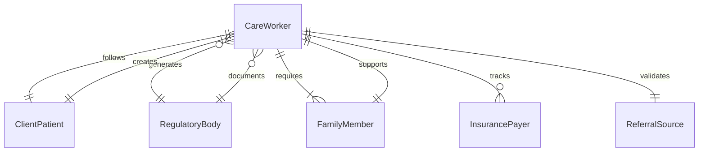
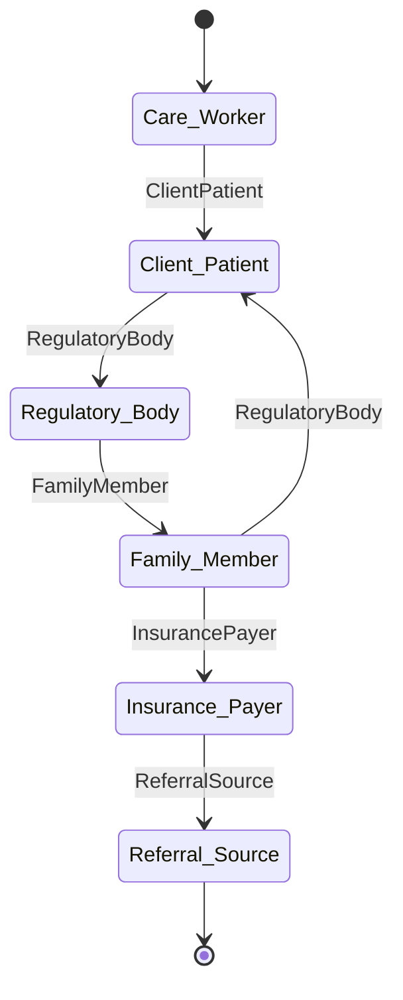
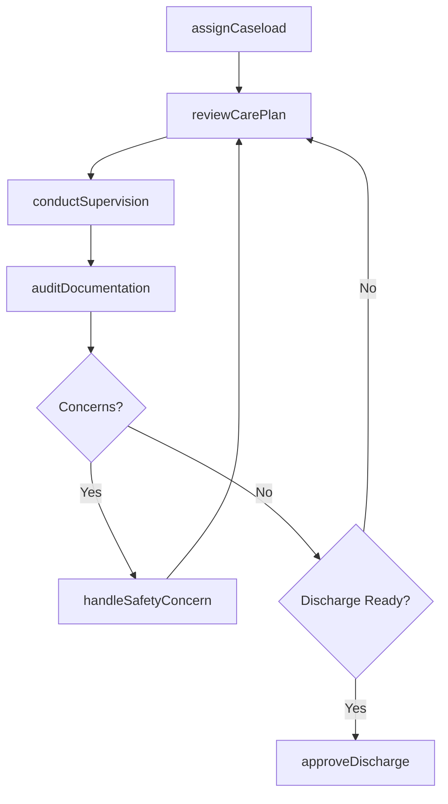
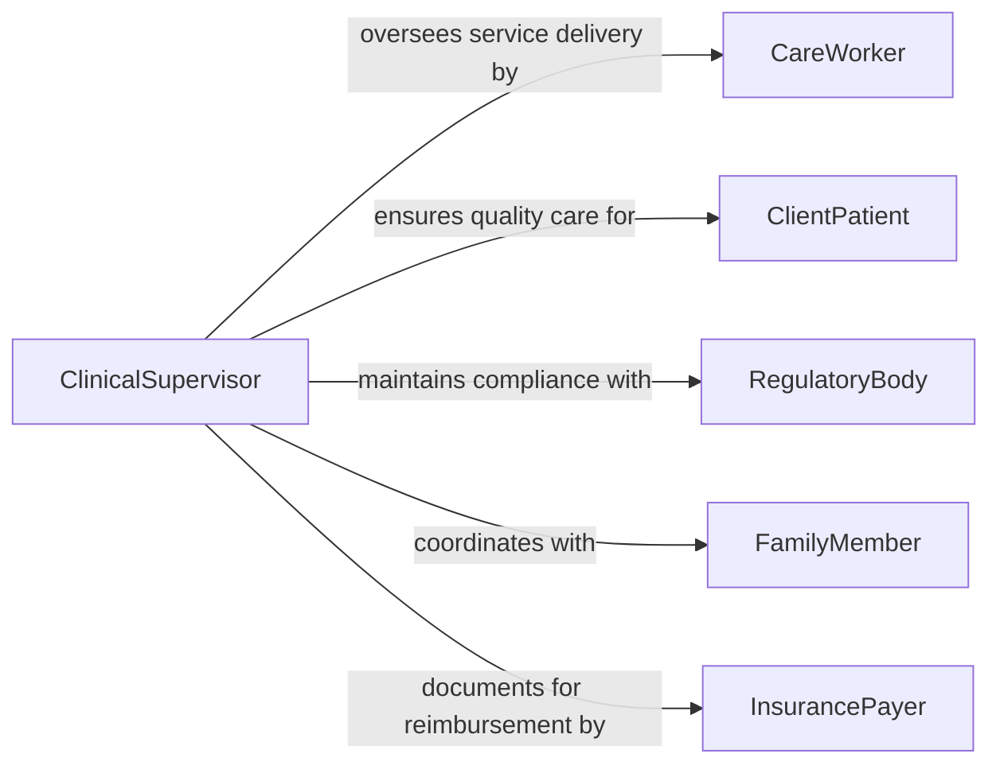

# Supervise Workers Providing Client Patient

> Business-as-Code definition for supervising workers who provide direct client or patient services in healthcare, social services, and counseling settings. Models caseload management, care quality oversight, and regulatory compliance.

## Overview

Supervising workers who provide client or patient services involves overseeing case workers, care aides, counselors, and therapists who deliver direct human services. Supervisors assign caseloads, monitor care plan adherence, conduct clinical or case supervision sessions, review documentation for compliance with regulatory and accreditation standards, and intervene when service quality or client safety concerns arise. This definition provides actions for managing service delivery teams in healthcare, behavioral health, and social services organizations.

## Actors

| Actor | Description |
|-------|-------------|
| CareWorker | Staff member delivering direct client or patient services |
| ClientPatient | Individual receiving care, counseling, or social services |
| RegulatoryBody | Agency enforcing standards for client care and worker qualifications |
| FamilyMember | Authorized representative involved in care coordination decisions |
| InsurancePayer | Entity responsible for reimbursement of covered services |
| ReferralSource | External organization or provider referring clients for services |

## Roles

| Role | Description |
|------|-------------|
| ClinicalSupervisor | Oversees care delivery quality and provides professional guidance |
| CaseloadManager | Assigns and balances client cases across service workers |
| ComplianceReviewer | Audits documentation and practices for regulatory adherence |
| IntakeCoordinator | Manages new client referrals and initial assessments |

## Entities

| Entity | Description |
|--------|-------------|
| Caseload | The set of clients assigned to a specific care worker |
| CarePlan | A documented plan of services and interventions for a client |
| SupervisionSession | A structured meeting between supervisor and care worker for case review |
| IncidentReport | Documentation of adverse events, safety concerns, or complaints |
| ComplianceRecord | Log of regulatory adherence checks and audit outcomes |
| ServiceNote | A clinical or case documentation entry for a client encounter |

## Actions

| Action | Description |
|--------|-------------|
| assignCaseload | Distribute client cases to care workers based on capacity and specialization |
| reviewCarePlan | Evaluate the appropriateness and progress of a client's service plan |
| conductSupervision | Hold a structured case review meeting with a care worker |
| auditDocumentation | Review service notes and records for completeness and compliance |
| handleSafetyConcern | Intervene in situations involving client risk or adverse events |
| approveDischarge | Authorize the completion of services for a client |
| balanceCaseloads | Redistribute clients across workers to maintain equitable workloads |

## Events

| Event | Description |
|-------|-------------|
| caseloadAssigned | Clients have been distributed to a care worker |
| carePlanReviewed | A client's service plan has been evaluated and updated |
| supervisionConducted | A case review session with a care worker has been completed |
| documentationAudited | Service records have been reviewed for compliance |
| safetyConcernRaised | A client safety issue or adverse event has been identified |
| dischargeApproved | A client has been authorized for service completion |
| caseloadImbalanceDetected | A care worker's caseload has exceeded the recommended threshold |

## Searches

| Search | Description |
|--------|-------------|
| findCaseloads | List caseload assignments by worker, capacity, or specialization |
| getCarePlanStatus | Retrieve care plan progress and upcoming review dates by client |
| getSupervisionHistory | Return supervision session records for a specific care worker |
| getComplianceFindings | Retrieve documentation audit results by worker, client, or period |
## Entity Relationships




## State Diagram




## Workflow



## Actor Relationships



## Usage

### Calling Actions

```typescript
import { superviseWorkersProvidingClientPatient } from '@headlessly/supervise-workers-providing-client-patient'

const services = superviseWorkersProvidingClientPatient()

// Assign caseload to care worker
await services.assignCaseload({
  workerId: 'cw-308',
  clients: ['client-1201', 'client-1202', 'client-1203'],
  specialization: 'behavioral-health',
  maxCapacity: 25
})

// Conduct supervision session
await services.conductSupervision({
  workerId: 'cw-308',
  type: 'individual-case-review',
  clientsDiscussed: ['client-1201', 'client-1203'],
  findings: 'Client 1203 showing improvement; recommend step-down in frequency',
  nextSessionDate: '2026-02-19'
})

// Audit documentation compliance
const audit = await services.auditDocumentation({
  workerId: 'cw-308',
  period: 'January-2026',
  criteria: ['timeliness', 'completeness', 'clinical-accuracy']
})
```

### Event-Driven Automation

```typescript
// Alert on client safety concern
services.safetyConcernRaised(async ({ clientId, workerId, severity, description }) => {
  await notify({
    to: 'clinical-supervisor',
    priority: 'critical',
    message: `Safety concern for client ${clientId}: ${description}`
  })
})

// Auto-rebalance when caseload threshold exceeded
services.caseloadImbalanceDetected(async ({ workerId, currentCount, threshold }) => {
  await services.balanceCaseloads({
    teamId: 'behavioral-health-team',
    reason: `Worker ${workerId} at ${currentCount}/${threshold} capacity`
  })
})
```
