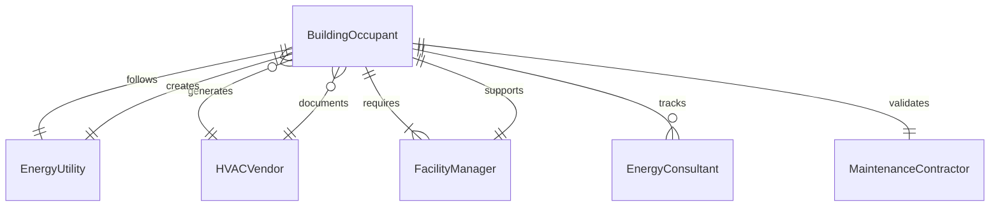
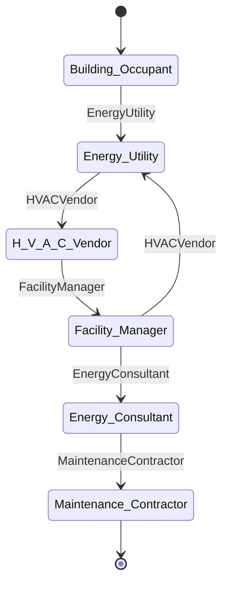
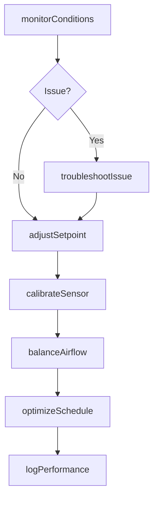
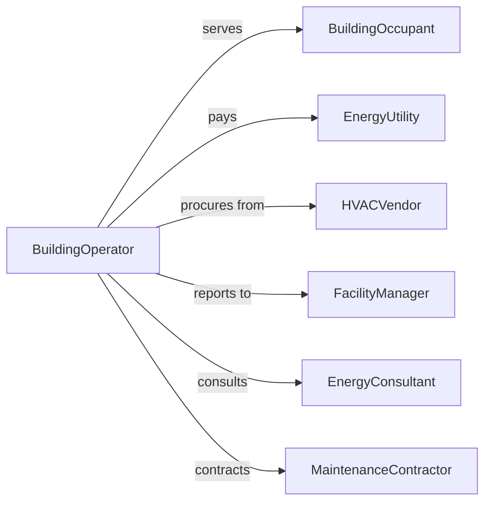

# Adjust Building Climate Control Systems

> Business-as-Code definition for building climate control system adjustment. Models the operation and optimization of HVAC equipment to maintain comfortable and efficient indoor environments.

## Overview

Building climate control system adjustment involves monitoring temperature and humidity sensors, modifying thermostat settings, calibrating HVAC controls, balancing airflow, troubleshooting performance issues, and optimizing energy efficiency. This definition exposes actions for environmental monitoring, equipment tuning, and performance optimization.

## Actors

| Actor | Description |
|-------|-------------|
| BuildingOccupant | Individual experiencing indoor environmental conditions |
| EnergyUtility | Provides electricity and gas for climate systems |
| HVACVendor | Supplies equipment and technical support |
| FacilityManager | Oversees building operations and comfort standards |
| EnergyConsultant | Advises on efficiency improvements |
| MaintenanceContractor | Performs repairs and preventive maintenance |

## Roles

| Role | Description |
|------|-------------|
| BuildingOperator | Manages daily HVAC system operation |
| ControlsTechnician | Calibrates and programs building automation |
| EnergyManager | Optimizes system performance for cost savings |
| ComfortAnalyst | Monitors and responds to occupant feedback |

## Entities

| Entity | Description |
|--------|-------------|
| ClimateZone | Area of building with independent temperature control |
| Thermostat | Device setting target temperature |
| Sensor | Instrument measuring temperature, humidity, or pressure |
| AirHandler | Equipment moving conditioned air through building |
| SetpointSchedule | Time-based temperature target configuration |
| PerformanceLog | Record of system operation and efficiency |

## Actions

| Action | Description |
|--------|-------------|
| monitorConditions | Track temperature, humidity, and occupancy data |
| adjustSetpoint | Modify target temperature or humidity level |
| calibrateSensor | Ensure accurate environmental readings |
| balanceAirflow | Optimize distribution of conditioned air |
| optimizeSchedule | Adjust operating times for efficiency |
| troubleshootIssue | Diagnose and resolve performance problems |
| logPerformance | Record system operation metrics |

## Events

| Event | Description |
|-------|-------------|
| conditionsMonitored | Environmental data has been collected |
| setpointAdjusted | Target temperature has been modified |
| sensorCalibrated | Instrument accuracy has been verified |
| airflowBalanced | Air distribution has been optimized |
| scheduleOptimized | Operating times have been adjusted |
| issueTroubleshooted | Performance problem has been diagnosed |
| performanceLogged | Operation metrics have been recorded |

## Searches

| Search | Description |
|--------|-------------|
| findZones | List climate zones by building or floor |
| getSetpoints | Retrieve target temperatures by zone or schedule |
| getSensors | Find instruments by type or calibration status |
| getPerformanceLogs | View operation metrics by date or zone |
| getIssues | Check troubleshooting records by type or resolution |

## Entity Relationships




## State Diagram



## Workflow



## Actor Relationships



## Usage

### Calling Actions

```typescript
import { adjustBuildingClimateControlSystems } from '@headlessly/adjust-building-climate-control-systems'

const climate = adjustBuildingClimateControlSystems()

// Monitor current conditions
const conditions = await climate.monitorConditions({
  zone: 'floor-3-east',
  metrics: ['temperature', 'humidity', 'co2'],
  interval: 'real-time'
})

// Adjust setpoint in response to occupancy
await climate.adjustSetpoint({
  zone: 'floor-3-east',
  temperature: 72,
  reason: 'high-occupancy-meeting',
  duration: 2
})

// Calibrate sensor after maintenance
await climate.calibrateSensor({
  sensorId: 'temp-sensor-301',
  referenceValue: 70.0,
  tolerance: 0.5,
  calibrationDate: '2026-02-15'
})

// Balance airflow across zones
await climate.balanceAirflow({
  building: 'headquarters',
  zones: ['floor-3-east', 'floor-3-west', 'floor-3-central'],
  targetCFM: [1200, 1000, 800],
  method: 'damper-adjustment'
})

// Optimize schedule for energy savings
await climate.optimizeSchedule({
  zone: 'all-zones',
  weekday: { occupied: '07:00-18:00', setback: 5 },
  weekend: { occupied: 'off', setback: 10 }
})
```

### Event-Driven Automation

```typescript
// Alert when conditions exceed comfort thresholds
climate.conditionsMonitored(async ({ zone, temperature, humidity }) => {
  if (temperature > 78 || temperature < 68) {
    await climate.troubleshootIssue({
      zone,
      issue: 'temperature-out-of-range',
      priority: 'high'
    })
    await notify({
      to: 'building-operator',
      message: `Zone ${zone} temperature ${temperature}F is outside comfort range`
    })
  }
})

// Log energy usage when schedule optimized
climate.scheduleOptimized(async ({ zone, schedule }) => {
  await climate.logPerformance({
    zone,
    metric: 'energy-savings',
    value: calculateSavings(schedule),
    timestamp: new Date()
  })
})
```
