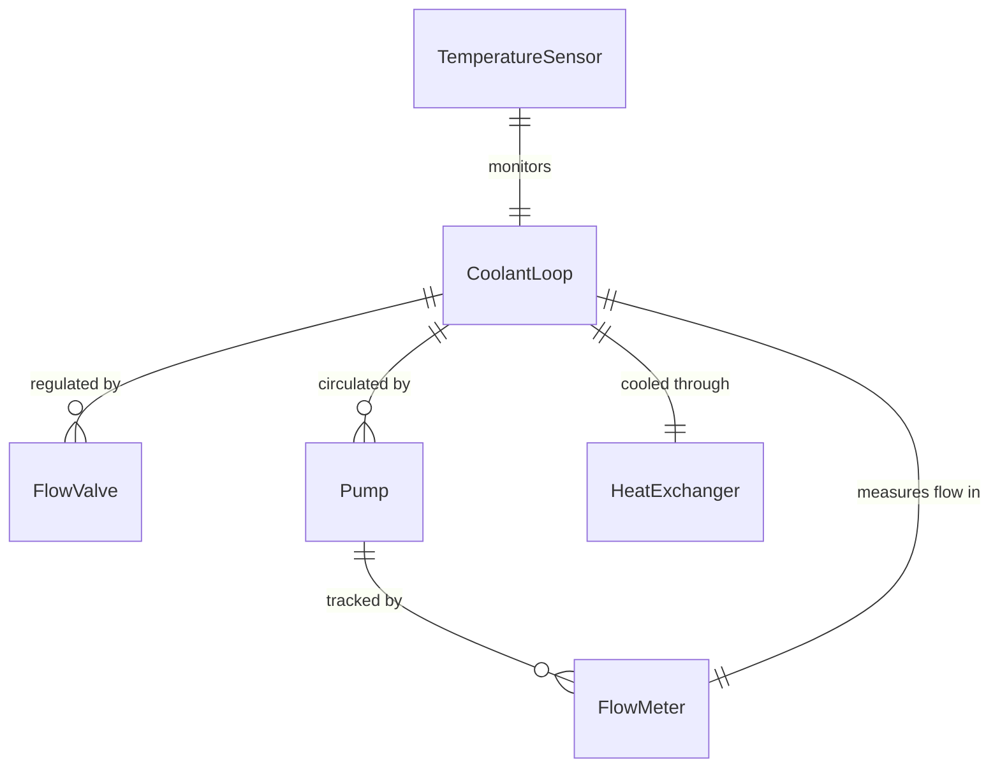
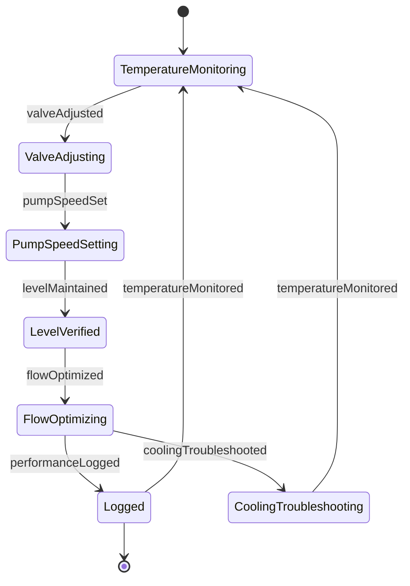
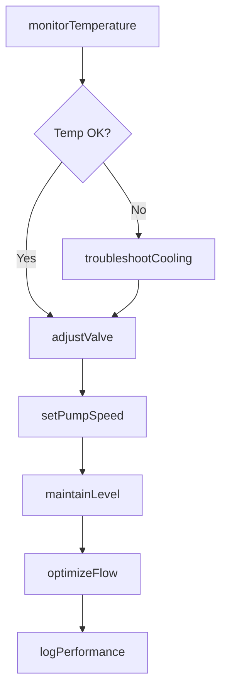
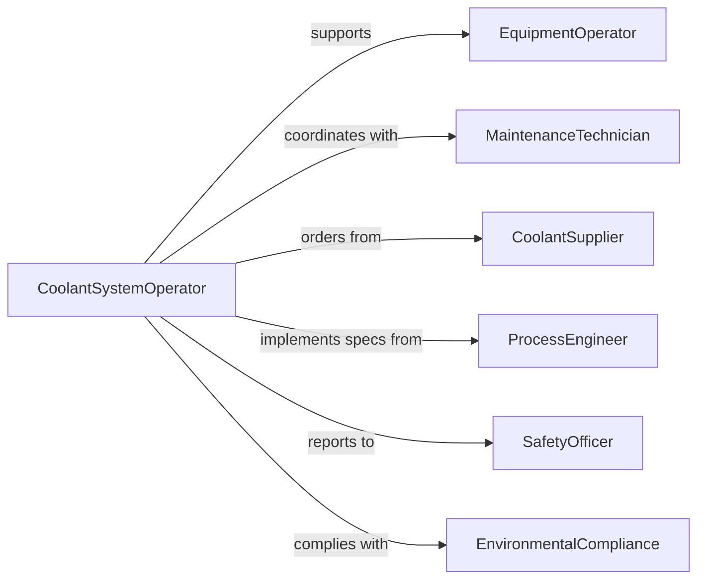

# Adjust Equipment Controls Regulate Coolant

> Business-as-Code definition for coolant flow regulation. Models the adjustment of controls on industrial machinery, HVAC systems, and manufacturing equipment to optimize cooling performance.

## Overview

Coolant flow regulation involves monitoring equipment temperature, adjusting valve positions, modifying pump speeds, maintaining coolant levels, troubleshooting cooling failures, and ensuring optimal heat transfer. This definition exposes actions for flow control, temperature management, and system optimization.

## Actors

| Actor | Description |
|-------|-------------|
| EquipmentOperator | Manages production machinery requiring cooling |
| MaintenanceTechnician | Services coolant systems and components |
| CoolantSupplier | Provides cooling fluids and additives |
| ProcessEngineer | Designs cooling requirements for operations |
| SafetyOfficer | Ensures coolant handling meets safety standards |
| EnvironmentalCompliance | Monitors coolant disposal and containment |

## Roles

| Role | Description |
|------|-------------|
| CoolantSystemOperator | Adjusts controls for optimal flow |
| TemperatureMonitor | Tracks equipment thermal performance |
| FlowTechnician | Calibrates valves and pumps |
| SystemAnalyst | Optimizes cooling efficiency |

## Entities

| Entity | Description |
|--------|-------------|
| CoolantLoop | Closed circuit delivering cooling fluid |
| FlowValve | Control device regulating coolant passage |
| Pump | Equipment moving coolant through system |
| HeatExchanger | Device transferring heat from coolant |
| TemperatureSensor | Instrument measuring coolant or equipment temperature |
| FlowMeter | Device tracking coolant volume rate |

## Actions

| Action | Description |
|--------|-------------|
| monitorTemperature | Track equipment and coolant thermal readings |
| adjustValve | Modify flow control position |
| setPumpSpeed | Change coolant circulation rate |
| maintainLevel | Ensure adequate coolant volume |
| optimizeFlow | Adjust controls for maximum efficiency |
| troubleshootCooling | Diagnose and resolve thermal issues |
| logPerformance | Record cooling system metrics |

## Events

| Event | Description |
|-------|-------------|
| temperatureMonitored | Thermal readings have been collected |
| valveAdjusted | Flow control position has been modified |
| pumpSpeedSet | Circulation rate has been changed |
| levelMaintained | Coolant volume has been verified |
| flowOptimized | Controls have been tuned for efficiency |
| coolingTroubleshooted | Thermal issue has been diagnosed |
| performanceLogged | Cooling metrics have been recorded |

## Searches

| Search | Description |
|--------|-------------|
| findLoops | List coolant circuits by equipment or status |
| getValves | Retrieve flow controls by position or calibration |
| getPumps | Find circulation equipment by speed or health |
| getTemperatures | View thermal readings by sensor or timeframe |
| getPerformance | Check cooling efficiency metrics |

## Entity Relationships




## State Diagram



## Workflow



## Actor Relationships



## Usage

### Calling Actions

```typescript
import { adjustEquipmentControlsRegulateCoolant } from '@headlessly/adjust-equipment-controls-regulate-coolant'

const coolant = adjustEquipmentControlsRegulateCoolant()

// Monitor CNC machine temperature
const temp = await coolant.monitorTemperature({
  equipment: 'cnc-mill-04',
  sensors: ['spindle-temp', 'coolant-supply-temp', 'coolant-return-temp'],
  interval: 'continuous'
})

// Adjust valve to increase cooling
await coolant.adjustValve({
  valveId: 'coolant-valve-04a',
  position: 75,
  reason: 'elevated-spindle-temperature',
  targetTemp: 85
})

// Set pump speed for optimal flow
await coolant.setPumpSpeed({
  pumpId: 'coolant-pump-04',
  speed: 1800,
  flowRate: 15,
  pressure: 40
})

// Maintain coolant level
await coolant.maintainLevel({
  loopId: 'cnc-mill-04-loop',
  currentLevel: 85,
  targetLevel: 95,
  additive: 'rust-inhibitor'
})

// Optimize flow for efficiency
await coolant.optimizeFlow({
  equipment: 'cnc-mill-04',
  objective: 'minimize-temperature-variance',
  constraints: { maxPumpSpeed: 2000, maxPressure: 50 }
})
```

### Event-Driven Automation

```typescript
// Alert when temperature exceeds safe limits
coolant.temperatureMonitored(async ({ equipment, temperature }) => {
  if (temperature > 95) {
    await coolant.troubleshootCooling({
      equipment,
      issue: 'over-temperature',
      priority: 'critical'
    })
    await notify({
      to: 'equipment-operator',
      priority: 'urgent',
      message: `${equipment} temperature ${temperature}F exceeds safe limit`
    })
  }
})

// Auto-adjust valve based on temperature
coolant.temperatureMonitored(async ({ equipment, temperature, targetTemp }) => {
  if (Math.abs(temperature - targetTemp) > 5) {
    const delta = temperature - targetTemp
    await coolant.adjustValve({
      equipment,
      adjustmentPercent: delta > 0 ? 10 : -10,
      reason: 'auto-temperature-regulation'
    })
  }
})
```
