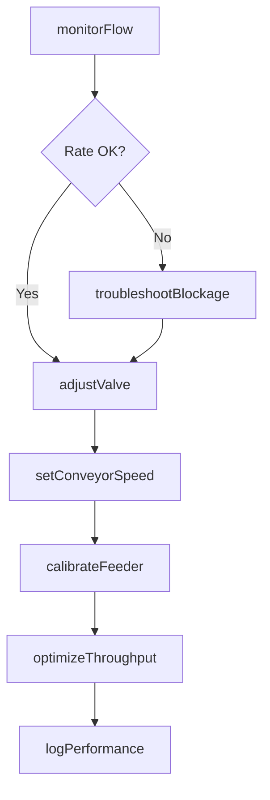
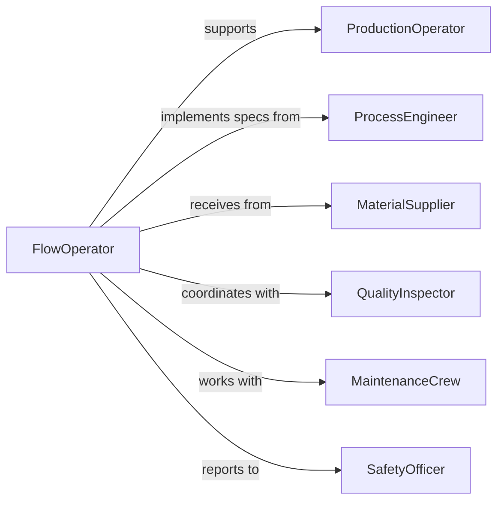

# Adjust Equipment Controls Regulate Flow

> Business-as-Code definition for production material flow regulation. Models the adjustment of valves, pumps, conveyors, and feeders to optimize manufacturing throughput and quality.

## Overview

Production material flow regulation involves monitoring flow rates, adjusting control settings, maintaining consistent delivery, troubleshooting blockages or overflows, and optimizing production efficiency. This definition exposes actions for flow control, rate adjustment, system tuning, and performance monitoring.

## Actors

| Actor | Description |
|-------|-------------|
| ProductionOperator | Manages manufacturing line operation |
| ProcessEngineer | Designs optimal flow parameters |
| MaterialSupplier | Provides raw materials and feedstock |
| QualityInspector | Verifies product consistency and specifications |
| MaintenanceCrew | Services flow control equipment |
| SafetyOfficer | Ensures flow systems meet safety standards |

## Roles

| Role | Description |
|------|-------------|
| FlowOperator | Adjusts controls to regulate material movement |
| LineCoordinator | Synchronizes flow across production stages |
| RateMonitor | Tracks throughput and identifies deviations |
| SystemOptimizer | Tunes parameters for maximum efficiency |

## Entities

| Entity | Description |
|--------|-------------|
| FlowLine | Path through which materials or products move |
| ControlValve | Device regulating material passage |
| Conveyor | Equipment transporting materials between stages |
| Feeder | Mechanism delivering materials at controlled rate |
| FlowSensor | Instrument measuring material volume or velocity |
| ThroughputLog | Record of production flow metrics |

## Actions

| Action | Description |
|--------|-------------|
| monitorFlow | Track material movement rate and consistency |
| adjustValve | Modify control position to change flow |
| setConveyorSpeed | Change material transport velocity |
| calibrateFeeder | Ensure accurate material delivery rate |
| optimizeThroughput | Tune controls for maximum production |
| troubleshootBlockage | Diagnose and clear flow obstructions |
| logPerformance | Record flow system metrics |

## Events

| Event | Description |
|-------|-------------|
| flowMonitored | Material movement has been tracked |
| valveAdjusted | Control position has been modified |
| conveyorSpeedSet | Transport velocity has been changed |
| feederCalibrated | Delivery rate accuracy has been verified |
| throughputOptimized | Controls have been tuned for efficiency |
| blockageTroubleshooted | Flow obstruction has been addressed |
| performanceLogged | Flow metrics have been recorded |

## Searches

| Search | Description |
|--------|-------------|
| findFlowLines | List material paths by product or status |
| getValves | Retrieve control devices by position or calibration |
| getConveyors | Find transport equipment by speed or health |
| getFlowRates | View material movement by line or timeframe |
| getPerformance | Check throughput efficiency metrics |

## Workflow



## Actor Relationships



## Usage

### Calling Actions

```typescript
import { adjustEquipmentControlsRegulateFlow } from '@headlessly/adjust-equipment-controls-regulate-flow'

const flow = adjustEquipmentControlsRegulateFlow()

// Monitor bottling line flow
const rate = await flow.monitorFlow({
  line: 'bottling-line-2',
  sensors: ['inlet-flow', 'filling-rate', 'capping-rate'],
  interval: 'real-time',
  targetRate: 350
})

// Adjust valve to increase material delivery
await flow.adjustValve({
  valveId: 'inlet-valve-2b',
  position: 80,
  reason: 'increase-throughput',
  targetFlowRate: 370
})

// Set conveyor speed to match upstream rate
await flow.setConveyorSpeed({
  conveyorId: 'transfer-conveyor-2',
  speed: 45,
  acceleration: 5,
  reason: 'sync-with-filling-station'
})

// Calibrate feeder for precise dosing
await flow.calibrateFeeder({
  feederId: 'powder-feeder-2a',
  targetRate: 50,
  tolerance: 2,
  material: 'protein-powder'
})

// Optimize throughput
await flow.optimizeThroughput({
  line: 'bottling-line-2',
  objective: 'maximize-rate',
  constraints: { maxSpeed: 400, minQuality: 98 }
})
```

### Event-Driven Automation

```typescript
// Alert when flow rate deviates from target
flow.flowMonitored(async ({ line, actualRate, targetRate }) => {
  const deviation = Math.abs(actualRate - targetRate) / targetRate
  if (deviation > 0.1) {
    await notify({
      to: 'production-supervisor',
      message: `${line} flow rate ${actualRate} deviates ${(deviation * 100).toFixed(1)}% from target`
    })
  }
})

// Auto-adjust valve based on flow rate
flow.flowMonitored(async ({ line, actualRate, targetRate }) => {
  if (Math.abs(actualRate - targetRate) > 20) {
    const delta = targetRate - actualRate
    await flow.adjustValve({
      line,
      adjustmentPercent: delta > 0 ? 5 : -5,
      reason: 'auto-flow-regulation'
    })
  }
})

// Log blockage events for maintenance analysis
flow.blockageTroubleshooted(async ({ line, cause, resolution }) => {
  await flow.logPerformance({
    line,
    metric: 'blockage-incident',
    data: { cause, resolution, timestamp: new Date() }
  })
})
```
