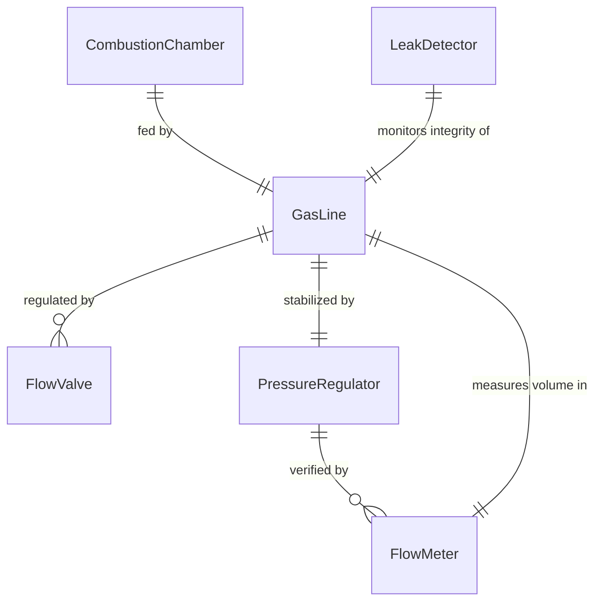
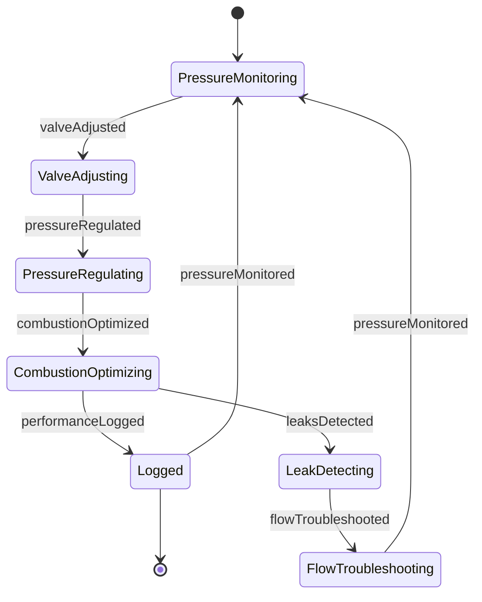
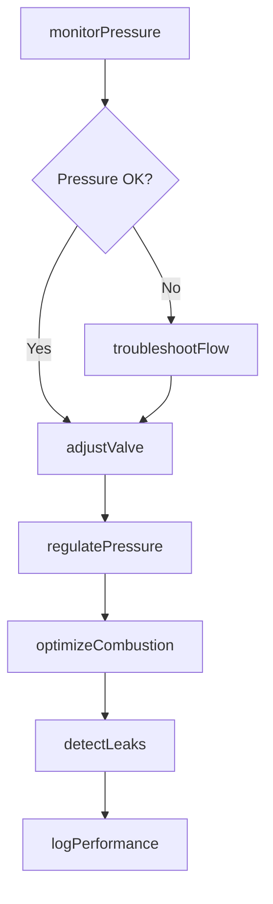
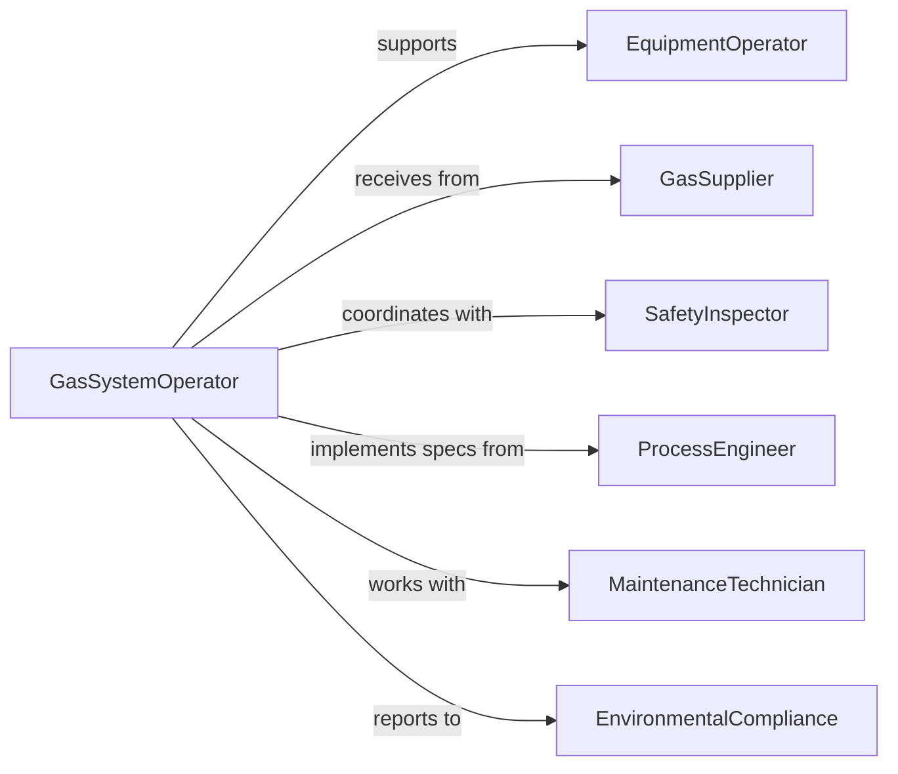

# Adjust Equipment Controls Regulate Gas

> Business-as-Code definition for gas flow regulation. Models the adjustment of controls on industrial furnaces, chemical reactors, HVAC systems, and welding equipment to optimize gas delivery and combustion.

## Overview

Gas flow regulation involves monitoring pressure and flow rates, adjusting valve positions, maintaining proper air-fuel ratios, ensuring combustion efficiency, troubleshooting leaks or pressure issues, and complying with safety protocols. This definition exposes actions for flow control, pressure management, combustion optimization, and safety monitoring.

## Actors

| Actor | Description |
|-------|-------------|
| EquipmentOperator | Manages gas-powered machinery or processes |
| GasSupplier | Provides natural gas, propane, or specialty gases |
| SafetyInspector | Monitors gas system compliance and leak detection |
| ProcessEngineer | Designs optimal gas flow and combustion parameters |
| MaintenanceTechnician | Services gas control equipment and valves |
| EnvironmentalCompliance | Monitors emissions and air quality |

## Roles

| Role | Description |
|------|-------------|
| GasSystemOperator | Adjusts controls for optimal flow and combustion |
| PressureMonitor | Tracks gas pressure and flow consistency |
| CombustionTechnician | Optimizes air-fuel ratios and efficiency |
| SafetyCoordinator | Ensures leak detection and emergency protocols |

## Entities

| Entity | Description |
|--------|-------------|
| GasLine | Pipeline delivering fuel or process gas |
| FlowValve | Control device regulating gas passage |
| PressureRegulator | Equipment maintaining consistent gas pressure |
| FlowMeter | Instrument measuring gas volume rate |
| CombustionChamber | Enclosure where gas is burned |
| LeakDetector | Sensor identifying gas escapes |

## Actions

| Action | Description |
|--------|-------------|
| monitorPressure | Track gas pressure and flow rate |
| adjustValve | Modify control position to change gas delivery |
| regulatePressure | Maintain consistent gas supply pressure |
| optimizeCombustion | Tune air-fuel ratio for efficiency |
| detectLeaks | Monitor system for gas escapes |
| troubleshootFlow | Diagnose and resolve gas delivery issues |
| logPerformance | Record gas system metrics |

## Events

| Event | Description |
|-------|-------------|
| pressureMonitored | Gas pressure has been tracked |
| valveAdjusted | Control position has been modified |
| pressureRegulated | Supply pressure has been maintained |
| combustionOptimized | Air-fuel ratio has been tuned |
| leaksDetected | Gas escape has been identified |
| flowTroubleshooted | Delivery issue has been diagnosed |
| performanceLogged | Gas system metrics have been recorded |

## Searches

| Search | Description |
|--------|-------------|
| findGasLines | List pipelines by gas type or location |
| getValves | Retrieve control devices by position or calibration |
| getPressures | View gas pressure by line or timeframe |
| getFlowRates | Check gas volume by meter or period |
| getLeaks | Find detected escapes by location or severity |

## Entity Relationships




## State Diagram



## Workflow



## Actor Relationships



## Usage

### Calling Actions

```typescript
import { adjustEquipmentControlsRegulateGas } from '@headlessly/adjust-equipment-controls-regulate-gas'

const gas = adjustEquipmentControlsRegulateGas()

// Monitor industrial furnace gas pressure
const pressure = await gas.monitorPressure({
  equipment: 'heat-treat-furnace-3',
  sensors: ['inlet-pressure', 'burner-pressure', 'flow-rate'],
  interval: 'continuous',
  targetPressure: 15
})

// Adjust valve to increase gas flow
await gas.adjustValve({
  valveId: 'gas-valve-3a',
  position: 65,
  reason: 'ramp-temperature',
  targetFlowRate: 1200
})

// Regulate pressure for consistent combustion
await gas.regulatePressure({
  regulatorId: 'pressure-reg-3',
  targetPressure: 15,
  tolerance: 0.5,
  gasType: 'natural-gas'
})

// Optimize air-fuel ratio
await gas.optimizeCombustion({
  equipment: 'heat-treat-furnace-3',
  targetRatio: 10.5,
  oxygenTarget: 2.5,
  objective: 'maximize-efficiency'
})

// Detect leaks
await gas.detectLeaks({
  area: 'furnace-3-gas-train',
  sensitivity: 'high',
  threshold: 100,
  gasType: 'natural-gas'
})
```

### Event-Driven Automation

```typescript
// Alert when pressure exceeds safe limits
gas.pressureMonitored(async ({ equipment, pressure, maxPressure }) => {
  if (pressure > maxPressure) {
    await gas.adjustValve({
      equipment,
      position: 0,
      reason: 'emergency-shutoff'
    })
    await notify({
      to: ['equipment-operator', 'safety-inspector'],
      priority: 'critical',
      message: `${equipment} pressure ${pressure} PSI exceeds safe limit ${maxPressure} PSI`
    })
  }
})

// Immediately respond to leak detection
gas.leaksDetected(async ({ location, concentration, severity }) => {
  if (severity === 'high') {
    await gas.adjustValve({
      location,
      position: 0,
      reason: 'leak-detected-emergency-shutoff'
    })
    await notify({
      to: ['safety-coordinator', 'emergency-response'],
      priority: 'urgent',
      message: `Gas leak detected at ${location} - ${concentration} PPM`
    })
  }
})

// Auto-adjust combustion based on oxygen levels
gas.combustionOptimized(async ({ equipment, oxygenLevel, targetOxygen }) => {
  const delta = oxygenLevel - targetOxygen
  if (Math.abs(delta) > 0.5) {
    await gas.adjustValve({
      equipment,
      adjustmentPercent: delta > 0 ? -2 : 2,
      reason: 'auto-combustion-tuning'
    })
  }
})
```
