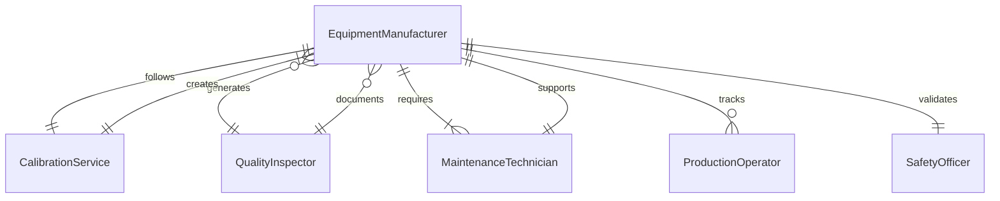
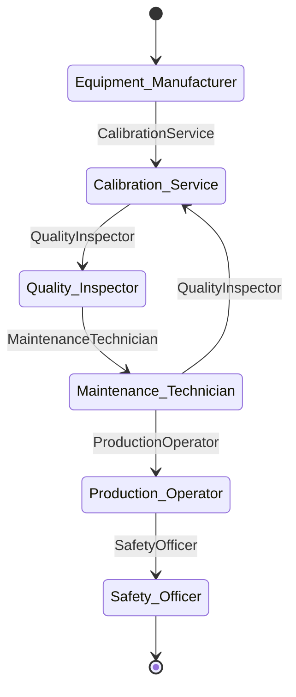
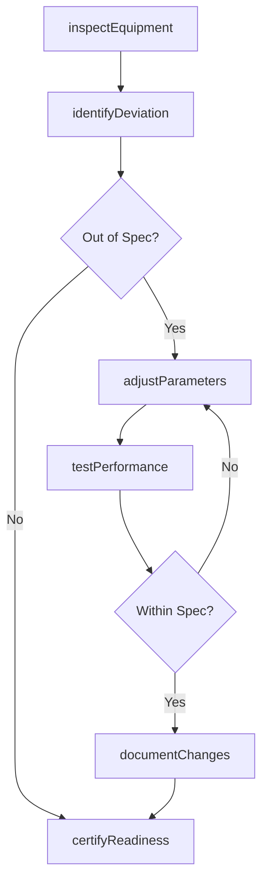
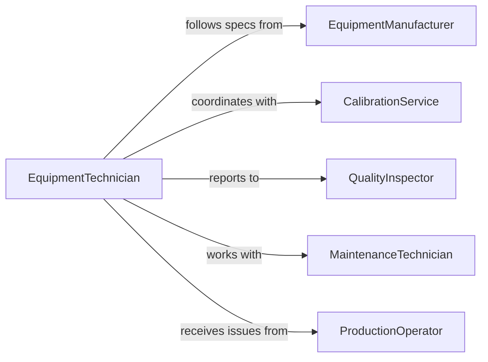

# Adjust Equipment Ensure Optimal Performance

> Business-as-Code definition for equipment calibration and performance optimization. Models inspection, adjustment, testing, and documentation of machinery and tools.

## Overview

Equipment performance adjustment involves inspecting machinery, identifying performance deviations, making calibrations, testing results, and documenting changes to ensure equipment operates within specifications. This definition provides actions for performance assessment, parameter adjustment, validation testing, and maintenance logging.

## Actors

| Actor | Description |
|-------|-------------|
| EquipmentManufacturer | Original producer providing specifications and support |
| CalibrationService | Specialized vendor performing precision adjustments |
| QualityInspector | Auditor verifying equipment meets performance standards |
| MaintenanceTechnician | Internal staff performing adjustments and repairs |
| ProductionOperator | Worker using equipment and reporting issues |
| SafetyOfficer | Official ensuring equipment meets safety requirements |

## Roles

| Role | Description |
|------|-------------|
| EquipmentTechnician | Specialist performing calibrations and adjustments |
| MaintenanceSupervisor | Oversees equipment optimization activities |
| QualityEngineer | Validates equipment performance meets specifications |
| OperationsManager | Approves downtime for equipment adjustments |

## Entities

| Entity | Description |
|--------|-------------|
| Equipment | Machinery, tools, or instruments requiring adjustment |
| PerformanceMetric | Measurable parameter indicating equipment effectiveness |
| Adjustment | Change made to equipment settings or configuration |
| CalibrationRecord | Documentation of adjustments and verification |
| PerformanceTest | Validation that equipment meets specifications |
| MaintenanceLog | Historical record of equipment modifications |

## Actions

| Action | Description |
|--------|-------------|
| inspectEquipment | Assess current performance against specifications |
| identifyDeviation | Determine parameters outside acceptable ranges |
| adjustParameters | Modify settings or configuration to improve performance |
| testPerformance | Validate equipment operates within specifications |
| documentChanges | Record adjustments made and results achieved |
| certifyReadiness | Approve equipment for return to production |

## Events

| Event | Description |
|-------|-------------|
| equipmentInspected | Performance assessment completed |
| deviationIdentified | Out-of-spec condition detected |
| parametersAdjusted | Equipment settings modified |
| performanceTested | Validation testing completed |
| changesDocumented | Adjustment records created |
| readinessCertified | Equipment approved for use |

## Searches

| Search | Description |
|--------|-------------|
| findEquipment | List machinery by type, location, or status |
| getMetrics | Retrieve performance data by equipment or parameter |
| getAdjustments | Find calibration records by equipment or date |
| getLogs | Retrieve maintenance history for equipment |

## Entity Relationships




## State Diagram



## Workflow



## Actor Relationships



## Usage

### Calling Actions

```typescript
import { adjustEquipmentEnsureOptimalPerformance } from '@headlessly/adjust-equipment-ensure-optimal-performance'

const equipment = adjustEquipmentEnsureOptimalPerformance()

// Inspect equipment performance
const inspection = await equipment.inspectEquipment({
  equipmentId: 'CNC-MILL-05',
  parameters: ['spindle-speed', 'positioning-accuracy', 'tool-offset'],
  inspector: 'tech-smith'
})

// Identify performance deviations
const deviations = await equipment.identifyDeviation({
  inspectionId: inspection.id,
  tolerances: {
    'spindle-speed': { target: 12000, variance: 100 },
    'positioning-accuracy': { target: 0.001, variance: 0.0002 }
  }
})

// Adjust parameters to correct deviations
if (deviations.length > 0) {
  await equipment.adjustParameters({
    equipmentId: 'CNC-MILL-05',
    adjustments: [
      { parameter: 'spindle-speed', from: 12150, to: 12000 },
      { parameter: 'positioning-accuracy', from: 0.0015, to: 0.001 }
    ]
  })

  // Test after adjustment
  const testResult = await equipment.testPerformance({
    equipmentId: 'CNC-MILL-05',
    parameters: ['spindle-speed', 'positioning-accuracy']
  })
}
```

### Event-Driven Automation

```typescript
// Alert when deviation exceeds critical threshold
equipment.deviationIdentified(async ({ equipmentId, deviation }) => {
  if (deviation.severity === 'Critical') {
    await notify({
      to: 'maintenance-supervisor',
      urgency: 'immediate',
      message: `Critical deviation on ${equipmentId}: ${deviation.parameter}`
    })
  }
})

// Automatically certify equipment when all tests pass
equipment.performanceTested(async ({ equipmentId, results }) => {
  if (results.allPassing) {
    await equipment.documentChanges({ equipmentId })
    await equipment.certifyReadiness({ equipmentId })
  }
})
```
