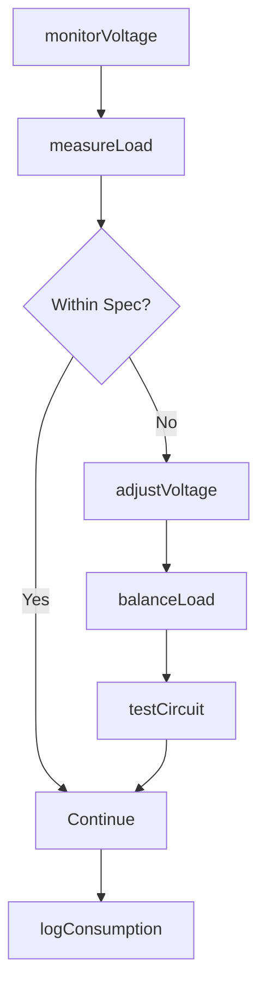
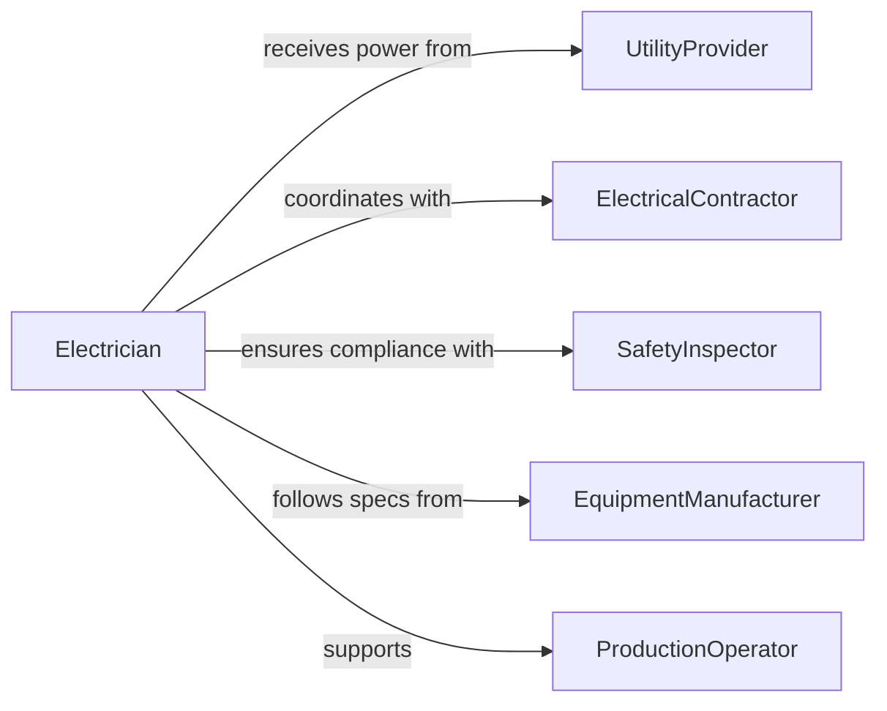

# Adjust Flow Electricity Tools Production

> Business-as-Code definition for electrical power management in production environments. Models voltage regulation, load balancing, circuit protection, and power optimization for tools and equipment.

## Overview

Adjusting electrical flow to production equipment involves monitoring voltage and current, regulating power distribution, protecting circuits from overload, and optimizing energy consumption. This definition provides actions for power monitoring, circuit adjustment, load management, and safety compliance.

## Actors

| Actor | Description |
|-------|-------------|
| UtilityProvider | Power company supplying electricity to facility |
| ElectricalContractor | Licensed vendor installing or modifying electrical systems |
| SafetyInspector | Regulatory official verifying electrical code compliance |
| EquipmentManufacturer | Vendor specifying power requirements for machinery |
| MaintenanceTeam | Internal staff performing electrical adjustments |
| ProductionOperator | Worker operating powered equipment |

## Roles

| Role | Description |
|------|-------------|
| Electrician | Licensed professional adjusting electrical systems |
| PowerSystemsEngineer | Specialist optimizing facility electrical distribution |
| SafetyCoordinator | Ensures electrical work meets safety standards |
| FacilityManager | Oversees building power infrastructure |

## Entities

| Entity | Description |
|--------|-------------|
| PowerCircuit | Electrical pathway supplying tools or equipment |
| VoltageReading | Measured electrical potential at a point in time |
| CurrentLoad | Amperage drawn by equipment from circuit |
| CircuitBreaker | Protective device preventing electrical overload |
| PowerAdjustment | Change to voltage, current, or circuit configuration |
| EnergyConsumption | Record of electrical usage by equipment or facility |

## Actions

| Action | Description |
|--------|-------------|
| monitorVoltage | Measure electrical potential at equipment or circuit |
| measureLoad | Assess current draw from tools or machinery |
| adjustVoltage | Modify electrical potential to equipment specifications |
| balanceLoad | Distribute electrical demand across circuits |
| testCircuit | Verify proper electrical flow and protection |
| logConsumption | Record energy usage for equipment or facility |

## Events

| Event | Description |
|-------|-------------|
| voltageMonitored | Electrical potential measured |
| loadMeasured | Current draw assessed |
| voltageAdjusted | Electrical potential modified |
| loadBalanced | Circuit demand distributed |
| circuitTested | Electrical safety verified |
| consumptionLogged | Energy usage recorded |

## Searches

| Search | Description |
|--------|-------------|
| findCircuits | List power pathways by location, load, or status |
| getReadings | Retrieve voltage or current measurements |
| getAdjustments | Find electrical modifications by equipment or date |
| getConsumption | Retrieve energy usage by equipment or period |

## Workflow



## Actor Relationships



## Usage

### Calling Actions

```typescript
import { adjustFlowElectricityToolsProduction } from '@headlessly/adjust-flow-electricity-tools-production'

const electrical = adjustFlowElectricityToolsProduction()

// Monitor voltage at production equipment
const voltage = await electrical.monitorVoltage({
  equipmentId: 'WELDER-03',
  circuitId: 'CIRCUIT-B12',
  targetVoltage: 480,
  tolerance: 5
})

// Measure current load
const load = await electrical.measureLoad({
  circuitId: 'CIRCUIT-B12',
  equipmentIds: ['WELDER-03', 'GRINDER-08'],
  maxCapacity: 200
})

// Adjust voltage if out of spec
if (voltage.deviation > voltage.tolerance) {
  await electrical.adjustVoltage({
    circuitId: 'CIRCUIT-B12',
    targetVoltage: 480,
    currentVoltage: voltage.measured
  })
}

// Balance load across circuits if overloaded
if (load.percentage > 85) {
  await electrical.balanceLoad({
    sourceCircuit: 'CIRCUIT-B12',
    targetCircuit: 'CIRCUIT-B13',
    equipmentToMove: ['GRINDER-08']
  })
}
```

### Event-Driven Automation

```typescript
// Alert when voltage deviation exceeds tolerance
electrical.voltageMonitored(async ({ equipmentId, deviation }) => {
  if (Math.abs(deviation) > 10) {
    await notify({
      to: 'electrician-on-duty',
      urgency: 'high',
      message: `Voltage deviation ${deviation}V on ${equipmentId}`
    })
  }
})

// Auto-balance load when circuit approaches capacity
electrical.loadMeasured(async ({ circuitId, percentage }) => {
  if (percentage > 90) {
    await electrical.balanceLoad({
      sourceCircuit: circuitId,
      strategy: 'auto-redistribute'
    })
  }
})
```
