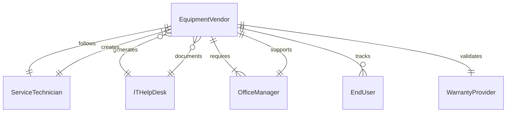
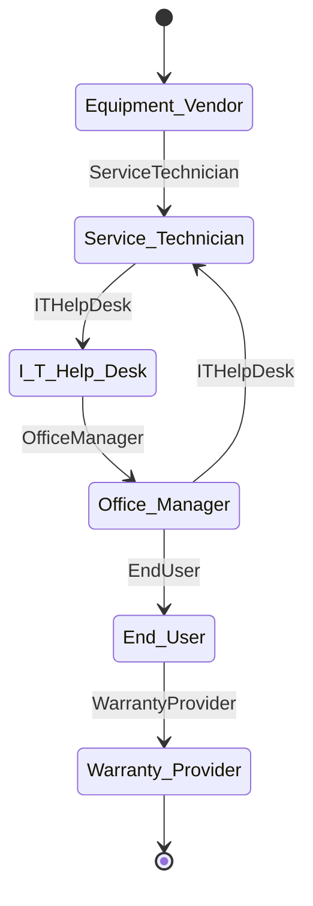
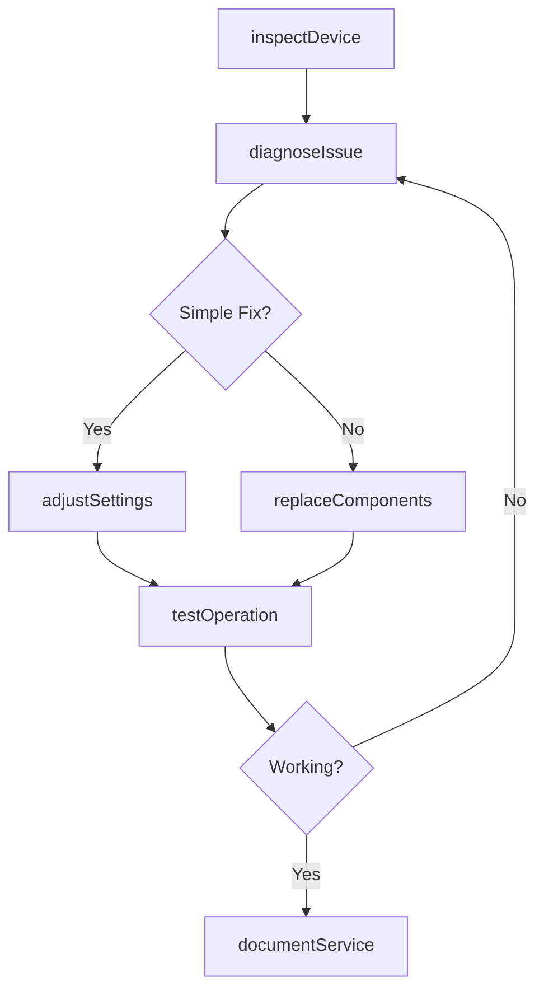
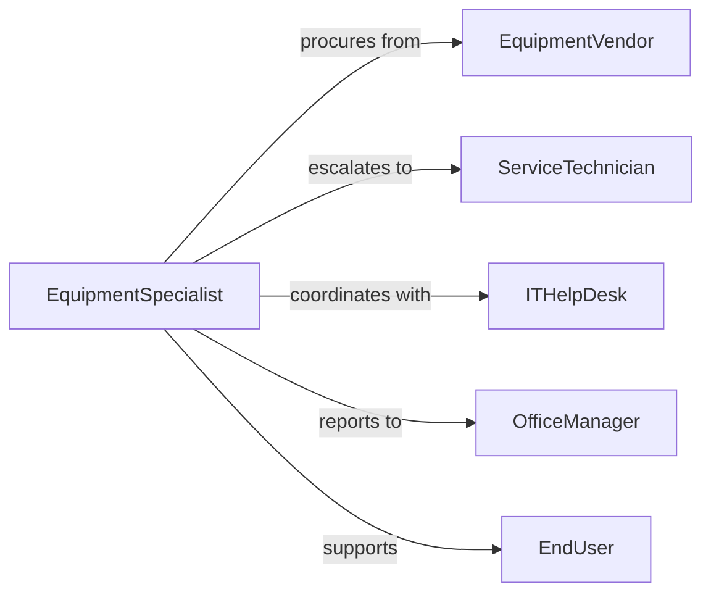

# Adjust Office Equipment Ensure Proper

> Business-as-Code definition for office equipment configuration and maintenance. Models setup, troubleshooting, adjustment, and optimization of workplace technology and devices.

## Overview

Office equipment adjustment involves configuring printers, copiers, computers, and other workplace devices to ensure proper operation, diagnosing issues, making corrections, and documenting changes. This definition provides actions for equipment inspection, troubleshooting, configuration adjustment, and maintenance logging.

## Actors

| Actor | Description |
|-------|-------------|
| EquipmentVendor | Manufacturer or supplier of office devices |
| ServiceTechnician | External specialist providing repair and maintenance |
| ITHelpDesk | Internal support team handling technology issues |
| OfficeManager | Administrator responsible for workplace equipment |
| EndUser | Employee using office equipment for daily work |
| WarrantyProvider | Company covering repair or replacement costs |

## Roles

| Role | Description |
|------|-------------|
| EquipmentSpecialist | Technician configuring and maintaining office devices |
| ITSupport | Staff providing technical assistance for equipment issues |
| FacilitiesCoordinator | Manages physical setup and placement of equipment |
| Trainer | Educates users on proper equipment operation |

## Entities

| Entity | Description |
|--------|-------------|
| OfficeEquipment | Printers, copiers, scanners, or other workplace devices |
| EquipmentSettings | Configuration parameters for device operation |
| MaintenanceTask | Scheduled or reactive work on equipment |
| SupportTicket | User-reported issue requiring resolution |
| ConfigurationChange | Modification to equipment settings or setup |
| ServiceRecord | Documentation of maintenance or repair activities |

## Actions

| Action | Description |
|--------|-------------|
| inspectDevice | Check equipment functionality and identify issues |
| diagnoseIssue | Determine root cause of equipment malfunction |
| adjustSettings | Modify configuration to resolve problems or optimize performance |
| testOperation | Verify equipment functions properly after adjustment |
| replaceComponents | Swap parts to restore equipment functionality |
| documentService | Record maintenance activities and outcomes |

## Events

| Event | Description |
|-------|-------------|
| deviceInspected | Equipment functionality assessed |
| issueDiagnosed | Problem root cause identified |
| settingsAdjusted | Configuration modified |
| operationTested | Equipment functionality verified |
| componentsReplaced | Parts swapped to restore operation |
| serviceDocumented | Maintenance record created |

## Searches

| Search | Description |
|--------|-------------|
| findEquipment | List office devices by type, location, or status |
| getTickets | Retrieve support requests by user, device, or severity |
| getSettings | Find configuration parameters for equipment |
| getRecords | Retrieve maintenance history for devices |
## Entity Relationships




## State Diagram




## Workflow



## Actor Relationships



## Usage

### Calling Actions

```typescript
import { adjustOfficeEquipmentEnsureProper } from '@headlessly/adjust-office-equipment-ensure-proper'

const office = adjustOfficeEquipmentEnsureProper()

// Inspect reported equipment issue
const inspection = await office.inspectDevice({
  equipmentId: 'PRINTER-3RDFLOOR-02',
  ticketId: 'TICKET-20260215-034',
  symptoms: ['Paper jams frequently', 'Print quality poor']
})

// Diagnose the problem
const diagnosis = await office.diagnoseIssue({
  inspectionId: inspection.id,
  tests: ['paper-feed', 'roller-condition', 'toner-level', 'fuser-temperature']
})

// Adjust settings to resolve issue
if (diagnosis.issue === 'incorrect-paper-settings') {
  await office.adjustSettings({
    equipmentId: 'PRINTER-3RDFLOOR-02',
    settings: {
      paperWeight: 'heavy',
      fuserTemperature: 'high',
      rollerPressure: 'increased'
    }
  })
}

// Test after adjustment
const test = await office.testOperation({
  equipmentId: 'PRINTER-3RDFLOOR-02',
  testPrint: true
})
```

### Event-Driven Automation

```typescript
// Notify user when issue is diagnosed
office.issueDiagnosed(async ({ ticketId, diagnosis }) => {
  const ticket = await getTicket({ ticketId })
  await notify({
    to: ticket.userId,
    message: `Your equipment issue has been diagnosed: ${diagnosis.description}`
  })
})

// Auto-schedule preventive maintenance after service
office.serviceDocumented(async ({ equipmentId, serviceType }) => {
  if (serviceType === 'Repair') {
    await scheduleMaintenanceTask({
      equipmentId,
      type: 'Preventive Inspection',
      dueDate: add30Days(new Date())
    })
  }
})
```
