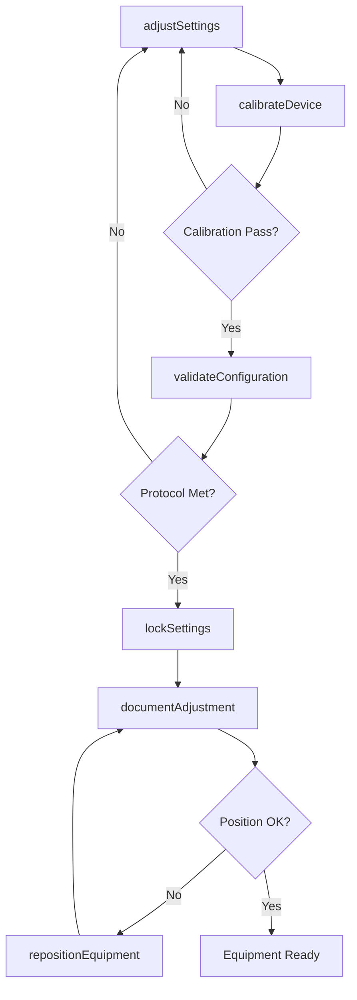
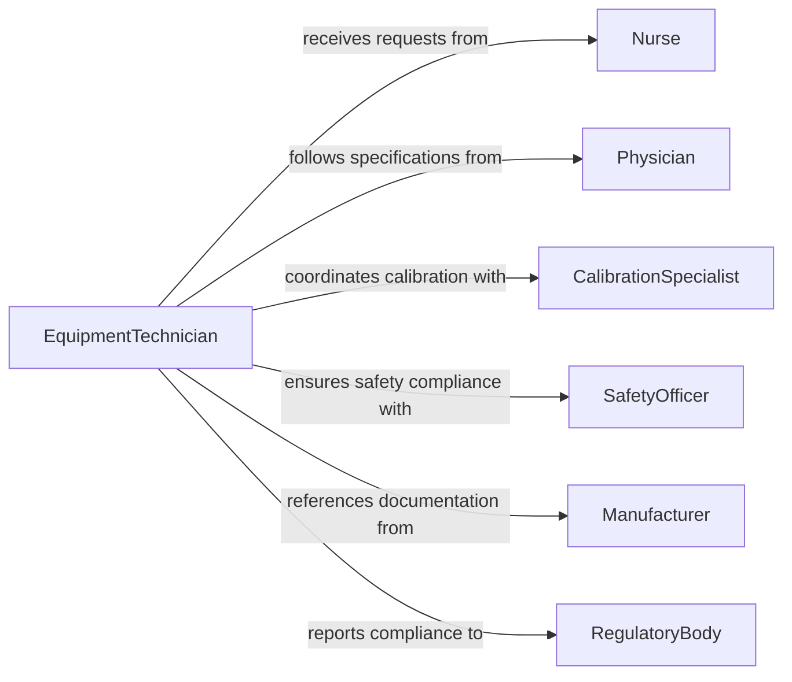

# Adjust Settings Positions Medical Equipment

> Business-as-Code definition for medical equipment adjustment and configuration. Models the complete lifecycle of equipment setup, calibration, and position optimization for clinical use.

## Overview

Medical equipment adjustment involves configuring device settings and positioning equipment to ensure optimal performance for patient care. This definition exposes actions for equipment configuration, calibration verification, and position adjustment, along with events for compliance tracking and automated alerts.

## Actors

| Actor | Description |
|-------|-------------|
| ClinicalEngineer | Maintains and calibrates medical equipment across facility |
| Nurse | Adjusts equipment settings during patient care delivery |
| Physician | Specifies required equipment configurations for procedures |
| Patient | Receives care facilitated by properly adjusted equipment |
| Manufacturer | Provides equipment specifications and support documentation |
| RegulatoryBody | Enforces medical device compliance standards |

## Roles

| Role | Description |
|------|-------------|
| EquipmentTechnician | Performs routine adjustments and preventive maintenance |
| CalibrationSpecialist | Verifies equipment accuracy against standards |
| ClinicalUser | Operates equipment during patient care |
| SafetyOfficer | Ensures equipment meets safety protocols |

## Entities

| Entity | Description |
|--------|-------------|
| MedicalDevice | Any diagnostic or therapeutic medical equipment unit |
| Configuration | Set of parameters defining equipment operation |
| PositionRecord | Documentation of equipment placement and orientation |
| CalibrationLog | History of calibration checks and adjustments |
| AdjustmentRequest | Request to modify equipment settings or position |
| SafetyProtocol | Guidelines for equipment setup and use |

## Actions

| Action | Description |
|--------|-------------|
| adjustSettings | Modify equipment operational parameters |
| repositionEquipment | Change physical placement or orientation of device |
| calibrateDevice | Verify and adjust equipment accuracy |
| validateConfiguration | Confirm settings meet protocol requirements |
| lockSettings | Secure configuration to prevent unauthorized changes |
| resetToDefaults | Restore equipment to factory settings |
| documentAdjustment | Record changes made to equipment setup |

## Events

| Event | Description |
|-------|-------------|
| settingsAdjusted | Equipment parameters have been modified |
| equipmentRepositioned | Device physical position has changed |
| deviceCalibrated | Calibration check completed with results |
| configurationValidated | Settings verified against protocols |
| settingsLocked | Configuration secured from further changes |
| adjustmentDocumented | Changes formally recorded in system |
| calibrationDue | Equipment requires scheduled calibration |

## Searches

| Search | Description |
|--------|-------------|
| findDevices | List medical equipment by type, location, or status |
| getConfigurations | Retrieve current settings for specific equipment |
| getCalibrationHistory | View calibration records for compliance |
| findAdjustmentRequests | List pending or completed adjustment requests |
| getMaintenanceSchedule | Retrieve upcoming calibration and service dates |

## Workflow



## Actor Relationships



## Usage

### Calling Actions

```typescript
import { adjustSettingsPositionsMedicalEquipment } from '@headlessly/adjust-settings-positions-medical-equipment'

const equipment = adjustSettingsPositionsMedicalEquipment()

// Adjust ventilator settings for new patient
await equipment.adjustSettings({
  deviceId: 'VENT-4029',
  settings: {
    tidalVolume: 450,
    respiratoryRate: 16,
    peep: 5,
    fio2: 40
  },
  adjustedBy: 'respiratory-therapist-001',
  reason: 'New patient admission'
})

// Reposition imaging equipment for procedure
await equipment.repositionEquipment({
  deviceId: 'XRAY-202',
  position: {
    height: 180,
    angle: 45,
    distance: 100
  },
  location: 'OR-3',
  positionedBy: 'rad-tech-008'
})

// Validate configuration meets protocol
const validation = await equipment.validateConfiguration({
  deviceId: 'VENT-4029',
  protocol: 'ARDS-LungProtective'
})
```

### Event-Driven Automation

```typescript
// Alert when calibration due
equipment.calibrationDue(async ({ deviceId, lastCalibration, dueDate }) => {
  await notify({
    to: 'biomedical-engineering',
    message: `Device ${deviceId} calibration due ${dueDate}`,
    priority: 'high'
  })
})

// Log all settings adjustments for compliance
equipment.settingsAdjusted(async ({ deviceId, settings, adjustedBy }) => {
  await auditLog.record({
    event: 'equipment-adjustment',
    device: deviceId,
    changes: settings,
    user: adjustedBy,
    timestamp: new Date()
  })
})
```
