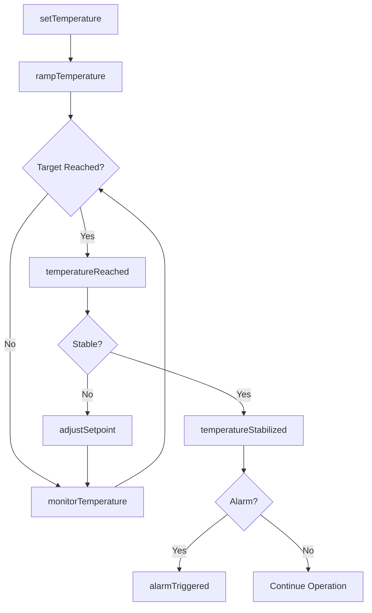
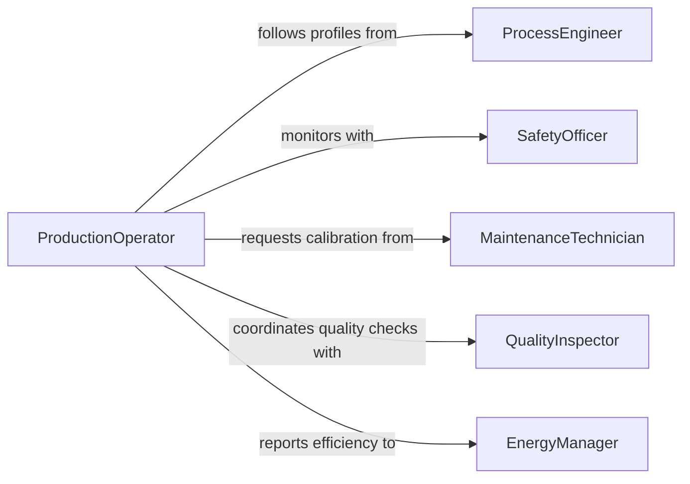

# Adjust Temperature Controls Ovens Heating

> Business-as-Code definition for thermal equipment control and temperature management. Models the complete process of configuring, monitoring, and adjusting heating systems for industrial and commercial applications.

## Overview

Temperature control adjustment involves setting and maintaining precise thermal conditions for ovens, furnaces, kilns, and other heating equipment. This definition exposes actions for temperature programming, real-time adjustment, and safety monitoring to ensure optimal heating performance across manufacturing and food service operations.

## Actors

| Actor | Description |
|-------|-------------|
| ProductionOperator | Operates heating equipment during manufacturing processes |
| MaintenanceTechnician | Services and calibrates temperature control systems |
| QualityInspector | Verifies temperature accuracy for product specifications |
| ProcessEngineer | Defines temperature profiles for specific operations |
| EnergyManager | Monitors energy consumption and efficiency |
| SafetyOfficer | Ensures thermal equipment meets safety standards |

## Roles

| Role | Description |
|------|-------------|
| EquipmentOperator | Adjusts controls during production runs |
| Calibrator | Verifies and adjusts temperature sensor accuracy |
| ProcessController | Programs complex temperature profiles |
| SafetyMonitor | Watches for hazardous temperature conditions |

## Entities

| Entity | Description |
|--------|-------------|
| HeatingEquipment | Oven, furnace, kiln, or other thermal device |
| TemperatureProfile | Programmed sequence of temperature setpoints over time |
| TemperatureReading | Current or historical temperature measurement |
| ControlParameter | Settings governing heating rate, hold time, and limits |
| AlarmThreshold | Temperature limits that trigger safety alerts |
| CalibrationRecord | Documentation of temperature sensor accuracy checks |

## Actions

| Action | Description |
|--------|-------------|
| setTemperature | Configure target temperature for heating equipment |
| adjustSetpoint | Modify temperature target during operation |
| programProfile | Create multi-step temperature sequence |
| monitorTemperature | Track current temperature and deviation from target |
| calibrateSensor | Verify and adjust temperature measurement accuracy |
| setAlarms | Configure high and low temperature alert thresholds |
| rampTemperature | Gradually increase or decrease temperature at controlled rate |

## Events

| Event | Description |
|-------|-------------|
| temperatureSet | Target temperature has been configured |
| setpointAdjusted | Temperature target modified during operation |
| profileProgrammed | Multi-step temperature sequence created |
| temperatureReached | Equipment has achieved target temperature |
| alarmTriggered | Temperature exceeded safe operating limits |
| sensorCalibrated | Temperature sensor accuracy verified and adjusted |
| temperatureStabilized | Temperature maintained within tolerance range |

## Searches

| Search | Description |
|--------|-------------|
| findEquipment | List heating equipment by type, location, or status |
| getTemperatureHistory | Retrieve historical temperature data for analysis |
| getActiveProfiles | List currently running temperature programs |
| getAlarms | Find active or historical temperature alarm events |
| getCalibrationSchedule | Retrieve upcoming sensor calibration dates |

## Workflow



## Actor Relationships



## Usage

### Calling Actions

```typescript
import { adjustTemperatureControlsOvensHeating } from '@headlessly/adjust-temperature-controls-ovens-heating'

const thermal = adjustTemperatureControlsOvensHeating()

// Set target temperature for industrial oven
await thermal.setTemperature({
  equipmentId: 'OVEN-301',
  targetTemp: 350,
  units: 'celsius',
  setBy: 'operator-042'
})

// Program multi-step heat treatment profile
await thermal.programProfile({
  equipmentId: 'FURNACE-12',
  profile: [
    { step: 1, temp: 200, rampRate: 5, holdTime: 60 },
    { step: 2, temp: 450, rampRate: 3, holdTime: 120 },
    { step: 3, temp: 100, rampRate: -2, holdTime: 30 }
  ],
  programmedBy: 'process-engineer-008'
})

// Configure safety alarm thresholds
await thermal.setAlarms({
  equipmentId: 'KILN-7',
  highLimit: 800,
  lowLimit: 150,
  tolerance: 10
})
```

### Event-Driven Automation

```typescript
// Alert on temperature alarm
thermal.alarmTriggered(async ({ equipmentId, currentTemp, threshold, type }) => {
  await notify({
    to: 'production-supervisors',
    message: `${type} alarm on ${equipmentId}: ${currentTemp}°C`,
    priority: 'critical'
  })

  // Trigger safety shutdown if needed
  if (currentTemp > 900) {
    await thermal.setTemperature({ equipmentId, targetTemp: 0 })
  }
})

// Log temperature stabilization for quality records
thermal.temperatureStabilized(async ({ equipmentId, targetTemp, actualTemp }) => {
  await qualityLog.record({
    equipment: equipmentId,
    event: 'temperature-stable',
    target: targetTemp,
    actual: actualTemp,
    timestamp: new Date()
  })
})
```
