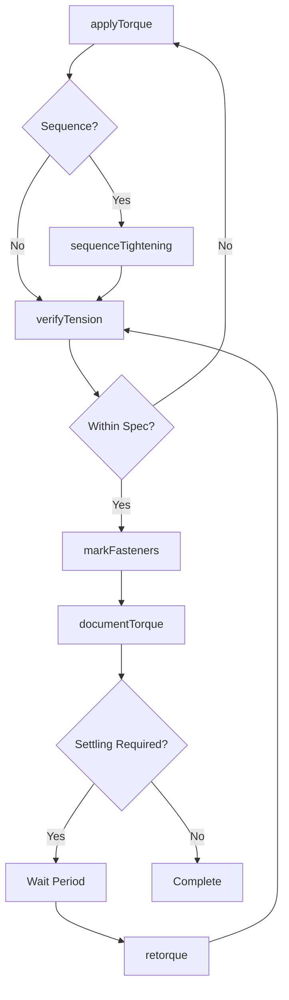
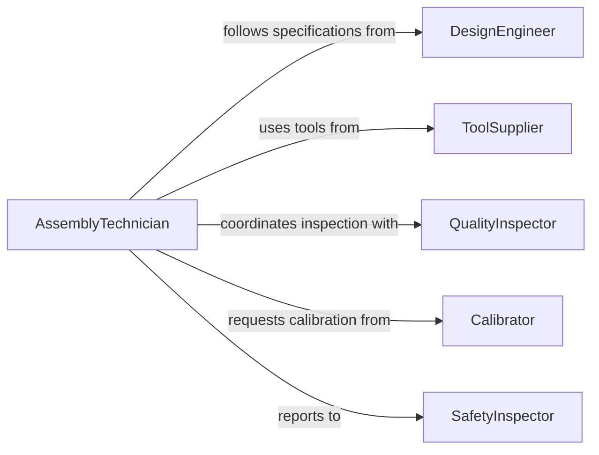

# Adjust Tension Nuts Bolts

> Business-as-Code definition for fastener tensioning and torque management. Models the complete process of setting, verifying, and maintaining proper bolt tension for structural integrity and equipment reliability.

## Overview

Bolt tension adjustment involves applying precise torque to threaded fasteners to achieve specified clamping force and prevent loosening or failure. This definition exposes actions for torque application, tension verification, and maintenance tracking to ensure safe and reliable mechanical assemblies across industrial applications.

## Actors

| Actor | Description |
|-------|-------------|
| AssemblyTechnician | Installs and torques fasteners during assembly |
| MaintenanceWorker | Inspects and retorques bolts during service |
| QualityInspector | Verifies torque values meet specifications |
| DesignEngineer | Specifies required torque and tension values |
| ToolSupplier | Provides calibrated torque wrenches and tools |
| SafetyInspector | Verifies critical joint integrity |

## Roles

| Role | Description |
|------|-------------|
| Torquer | Applies specified torque to fasteners |
| Inspector | Verifies torque accuracy and joint integrity |
| Calibrator | Maintains and calibrates torque tools |
| DocumentationClerk | Records torque values for compliance |

## Entities

| Entity | Description |
|--------|-------------|
| Fastener | Bolt, nut, or threaded component |
| TorqueSpecification | Required torque value and tolerance for joint |
| TensionReading | Measured clamping force or torque value |
| TorqueSequence | Order in which fasteners must be tightened |
| CalibrationCertificate | Documentation of torque tool accuracy |
| JointRecord | History of torque applications for specific assembly |

## Actions

| Action | Description |
|--------|-------------|
| applyTorque | Tighten fastener to specified torque value |
| verifyTension | Measure and confirm proper clamping force |
| retorque | Re-tighten fasteners after initial settling |
| sequenceTightening | Apply torque in specified pattern and order |
| markFasteners | Apply indicator to show torque completion |
| calibrateTool | Verify and adjust torque wrench accuracy |
| documentTorque | Record torque values for compliance |

## Events

| Event | Description |
|-------|-------------|
| torqueApplied | Fastener tightened to specified value |
| tensionVerified | Clamping force confirmed within tolerance |
| retorqueCompleted | Fasteners re-tightened after settling period |
| sequenceCompleted | All fasteners in pattern torqued correctly |
| fastenerMarked | Indicator applied to show completion |
| toolCalibrated | Torque wrench accuracy verified |
| torqueDocumented | Values recorded in compliance system |

## Searches

| Search | Description |
|--------|-------------|
| findFasteners | List bolts by assembly, location, or status |
| getTorqueSpecs | Retrieve required torque values for joint type |
| getTorqueHistory | View historical torque records for assembly |
| getCalibrationStatus | Check torque tool calibration validity |
| findRetorqueSchedule | List assemblies due for retorque inspection |

## Workflow



## Actor Relationships



## Usage

### Calling Actions

```typescript
import { adjustTensionNutsBolts } from '@headlessly/adjust-tension-nuts-bolts'

const fasteners = adjustTensionNutsBolts()

// Apply torque to critical flange bolts
await fasteners.applyTorque({
  assemblytId: 'FLANGE-8840',
  fastenerId: 'BOLT-12',
  torqueValue: 150,
  units: 'ft-lbs',
  toolId: 'WRENCH-0045',
  appliedBy: 'tech-029'
})

// Sequence tightening for cylinder head
await fasteners.sequenceTightening({
  assemblyId: 'ENGINE-HEAD-442',
  sequence: [1, 3, 5, 7, 2, 4, 6, 8],
  torqueValue: 80,
  passes: 3,
  incrementPerPass: [40, 70, 80]
})

// Verify tension with ultrasonic measurement
const verification = await fasteners.verifyTension({
  fastenerId: 'BOLT-12',
  method: 'ultrasonic',
  expectedLoad: 45000,
  tolerance: 2000
})
```

### Event-Driven Automation

```typescript
// Alert on out-of-spec torque
fasteners.tensionVerified(async ({ fastenerId, actual, expected, withinSpec }) => {
  if (!withinSpec) {
    await notify({
      to: 'quality-team',
      message: `Fastener ${fastenerId} tension ${actual} outside spec ${expected}`,
      priority: 'high'
    })
  }
})

// Schedule retorque after settling period
fasteners.torqueApplied(async ({ assemblyId, settlePeriod }) => {
  if (settlePeriod) {
    await schedule({
      task: 'retorque-inspection',
      assembly: assemblyId,
      delay: settlePeriod,
      assignTo: 'maintenance-team'
    })
  }
})
```
