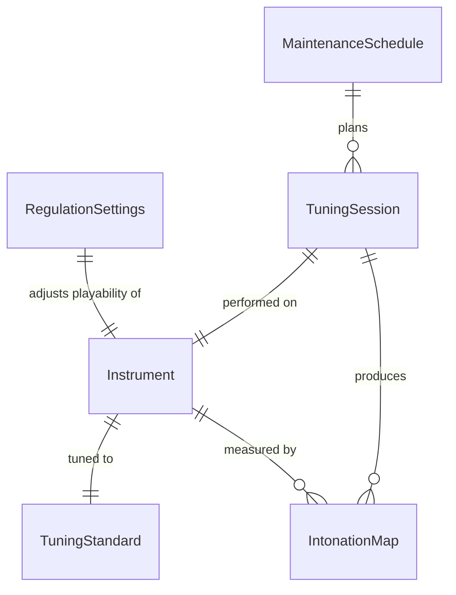
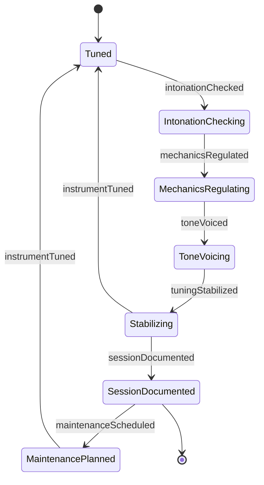
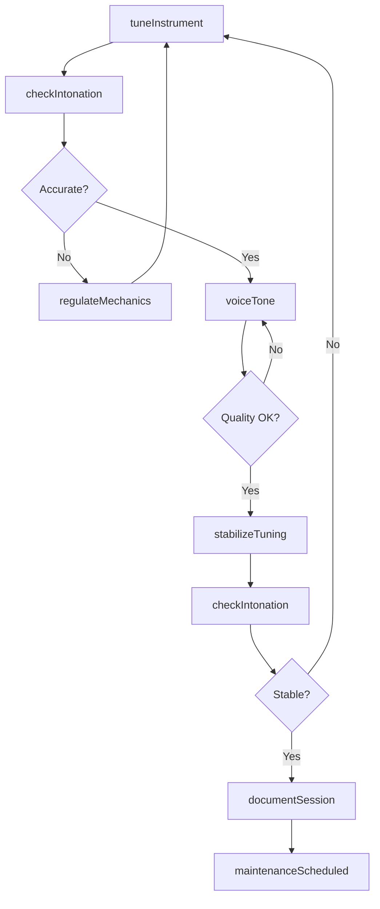
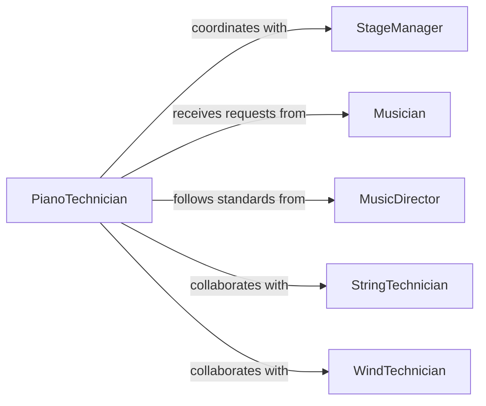

# Adjust Tuning Functioning Musical Instruments

> Business-as-Code definition for musical instrument tuning and performance optimization. Models the complete process of pitch adjustment, intonation correction, and mechanical regulation for acoustic and electronic instruments.

## Overview

Musical instrument tuning involves adjusting pitch, intonation, and mechanical function to achieve optimal tonal quality and playability. This definition exposes actions for tuning procedures, voicing adjustments, and maintenance tracking across orchestral, band, and studio environments.

## Actors

| Actor | Description |
|-------|-------------|
| PianoTechnician | Tunes and regulates pianos and keyboard instruments |
| StringTechnician | Adjusts tuning and setup of string instruments |
| WindTechnician | Maintains and adjusts wind instrument mechanics |
| Musician | Performs on and requests adjustments to instruments |
| StageManager | Coordinates instrument setup for performances |
| MusicDirector | Specifies tuning standards and tonal preferences |

## Roles

| Role | Description |
|------|-------------|
| InstrumentTuner | Adjusts pitch and intonation |
| Technician | Performs mechanical repairs and regulation |
| Voicer | Adjusts tonal quality and timbre |
| QualityChecker | Verifies tuning accuracy and stability |

## Entities

| Entity | Description |
|--------|-------------|
| Instrument | Musical instrument requiring tuning or adjustment |
| TuningStandard | Reference pitch frequency and temperament system |
| IntonationMap | Pitch accuracy measurements across instrument range |
| RegulationSettings | Mechanical adjustments affecting playability |
| TuningSession | Record of tuning work performed |
| MaintenanceSchedule | Planned tuning and service intervals |

## Actions

| Action | Description |
|--------|-------------|
| tuneInstrument | Adjust pitch to match reference standard |
| checkIntonation | Measure pitch accuracy across range |
| regulateMechanics | Adjust mechanical components for optimal function |
| voiceTone | Modify tonal quality and timbre |
| stabilizeTuning | Allow instrument to settle and recheck pitch |
| calibrateElectronics | Adjust electronic tuning and pickup systems |
| documentSession | Record tuning work and instrument condition |

## Events

| Event | Description |
|-------|-------------|
| instrumentTuned | Pitch adjusted to reference standard |
| intonationChecked | Pitch accuracy verified across range |
| mechanicsRegulated | Mechanical adjustments completed |
| toneVoiced | Tonal quality optimized |
| tuningStabilized | Instrument pitch stable after settling |
| sessionDocumented | Tuning work recorded in system |
| maintenanceScheduled | Next service interval determined |

## Searches

| Search | Description |
|--------|-------------|
| findInstruments | List instruments by type, location, or status |
| getTuningHistory | Retrieve historical tuning records |
| getMaintenanceSchedule | View upcoming service dates |
| getIntonationData | Access pitch accuracy measurements |
| findSessionNotes | Search tuning session documentation |
## Entity Relationships




## State Diagram




## Workflow



## Actor Relationships



## Usage

### Calling Actions

```typescript
import { adjustTuningFunctioningMusicalInstruments } from '@headlessly/adjust-tuning-functioning-musical-instruments'

const instruments = adjustTuningFunctioningMusicalInstruments()

// Tune concert grand piano
await instruments.tuneInstrument({
  instrumentId: 'PIANO-STEINWAY-442',
  standard: 'A440',
  temperament: 'equal',
  tunedBy: 'technician-008',
  venue: 'concert-hall-main'
})

// Check intonation on violin
const intonation = await instruments.checkIntonation({
  instrumentId: 'VIOLIN-STRAD-1707',
  testPoints: ['open-strings', 'harmonics', 'scale'],
  tolerance: 2
})

// Regulate piano action mechanics
await instruments.regulateMechanics({
  instrumentId: 'PIANO-STEINWAY-442',
  adjustments: {
    letoff: 1.5,
    drop: 0.5,
    hammer: 'reshape',
    dampers: 'align'
  },
  regulatedBy: 'technician-008'
})
```

### Event-Driven Automation

```typescript
// Schedule next tuning when stability confirmed
instruments.tuningStabilized(async ({ instrumentId, lastTuned, stability }) => {
  const interval = stability === 'excellent' ? 90 : 30

  await schedule({
    task: 'instrument-tuning',
    instrument: instrumentId,
    daysFromNow: interval,
    assignTo: 'tuning-team'
  })
})

// Alert on poor intonation requiring repair
instruments.intonationChecked(async ({ instrumentId, accuracy, issues }) => {
  if (accuracy < 80) {
    await notify({
      to: 'instrument-shop',
      message: `${instrumentId} intonation ${accuracy}% - repair needed`,
      priority: 'high',
      issues: issues
    })
  }
})
```
