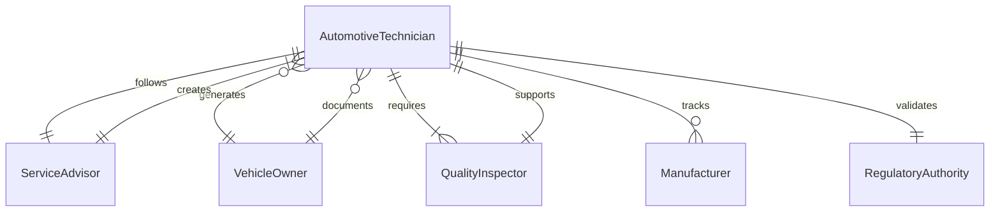
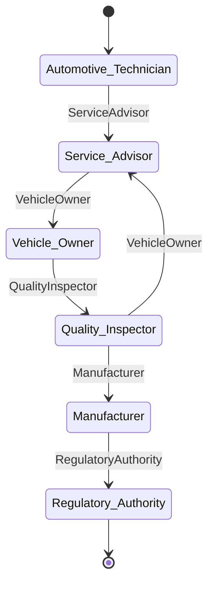
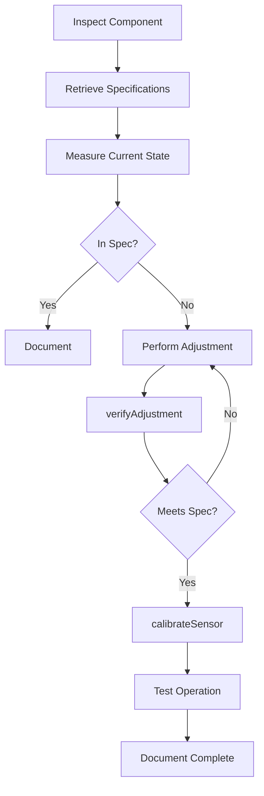
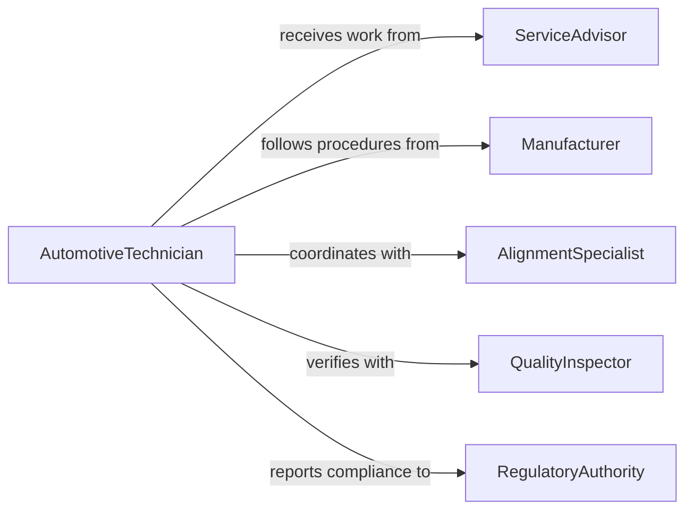

# Adjust Vehicle Components According Specifications

> Business-as-Code definition for automotive component adjustment and alignment. Models the complete process of configuring, calibrating, and optimizing vehicle systems to manufacturer specifications for performance, safety, and emissions compliance.

## Overview

Vehicle component adjustment involves setting mechanical, electrical, and electronic systems to precise specifications for optimal operation. This definition exposes actions for alignment procedures, calibration tasks, and diagnostic verification across automotive service and manufacturing environments.

## Actors

| Actor | Description |
|-------|-------------|
| AutomotiveTechnician | Performs adjustments and alignments on vehicles |
| ServiceAdvisor | Schedules and documents service work |
| VehicleOwner | Requests service and approves repairs |
| QualityInspector | Verifies adjustments meet specifications |
| Manufacturer | Provides specifications and service procedures |
| RegulatoryAuthority | Enforces safety and emissions standards |

## Roles

| Role | Description |
|------|-------------|
| AlignmentSpecialist | Performs suspension and steering adjustments |
| DiagnosticTechnician | Uses scan tools to verify electronic calibration |
| CalibrationTechnician | Adjusts sensors and ADAS systems |
| Inspector | Verifies completed adjustments meet standards |

## Entities

| Entity | Description |
|--------|-------------|
| Vehicle | Automobile requiring component adjustment |
| ComponentSpecification | Manufacturer-defined adjustment parameters |
| AdjustmentProcedure | Step-by-step process for specific adjustment |
| MeasurementReading | Pre- and post-adjustment values |
| CalibrationRecord | Documentation of adjustment work performed |
| ServiceHistory | Complete record of vehicle maintenance and adjustments |

## Actions

| Action | Description |
|--------|-------------|
| performAlignment | Adjust suspension angles to specifications |
| calibrateSensor | Set sensor parameters and zero points |
| adjustIdleSpeed | Set engine idle RPM within range |
| setValveGaps | Adjust valve clearances to specification |
| timeIgnition | Set ignition timing advance |
| balanceWheels | Adjust wheel weights for smooth rotation |
| verifyAdjustment | Confirm component meets specification |

## Events

| Event | Description |
|-------|-------------|
| alignmentPerformed | Suspension angles adjusted to spec |
| sensorCalibrated | Sensor parameters set and verified |
| idleSpeedAdjusted | Engine idle RPM set within range |
| valveGapsSet | Valve clearances adjusted correctly |
| ignitionTimed | Timing advance set to specification |
| wheelsBalanced | Wheel balance within tolerance |
| adjustmentVerified | Component confirmed meeting spec |

## Searches

| Search | Description |
|--------|-------------|
| findVehicles | List vehicles by make, model, or service status |
| getSpecifications | Retrieve adjustment specs for vehicle |
| getServiceHistory | View previous adjustments and service |
| getProcedures | Find step-by-step adjustment instructions |
| getCalibrationStatus | Check which systems require calibration |
## Entity Relationships




## State Diagram




## Workflow



## Actor Relationships



## Usage

### Calling Actions

```typescript
import { adjustVehicleComponentsAccordingSpecifications } from '@headlessly/adjust-vehicle-components-according-specifications'

const vehicle = adjustVehicleComponentsAccordingSpecifications()

// Perform four-wheel alignment
await vehicle.performAlignment({
  vehicleId: 'VIN-1HGCM82633A123456',
  measurements: {
    frontCamber: { left: -0.5, right: -0.3 },
    frontCaster: { left: 3.2, right: 3.5 },
    frontToe: { total: 0.08 },
    rearCamber: { left: -1.2, right: -1.0 },
    rearToe: { total: 0.12 }
  },
  adjustedBy: 'tech-442',
  equipment: 'HUNTER-HWA-700'
})

// Calibrate forward collision sensor
await vehicle.calibrateSensor({
  vehicleId: 'VIN-1HGCM82633A123456',
  sensorType: 'forward-radar',
  system: 'ADAS',
  procedure: 'static-target',
  calibrationTool: 'OEM-SCAN-PRO',
  performedBy: 'tech-089'
})

// Verify adjustment meets specification
const verification = await vehicle.verifyAdjustment({
  vehicleId: 'VIN-1HGCM82633A123456',
  component: 'suspension-alignment',
  tolerance: 'factory-spec'
})
```

### Event-Driven Automation

```typescript
// Alert on out-of-spec adjustment
vehicle.adjustmentVerified(async ({ vehicleId, component, withinSpec, deviation }) => {
  if (!withinSpec) {
    await notify({
      to: 'service-manager',
      message: `${component} on ${vehicleId} out of spec by ${deviation}`,
      priority: 'high'
    })
  }
})

// Update service history on completion
vehicle.calibrationRecord(async ({ vehicleId, calibrations, technician }) => {
  await serviceHistory.update({
    vehicle: vehicleId,
    event: 'calibration-complete',
    systems: calibrations,
    performedBy: technician,
    timestamp: new Date()
  })
})
```
