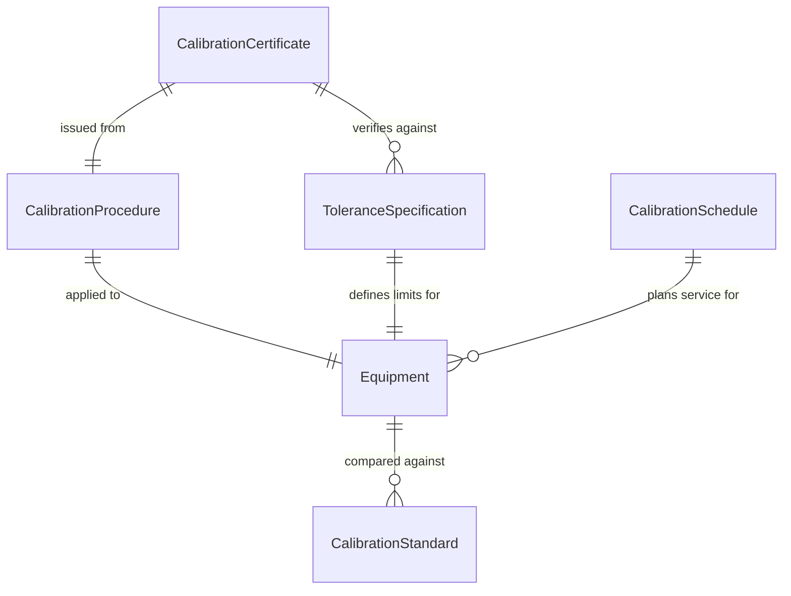
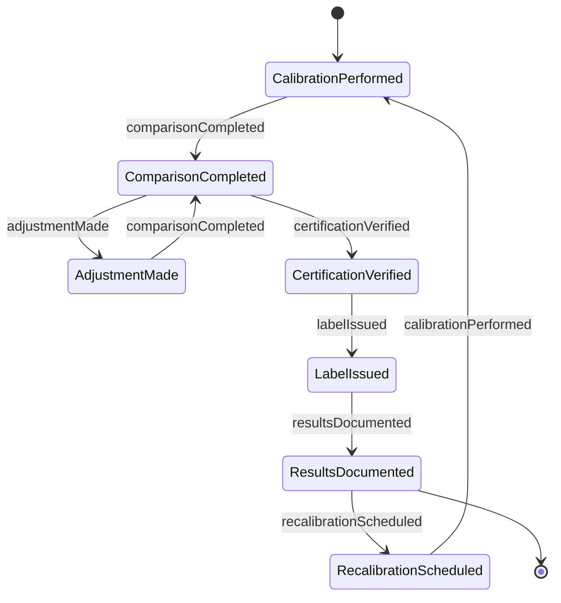
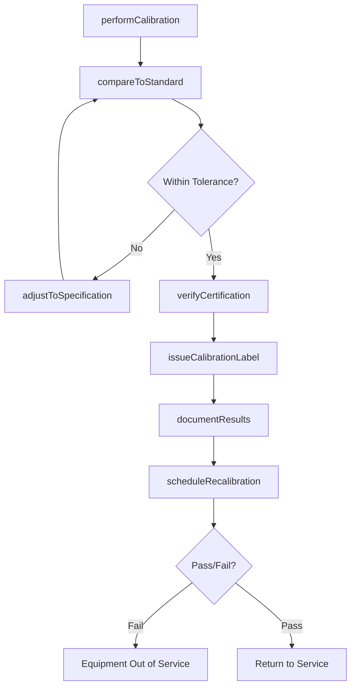
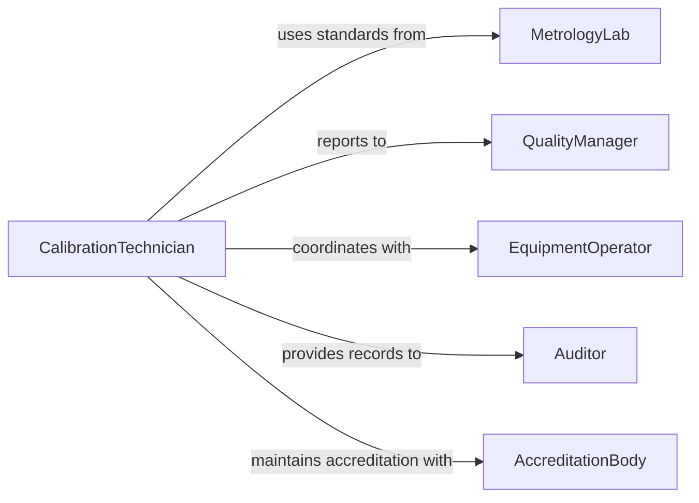

# Calibrate Equipment Specifications

> Business-as-Code definition for equipment calibration and accuracy verification. Models the complete process of validating, adjusting, and certifying measurement and control equipment to ensure specification compliance across industrial operations.

## Overview

Equipment calibration involves comparing instrument readings against known reference standards and adjusting for accuracy. This definition exposes actions for calibration procedures, traceability documentation, and scheduled maintenance to ensure measurement reliability and regulatory compliance.

## Actors

| Actor | Description |
|-------|-------------|
| CalibrationTechnician | Performs calibration procedures and adjustments |
| MetrologyLab | Provides reference standards and certification |
| QualityManager | Oversees calibration program compliance |
| EquipmentOperator | Uses calibrated equipment in production |
| Auditor | Verifies calibration program effectiveness |
| AccreditationBody | Certifies calibration laboratory competence |

## Roles

| Role | Description |
|------|-------------|
| Calibrator | Executes calibration procedures |
| StandardsCustodian | Maintains reference standards |
| RecordsManager | Documents calibration history |
| ScheduleCoordinator | Plans and tracks calibration intervals |

## Entities

| Entity | Description |
|--------|-------------|
| Equipment | Instrument or device requiring calibration |
| CalibrationStandard | Traceable reference for comparison |
| CalibrationProcedure | Documented method for specific equipment type |
| CalibrationCertificate | Official record of calibration results |
| ToleranceSpecification | Acceptable deviation from true value |
| CalibrationSchedule | Planned intervals for equipment recalibration |

## Actions

| Action | Description |
|--------|-------------|
| performCalibration | Execute calibration procedure on equipment |
| compareToStandard | Measure equipment against reference |
| adjustToSpecification | Modify equipment to meet tolerance |
| verifyCertification | Confirm calibration accuracy |
| issueCalibrationLabel | Apply sticker showing calibration status |
| documentResults | Record calibration data and certificate |
| scheduleRecalibration | Set next calibration due date |

## Events

| Event | Description |
|-------|-------------|
| calibrationPerformed | Calibration procedure completed |
| comparisonCompleted | Equipment measured against standard |
| adjustmentMade | Equipment modified to meet spec |
| certificationVerified | Accuracy confirmed within tolerance |
| labelIssued | Calibration sticker applied to equipment |
| resultsDocumented | Certificate and data recorded |
| recalibrationScheduled | Next service date determined |

## Searches

| Search | Description |
|--------|-------------|
| findEquipment | List instruments by type, location, or status |
| getCalibrationHistory | Retrieve past calibration records |
| getDueCalibrations | Find equipment requiring calibration |
| getCertificates | Access calibration certificates |
| getStandards | List available reference standards |
## Entity Relationships




## State Diagram




## Workflow



## Actor Relationships



## Usage

### Calling Actions

```typescript
import { calibrateEquipmentSpecifications } from '@headlessly/calibrate-equipment-specifications'

const calibration = calibrateEquipmentSpecifications()

// Calibrate precision scale
await calibration.performCalibration({
  equipmentId: 'SCALE-0442',
  procedure: 'CAL-PROC-SCALE-001',
  standardId: 'STD-MASS-SET-A',
  technician: 'cal-tech-008',
  environment: {
    temperature: 22.1,
    humidity: 45
  }
})

// Compare against reference standard
const comparison = await calibration.compareToStandard({
  equipmentId: 'SCALE-0442',
  testPoints: [0, 50, 100, 200, 500, 1000],
  readings: [0.02, 50.15, 100.08, 200.12, 500.05, 1000.18],
  tolerance: 0.5
})

// Document calibration results
await calibration.documentResults({
  equipmentId: 'SCALE-0442',
  certificateNumber: 'CAL-2026-00442',
  results: comparison,
  status: 'pass',
  nextDue: '2027-02-05'
})
```

### Event-Driven Automation

```typescript
// Alert on failed calibration
calibration.certificationVerified(async ({ equipmentId, status, outOfTolerance }) => {
  if (status === 'fail') {
    await notify({
      to: 'quality-manager',
      message: `Equipment ${equipmentId} failed calibration - ${outOfTolerance} points out of spec`,
      priority: 'critical'
    })

    await equipment.setStatus({ equipmentId, status: 'out-of-service' })
  }
})

// Schedule reminder before due date
calibration.recalibrationScheduled(async ({ equipmentId, dueDate }) => {
  const reminderDate = new Date(dueDate)
  reminderDate.setDate(reminderDate.getDate() - 14)

  await schedule({
    task: 'calibration-reminder',
    equipment: equipmentId,
    date: reminderDate,
    assignTo: 'calibration-team'
  })
})
```
