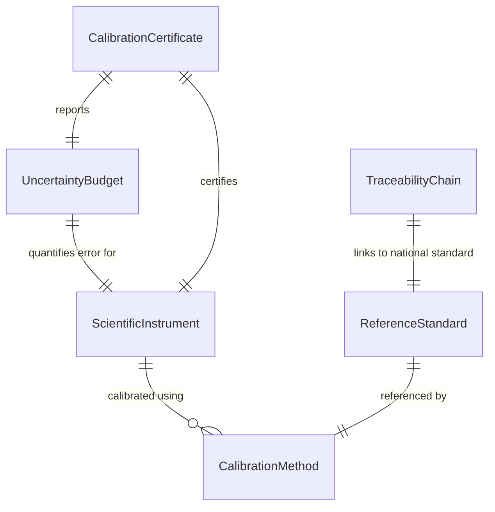
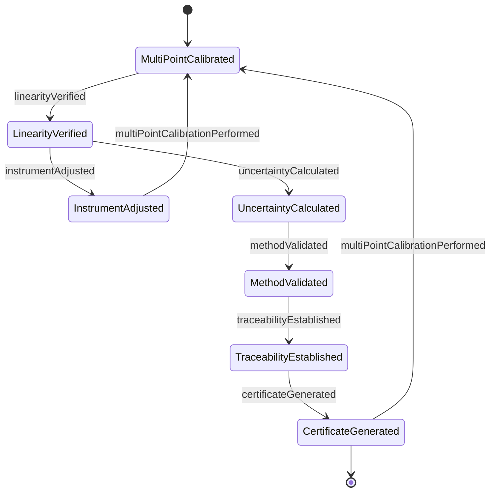
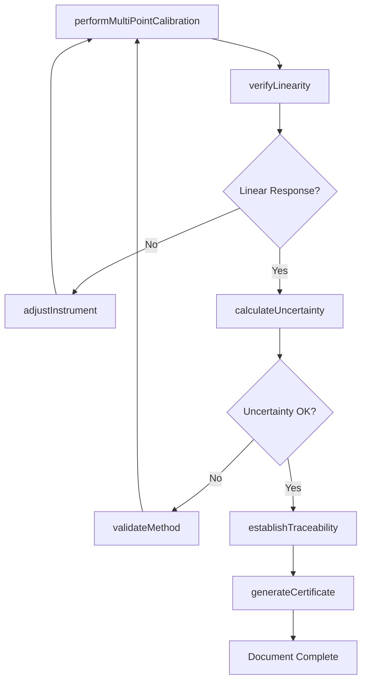
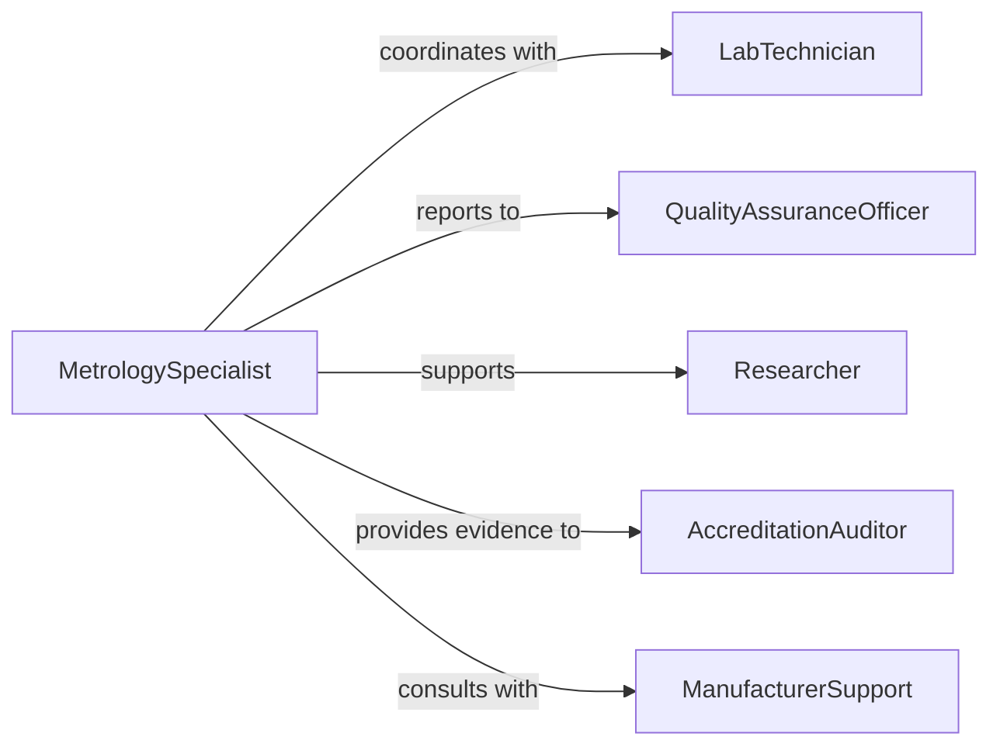

# Calibrate Scientific Technical Equipment

> Business-as-Code definition for scientific instrument calibration and measurement validation. Models the complete process of verifying, adjusting, and certifying laboratory and technical equipment for accurate research, testing, and analysis operations.

## Overview

Scientific equipment calibration ensures measurement accuracy and data integrity for research, testing, and quality control. This definition exposes actions for multi-point calibration, uncertainty analysis, and traceability documentation to maintain compliance with laboratory accreditation standards and regulatory requirements.

## Actors

| Actor | Description |
|-------|-------------|
| LabTechnician | Operates and maintains scientific instruments |
| MetrologySpecialist | Performs advanced calibration procedures |
| QualityAssuranceOfficer | Ensures calibration program compliance |
| Researcher | Uses calibrated equipment for experiments |
| AccreditationAuditor | Verifies laboratory measurement competence |
| ManufacturerSupport | Provides calibration specifications and service |

## Roles

| Role | Description |
|------|-------------|
| CalibrationEngineer | Develops and validates calibration methods |
| InstrumentSpecialist | Calibrates specific instrument types |
| UncertaintyAnalyst | Calculates measurement uncertainty budgets |
| DocumentationClerk | Maintains calibration records and certificates |

## Entities

| Entity | Description |
|--------|-------------|
| ScientificInstrument | Laboratory or technical measurement device |
| CalibrationMethod | Validated procedure for specific instrument |
| ReferenceStandard | NIST-traceable calibration artifact |
| UncertaintyBudget | Analysis of measurement error sources |
| CalibrationCertificate | ISO/IEC 17025 compliant documentation |
| TraceabilityChain | Linkage from instrument to national standard |

## Actions

| Action | Description |
|--------|-------------|
| performMultiPointCalibration | Execute calibration across measurement range |
| calculateUncertainty | Determine combined measurement uncertainty |
| adjustInstrument | Modify parameters to achieve accuracy |
| verifyLinearity | Confirm linear response across range |
| validateMethod | Prove calibration procedure effectiveness |
| establishTraceability | Link calibration to national standards |
| generateCertificate | Produce ISO 17025 compliant documentation |

## Events

| Event | Description |
|-------|-------------|
| multiPointCalibrationPerformed | Calibration completed at all test points |
| uncertaintyCalculated | Measurement uncertainty determined |
| instrumentAdjusted | Parameters modified for accuracy |
| linearityVerified | Linear response confirmed |
| methodValidated | Calibration procedure proven effective |
| traceabilityEstablished | Link to national standards documented |
| certificateGenerated | Official calibration certificate issued |

## Searches

| Search | Description |
|--------|-------------|
| findInstruments | List scientific equipment by type or location |
| getCalibrationMethods | Retrieve procedures for instrument type |
| getUncertaintyBudgets | Access uncertainty analysis documents |
| getCertificates | Find calibration certificates and records |
| getTraceabilityChain | View linkage to reference standards |
## Entity Relationships




## State Diagram




## Workflow



## Actor Relationships



## Usage

### Calling Actions

```typescript
import { calibrateScientificTechnicalEquipment } from '@headlessly/calibrate-scientific-technical-equipment'

const scientific = calibrateScientificTechnicalEquipment()

// Calibrate analytical balance
await scientific.performMultiPointCalibration({
  instrumentId: 'BALANCE-METTLER-442',
  method: 'CAL-METHOD-BALANCE-001',
  testPoints: [0, 10, 50, 100, 200],
  standardId: 'MASS-SET-E2-CLASS',
  readings: [
    { nominal: 0, measured: 0.0001, uncertainty: 0.0002 },
    { nominal: 10, measured: 10.0003, uncertainty: 0.0002 },
    { nominal: 50, measured: 50.0001, uncertainty: 0.0003 },
    { nominal: 100, measured: 100.0002, uncertainty: 0.0004 },
    { nominal: 200, measured: 200.0005, uncertainty: 0.0005 }
  ],
  technician: 'metrology-008'
})

// Calculate measurement uncertainty
const uncertainty = await scientific.calculateUncertainty({
  instrumentId: 'BALANCE-METTLER-442',
  sources: [
    { component: 'repeatability', value: 0.0002, distribution: 'normal' },
    { component: 'standard-uncertainty', value: 0.0001, distribution: 'normal' },
    { component: 'resolution', value: 0.00005, distribution: 'rectangular' },
    { component: 'drift', value: 0.0001, distribution: 'rectangular' }
  ],
  coverageFactor: 2,
  confidenceLevel: 95
})

// Generate ISO 17025 certificate
await scientific.generateCertificate({
  instrumentId: 'BALANCE-METTLER-442',
  certificateNumber: 'LAB-CAL-2026-0442',
  calibrationDate: '2026-02-05',
  nextDueDate: '2027-02-05',
  uncertainty: uncertainty,
  traceability: 'NIST',
  signedBy: 'metrology-manager'
})
```

### Event-Driven Automation

```typescript
// Alert on linearity failure
scientific.linearityVerified(async ({ instrumentId, linearity, acceptable }) => {
  if (!acceptable) {
    await notify({
      to: 'metrology-team',
      message: `Instrument ${instrumentId} failed linearity check: ${linearity}`,
      priority: 'high',
      action: 'requires-adjustment-or-repair'
    })
  }
})

// Update inventory on certificate generation
scientific.certificateGenerated(async ({ instrumentId, certificateNumber, nextDue }) => {
  await inventory.update({
    instrument: instrumentId,
    calibrationStatus: 'current',
    lastCalibration: new Date(),
    nextDue: nextDue,
    certificate: certificateNumber
  })
})
```
