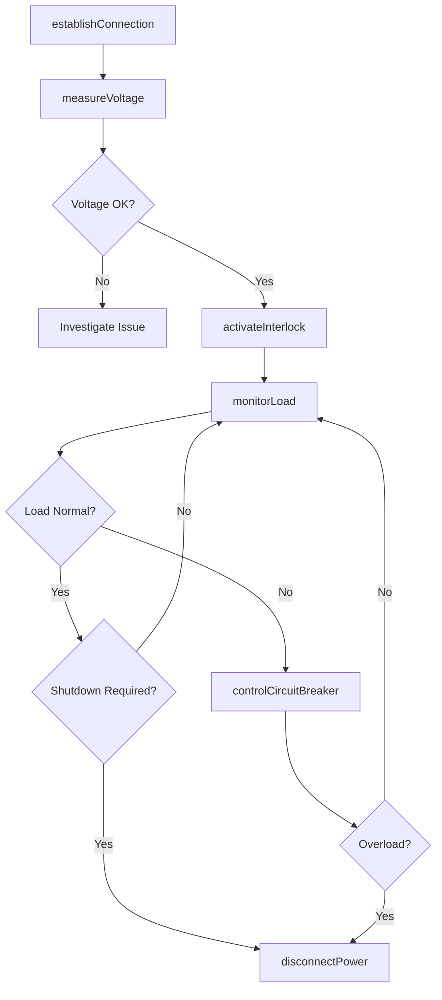
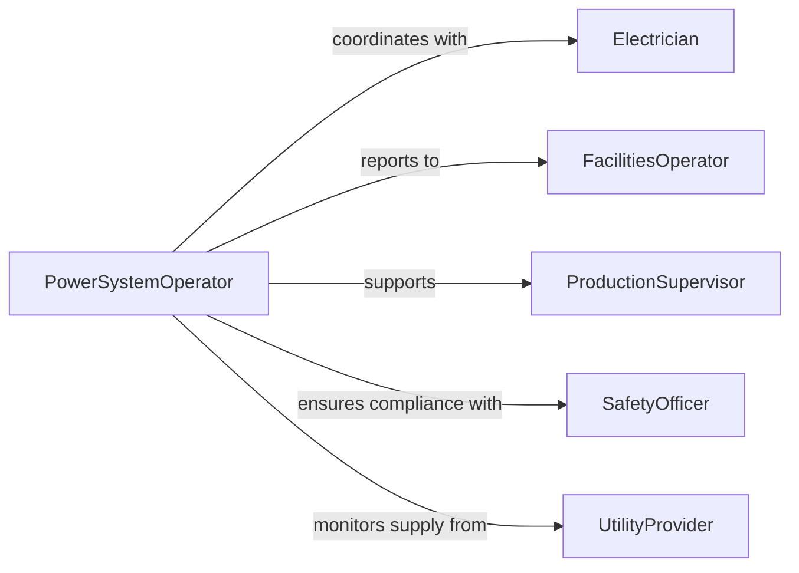

# Control Power Supply Connections

> Business-as-Code definition for electrical power distribution and connection management. Models the complete process of establishing, monitoring, and controlling power supply connections for equipment, facilities, and production systems.

## Overview

Power supply connection control involves managing electrical distribution to ensure safe, reliable power delivery to equipment and systems. This definition exposes actions for connection management, load monitoring, and safety interlocks across industrial, commercial, and critical infrastructure environments.

## Actors

| Actor | Description |
|-------|-------------|
| Electrician | Establishes and maintains power connections |
| FacilitiesOperator | Monitors and controls building power systems |
| ProductionSupervisor | Coordinates power requirements for manufacturing |
| SafetyOfficer | Ensures electrical safety compliance |
| UtilityProvider | Supplies primary electrical power |
| EquipmentVendor | Specifies power requirements for equipment |

## Roles

| Role | Description |
|------|-------------|
| PowerSystemOperator | Manages electrical distribution panels |
| ConnectionTechnician | Establishes physical power connections |
| LoadMonitor | Tracks power consumption and capacity |
| EmergencyResponder | Handles power system emergencies |

## Entities

| Entity | Description |
|--------|-------------|
| PowerConnection | Physical link providing electrical power |
| DistributionPanel | Electrical panel distributing power to circuits |
| LoadProfile | Power consumption characteristics over time |
| SafetyInterlock | Device preventing unsafe power conditions |
| PowerMonitor | Instrument measuring voltage, current, and power |
| EmergencyShutoff | System for rapid power disconnection |

## Actions

| Action | Description |
|--------|-------------|
| establishConnection | Create new power supply connection |
| disconnectPower | Safely remove power from equipment |
| monitorLoad | Track current power consumption |
| switchPowerSource | Change between primary and backup power |
| activateInterlock | Engage safety device to prevent operation |
| measureVoltage | Check electrical potential at connection |
| controlCircuitBreaker | Manage circuit protection devices |

## Events

| Event | Description |
|-------|-------------|
| connectionEstablished | Power link successfully created |
| powerDisconnected | Equipment safely de-energized |
| loadMonitored | Power consumption data recorded |
| sourcesSwitched | Power transferred between sources |
| interlockActivated | Safety device engaged |
| voltageMeasured | Electrical potential verified |
| breakerTripped | Circuit protection activated |

## Searches

| Search | Description |
|--------|-------------|
| findConnections | List power connections by location or status |
| getLoadData | Retrieve power consumption history |
| getPanelStatus | View distribution panel circuit states |
| getInterlockStatus | Check safety interlock conditions |
| getAlarms | Find active electrical system alerts |

## Workflow



## Actor Relationships



## Usage

### Calling Actions

```typescript
import { controlPowerSupplyConnections } from '@headlessly/control-power-supply-connections'

const power = controlPowerSupplyConnections()

// Establish power connection to new equipment
await power.establishConnection({
  equipmentId: 'CNC-MILL-442',
  panelId: 'PANEL-3A',
  circuit: 'C-12',
  voltage: 480,
  amperage: 100,
  phases: 3,
  connectedBy: 'electrician-008'
})

// Monitor power load on circuit
const load = await power.monitorLoad({
  circuitId: 'PANEL-3A-C12',
  interval: 1000,
  duration: 3600
})

// Switch to backup power source
await power.switchPowerSource({
  panelId: 'PANEL-3A',
  fromSource: 'utility-primary',
  toSource: 'generator-backup',
  reason: 'scheduled-maintenance',
  switchedBy: 'operator-042'
})

// Safely disconnect power for maintenance
await power.disconnectPower({
  equipmentId: 'CNC-MILL-442',
  lockoutTagout: true,
  verifyZeroEnergy: true,
  disconnectedBy: 'electrician-008'
})
```

### Event-Driven Automation

```typescript
// Alert on circuit breaker trip
power.breakerTripped(async ({ panelId, circuit, amperage, reason }) => {
  await notify({
    to: 'facilities-team',
    message: `Breaker tripped on ${panelId} circuit ${circuit}: ${reason}`,
    priority: 'high'
  })

  // Log for maintenance review
  await maintenanceLog.record({
    event: 'breaker-trip',
    panel: panelId,
    circuit: circuit,
    load: amperage,
    timestamp: new Date()
  })
})

// Trigger emergency shutdown on overload
power.loadMonitored(async ({ circuitId, current, capacity, percentLoad }) => {
  if (percentLoad > 95) {
    await notify({
      to: 'emergency-response',
      message: `Critical overload on ${circuitId}: ${percentLoad}%`,
      priority: 'critical'
    })

    await power.controlCircuitBreaker({
      circuitId: circuitId,
      action: 'trip',
      reason: 'overload-protection'
    })
  }
})
```
