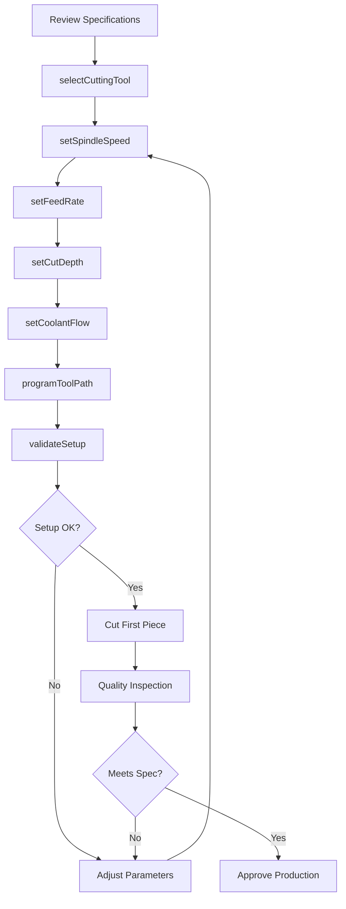
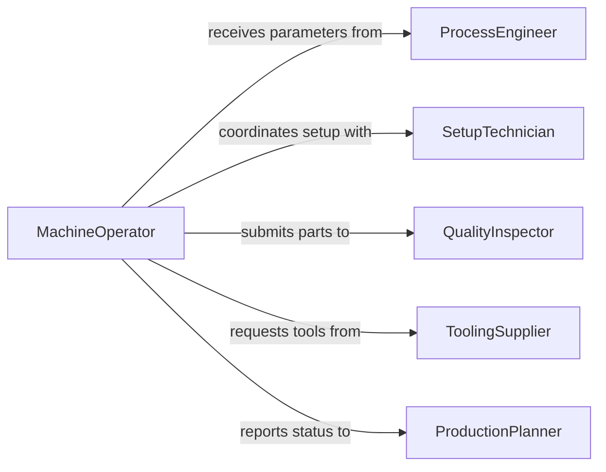

# Set Equipment Controls Meet Cutting

> Business-as-Code definition for cutting equipment configuration and parameter optimization. Models the complete process of setting machine controls, tooling parameters, and process variables to achieve specified cutting quality and dimensional accuracy.

## Overview

Cutting equipment control involves configuring machine parameters such as speed, feed rate, depth of cut, and tool selection to produce parts meeting dimensional and surface finish specifications. This definition exposes actions for setup, optimization, and quality verification across machining, fabrication, and material processing operations.

## Actors

| Actor | Description |
|-------|-------------|
| MachineOperator | Sets up and operates cutting equipment |
| ProcessEngineer | Develops optimal cutting parameters |
| QualityInspector | Verifies cut parts meet specifications |
| SetupTechnician | Prepares machines for production runs |
| ToolingSupplier | Provides cutting tools and inserts |
| ProductionPlanner | Schedules jobs and allocates equipment |

## Roles

| Role | Description |
|------|-------------|
| MachineSetupSpecialist | Configures equipment for specific operations |
| ProcessOptimizer | Fine-tunes parameters for efficiency |
| FirstPieceInspector | Verifies initial production quality |
| ToolChanger | Manages cutting tool inventory and changes |

## Entities

| Entity | Description |
|--------|-------------|
| CuttingMachine | CNC mill, lathe, saw, or other cutting equipment |
| CuttingParameters | Speed, feed, depth, and coolant settings |
| ToolingSetup | Cutting tools, holders, and offsets configured |
| CuttingSpecification | Required dimensions, tolerances, and surface finish |
| SetupSheet | Documented parameters for specific job |
| FirstPieceInspection | Quality verification of initial production part |

## Actions

| Action | Description |
|--------|-------------|
| setSpindleSpeed | Configure rotational speed of cutting tool |
| setFeedRate | Adjust linear feed speed of tool or workpiece |
| setCutDepth | Specify depth of material removal per pass |
| selectCuttingTool | Choose appropriate tool for operation |
| programToolPath | Define cutting motion and sequence |
| setCoolantFlow | Configure cutting fluid delivery |
| validateSetup | Verify parameters meet specification |

## Events

| Event | Description |
|-------|-------------|
| spindleSpeedSet | Rotational speed configured |
| feedRateSet | Feed speed adjusted |
| cutDepthSet | Cutting depth specified |
| toolSelected | Cutting tool chosen and loaded |
| toolPathProgrammed | Motion sequence defined |
| coolantFlowSet | Cutting fluid configured |
| setupValidated | Parameters confirmed meeting spec |

## Searches

| Search | Description |
|--------|-------------|
| findMachines | List cutting equipment by type or status |
| getCuttingParameters | Retrieve recommended settings for material |
| getSetupSheets | Find documented parameters for jobs |
| getToolInventory | List available cutting tools |
| getQualityRecords | Access first piece inspection results |

## Workflow



## Actor Relationships



## Usage

### Calling Actions

```typescript
import { setEquipmentControlsMeetCutting } from '@headlessly/set-equipment-controls-meet-cutting'

const cutting = setEquipmentControlsMeetCutting()

// Configure CNC mill for aluminum machining
await cutting.setSpindleSpeed({
  machineId: 'CNC-MILL-442',
  speed: 8000,
  units: 'rpm',
  material: 'aluminum-6061',
  operation: 'face-mill'
})

await cutting.setFeedRate({
  machineId: 'CNC-MILL-442',
  feedRate: 200,
  units: 'mm/min',
  setBy: 'operator-008'
})

await cutting.setCutDepth({
  machineId: 'CNC-MILL-442',
  depth: 2.5,
  units: 'mm',
  passes: 3
})

// Select and program cutting tool
await cutting.selectCuttingTool({
  machineId: 'CNC-MILL-442',
  toolNumber: 5,
  toolType: 'face-mill',
  diameter: 80,
  flutes: 6,
  coating: 'TiAlN'
})

// Validate complete setup
const validation = await cutting.validateSetup({
  machineId: 'CNC-MILL-442',
  specification: 'PART-8840-REV-C',
  tolerance: 0.05
})
```

### Event-Driven Automation

```typescript
// Alert on setup validation failure
cutting.setupValidated(async ({ machineId, specification, valid, issues }) => {
  if (!valid) {
    await notify({
      to: 'setup-team',
      message: `Setup validation failed on ${machineId}: ${issues.join(', ')}`,
      priority: 'high'
    })
  }
})

// Log parameters when first piece passes
cutting.setupValidated(async ({ machineId, parameters }) => {
  await setupLibrary.save({
    machine: machineId,
    parameters: parameters,
    verified: true,
    timestamp: new Date()
  })
})
```
