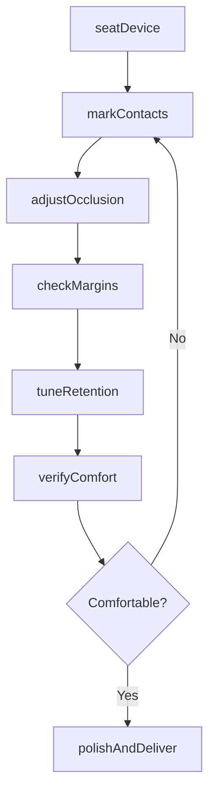
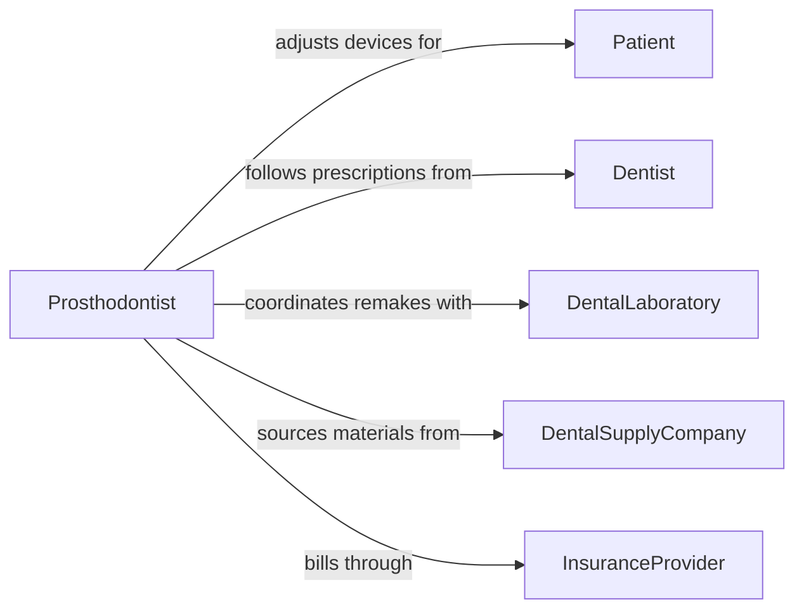

# Adjust Dental Devices or Appliances to Ensure Fit

> Business-as-Code definition for dental device and appliance adjustment. Models the try-in evaluation, occlusal marking, material removal, contact adjustment, retention tuning, comfort verification, and delivery documentation for dentures, crowns, bridges, orthodontic appliances, and oral prostheses.

## Overview

Adjusting dental devices or appliances to ensure fit involves seating the device in the patient's mouth, checking occlusion and contact points with articulating paper, identifying high spots or pressure areas, selectively grinding or reshaping material, verifying marginal adaptation and retention, confirming patient comfort, and documenting the final fit. This definition covers denture and partial denture adjustments, crown and bridge seating, orthodontic appliance activation and fitting, nightguard and splint adjustments, and implant prosthesis refinement.

## Actors

| Actor | Description |
|-------|-------------|
| Patient | Receives the dental device and provides feedback on fit and comfort |
| Dentist | Prescribes the device and directs adjustment parameters |
| DentalLaboratory | Fabricates the device and remakes or modifies it when chairside adjustment is insufficient |
| DentalSupplyCompany | Provides articulating paper, adjustment burs, polishing materials, and liners |
| InsuranceProvider | Authorizes coverage for dental device fabrication and adjustment visits |

## Roles

| Role | Description |
|------|-------------|
| DentalTechnician | Performs laboratory-side adjustments to device contours and occlusion |
| Prosthodontist | Specializes in complex prosthetic device fitting and occlusal adjustment |
| Orthodontist | Adjusts wire tension, bracket positioning, and appliance activation |
| DentalHygienist | Assists with try-in, marks contacts, and supports chairside adjustment |

## Entities

| Entity | Description |
|--------|-------------|
| DentalDevice | A prosthetic or orthodontic appliance being adjusted for the patient |
| OcclusalContact | A point where the device touches opposing teeth requiring marking and adjustment |
| ArticulatingPaper | A thin marking film used to identify high spots and contact points |
| MarginAdaptation | The seal between a crown or prosthesis and the prepared tooth structure |
| RetentionFit | The degree to which the device resists displacement during function |
| AdjustmentBur | A rotary instrument used to selectively remove material from the device |
| DeliveryRecord | Documentation of the final fit, occlusion, and patient acceptance |

## Actions

| Action | Description |
|--------|-------------|
| seatDevice | Place the dental device in the patient's mouth and verify initial insertion |
| markContacts | Use articulating paper to identify occlusal high spots and premature contacts |
| adjustOcclusion | Selectively grind or reshape the device to achieve balanced occlusal contact |
| checkMargins | Verify that crown or prosthesis margins adapt closely to the tooth preparation |
| tuneRetention | Adjust clasps, connectors, or internal surfaces to optimize device retention |
| verifyComfort | Confirm the patient reports no pain, pressure, or interference during function |
| polishAndDeliver | Smooth all adjusted surfaces, polish the device, and complete the delivery |

## Events

| Event | Description |
|-------|-------------|
| deviceSeated | The dental device has been placed in the patient's mouth |
| contactsMarked | Occlusal contact points have been identified with articulating paper |
| occlusionAdjusted | High spots have been selectively removed to balance the bite |
| marginsChecked | Crown or prosthesis margins have been verified for proper adaptation |
| retentionTuned | Clasps or internal surfaces have been adjusted for optimal hold |
| comfortVerified | Patient has confirmed the device is comfortable during function |
| deviceDelivered | The adjusted device has been polished and formally delivered to the patient |

## Searches

| Search | Description |
|--------|-------------|
| findPatientDevices | Locate all dental devices and appliances for a specific patient |
| getAdjustmentHistory | Retrieve past adjustment visits and modifications by device or patient |
| findPendingDeliveries | List devices fabricated by the lab and awaiting try-in and adjustment |
| getOcclusionRecords | Look up occlusal contact documentation by patient or device |
| findDevicesByLab | Retrieve devices by fabricating laboratory and case status |

## Workflow



## Actor Relationships



## Usage

### Calling Actions

```typescript
import { adjustDentalDevicesAppliancesEnsure } from '@headlessly/adjust-dental-devices-appliances-ensure'

const dental = adjustDentalDevicesAppliancesEnsure()

// Seat and mark contacts
await dental.seatDevice({
  patientId: 'PAT-2024-07832',
  deviceId: 'DEN-RPD-2024-0445',
  deviceType: 'removable-partial-denture',
  teeth: ['3', '4', '5', '12', '13', '14'],
  framework: 'cobalt-chrome'
})

await dental.markContacts({
  deviceId: 'DEN-RPD-2024-0445',
  paperThickness: '40-micron',
  movements: ['centric-occlusion', 'lateral-excursion-left', 'protrusive'],
  highSpots: ['tooth-5-mesial-cusp', 'tooth-13-distal-ridge']
})

// Adjust and verify
await dental.adjustOcclusion({
  deviceId: 'DEN-RPD-2024-0445',
  adjustments: [
    { location: 'tooth-5-mesial-cusp', action: 'reduce', amount: '0.2mm' },
    { location: 'tooth-13-distal-ridge', action: 'reduce', amount: '0.15mm' }
  ],
  bur: 'fine-diamond-football'
})
```

### Event-Driven Automation

```typescript
// Schedule follow-up for new denture patients
dental.deviceDelivered(async ({ patientId, deviceType }) => {
  if (deviceType.includes('denture')) {
    await scheduling.bookFollowUp({
      patientId,
      reason: 'Post-delivery adjustment check',
      daysOut: 7
    })
  }
})

// Notify lab when chairside adjustment indicates remake needed
dental.occlusionAdjusted(async ({ deviceId, adjustments, totalRemoved }) => {
  if (totalRemoved > 1.0) {
    await lab.flagForReview({
      deviceId,
      reason: 'Excessive chairside adjustment required - evaluate for remake',
      adjustmentDetails: adjustments
    })
  }
})
```
