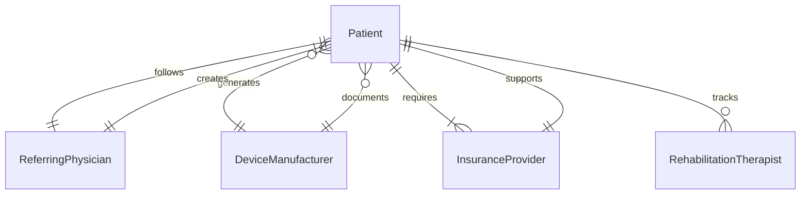
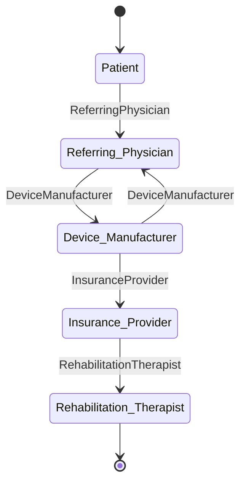
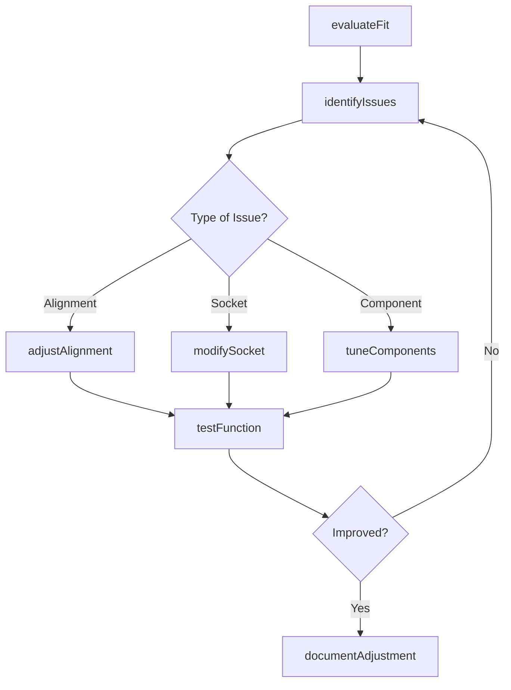
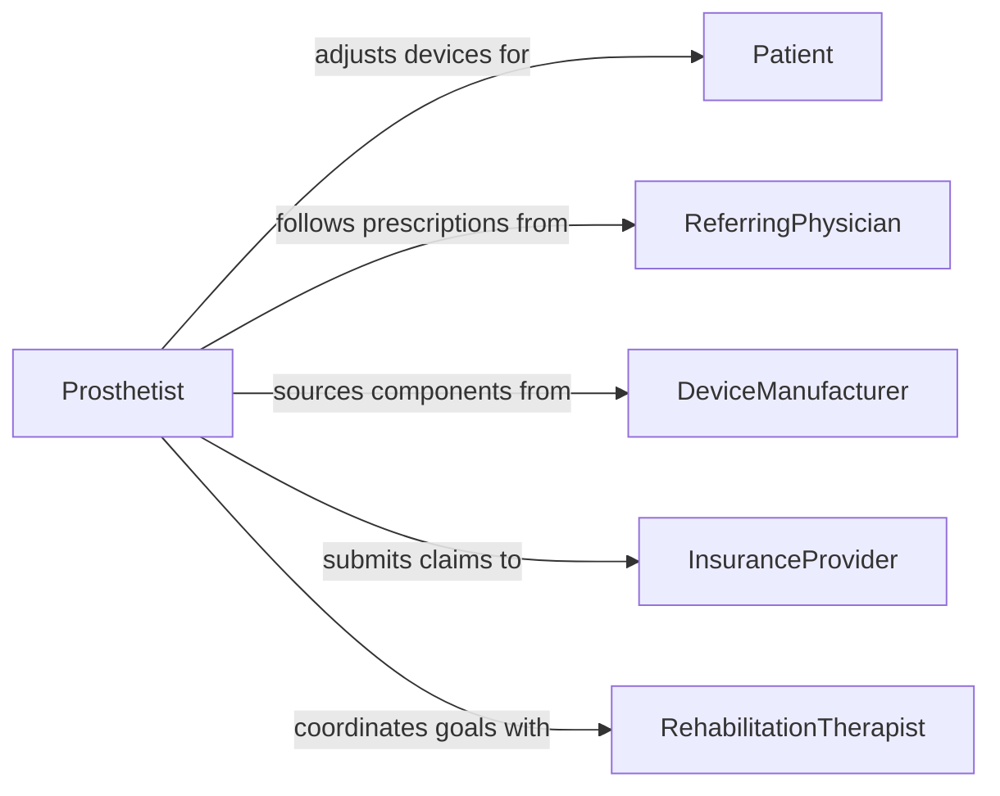

# Adjust Prostheses or Other Assistive Devices

> Business-as-Code definition for prosthesis and assistive device adjustment. Models the patient assessment, fit evaluation, alignment correction, component tuning, comfort optimization, functional testing, and documentation for prosthetic limbs, orthotic braces, wheelchairs, hearing aids, and other assistive devices.

## Overview

Adjusting prostheses or other assistive devices involves evaluating the patient's current fit and function, identifying areas of discomfort or misalignment, making mechanical, positional, or material modifications, testing the device under functional conditions, and documenting all changes for the clinical record. This definition covers prosthetic limb socket and alignment adjustments, orthotic brace modifications, wheelchair seating and positioning adjustments, hearing aid programming and fitting, and mobility aid customization.

## Actors

| Actor | Description |
|-------|-------------|
| Patient | Wears or uses the assistive device and reports comfort and functional feedback |
| ReferringPhysician | Prescribes the device and authorizes adjustment parameters |
| DeviceManufacturer | Supplies prosthetic and orthotic components, parts, and technical specifications |
| InsuranceProvider | Authorizes and reimburses adjustment visits and replacement components |
| RehabilitationTherapist | Evaluates functional outcomes and recommends adjustment goals |

## Roles

| Role | Description |
|------|-------------|
| Prosthetist | Adjusts alignment, socket fit, and components of prosthetic limbs |
| Orthotist | Modifies orthotic braces, splints, and supports for proper fit and function |
| RehabilitationEngineer | Adjusts wheelchair seating, power controls, and mobility device configurations |
| AssistiveTechnologySpecialist | Tunes hearing aids, communication devices, and electronic assistive equipment |

## Entities

| Entity | Description |
|--------|-------------|
| ProstheticDevice | An artificial limb or body part requiring fit and alignment adjustment |
| OrthoticDevice | A brace or support requiring modification for comfort and function |
| AlignmentSetting | The angular and positional configuration of prosthetic components |
| SocketModification | A change to the prosthetic socket shape, volume, or padding |
| FunctionalAssessment | A clinical evaluation of how well the device performs during activity |
| AdjustmentRecord | Documentation of all changes made, rationale, and patient response |
| ComponentReplacement | A worn or outdated part swapped for a new component during adjustment |

## Actions

| Action | Description |
|--------|-------------|
| evaluateFit | Assess the current fit of the device against the patient's anatomy |
| identifyIssues | Pinpoint areas of pressure, misalignment, or functional limitation |
| adjustAlignment | Modify the angular and positional settings of the device components |
| modifySocket | Reshape, pad, or relieve the socket or contact surface for comfort |
| tuneComponents | Adjust hydraulic, pneumatic, or electronic settings on device mechanisms |
| testFunction | Have the patient perform activities to verify the adjustment improves performance |
| documentAdjustment | Record all changes made, measurements taken, and patient outcomes |

## Events

| Event | Description |
|-------|-------------|
| fitEvaluated | Current device fit has been assessed against the patient's anatomy |
| issuesIdentified | Specific comfort or functional problems have been documented |
| alignmentAdjusted | Prosthetic or orthotic alignment settings have been corrected |
| socketModified | Socket or contact surface has been reshaped for improved fit |
| componentsTuned | Mechanical or electronic device parameters have been optimized |
| functionTested | Patient has performed activities confirming improved device performance |
| adjustmentDocumented | All changes and outcomes have been recorded in the clinical file |

## Searches

| Search | Description |
|--------|-------------|
| findPatientDevices | Locate all prosthetic and assistive devices assigned to a specific patient |
| getAdjustmentHistory | Retrieve past adjustment records by patient, device, or date |
| findPendingAdjustments | List patients with scheduled or overdue device adjustment appointments |
| getComponentInventory | Check available replacement parts by device type and manufacturer |
| getAlignmentBaseline | Retrieve original alignment settings and manufacturer specifications |
## Entity Relationships




## State Diagram




## Workflow



## Actor Relationships



## Usage

### Calling Actions

```typescript
import { adjustProsthesesAssistiveDevices } from '@headlessly/adjust-prostheses-assistive-devices'

const devices = adjustProsthesesAssistiveDevices()

// Evaluate and identify issues
await devices.evaluateFit({
  patientId: 'PAT-2024-05521',
  deviceId: 'PROS-BK-2024-0118',
  deviceType: 'below-knee-prosthesis',
  complaints: ['medial-distal-pressure', 'pistoning-during-swing'],
  lastAdjustment: '2024-08-15'
})

await devices.adjustAlignment({
  deviceId: 'PROS-BK-2024-0118',
  changes: [
    { parameter: 'socket-flexion', from: 5, to: 7, unit: 'degrees' },
    { parameter: 'foot-rotation', from: 0, to: 3, unit: 'degrees-external' },
    { parameter: 'pylon-translation', from: 0, to: 2, unit: 'mm-lateral' }
  ]
})

// Test and document
const test = await devices.testFunction({
  patientId: 'PAT-2024-05521',
  activities: ['level-walking', 'ramp-ascent', 'sit-to-stand'],
  metrics: ['gait-symmetry', 'socket-comfort-scale', 'step-length']
})
```

### Event-Driven Automation

```typescript
// Schedule follow-up after significant adjustment
devices.adjustmentDocumented(async ({ patientId, deviceId, changesMade }) => {
  const significantChange = changesMade.some(c => c.magnitude > 5)
  if (significantChange) {
    await scheduling.bookFollowUp({
      patientId,
      reason: `Follow-up for ${deviceId} alignment adjustment`,
      daysOut: 14
    })
  }
})

// Notify rehab therapist of adjustment for gait training coordination
devices.alignmentAdjusted(async ({ patientId, deviceId, changes }) => {
  await notify({
    to: 'rehabilitation-therapist',
    message: `Alignment adjusted on ${deviceId} for patient ${patientId}. Recommend gait retraining session.`,
    details: changes
  })
})
```
