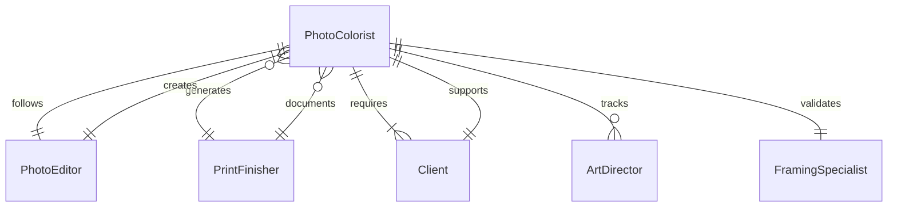
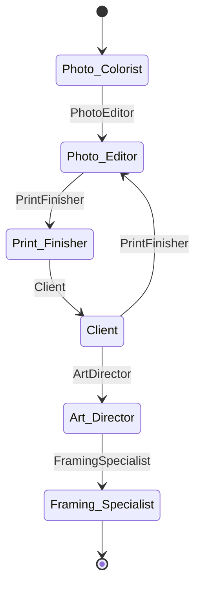
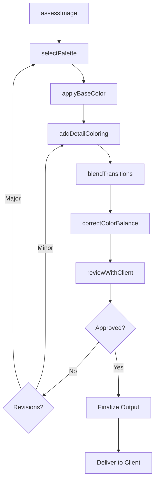
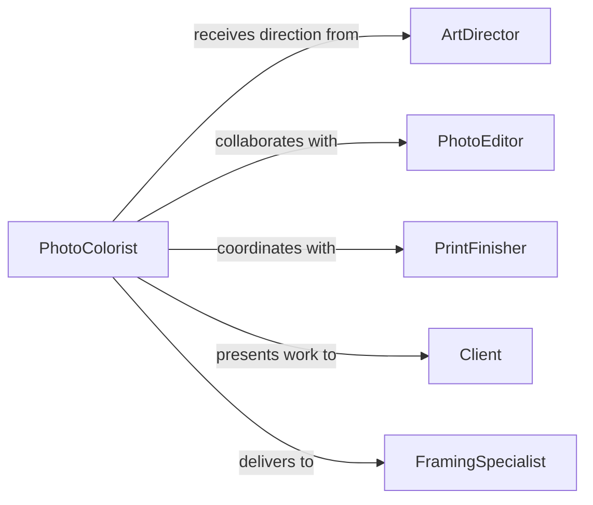

# Apply Decorative Coloring Photographs Printed

> Business-as-Code definition for photographic and print media coloring services. Models the complete process of enhancing, tinting, and applying decorative color treatments to photographs, prints, and printed materials for artistic and commercial purposes.

## Overview

Decorative coloring of photographs involves applying tints, hand-coloring, or digital enhancement to create artistic effects or restore historical images. This definition exposes actions for color application techniques, quality control, and client approval workflows across photography studios, print shops, and restoration services.

## Actors

| Actor | Description |
|-------|-------------|
| PhotoColorist | Applies color treatments to photographs |
| PhotoEditor | Enhances and processes digital images |
| PrintFinisher | Applies finishing treatments to printed materials |
| Client | Commissions color work and approves results |
| ArtDirector | Specifies creative direction for coloring |
| FramingSpecialist | Prepares colored photos for display |

## Roles

| Role | Description |
|------|-------------|
| HandColoringArtist | Manually applies color to prints |
| DigitalColorist | Uses software for color enhancement |
| QualityChecker | Verifies color accuracy and consistency |
| RestorationSpecialist | Colors historical or damaged photographs |

## Entities

| Entity | Description |
|--------|-------------|
| Photograph | Print or digital image to be colored |
| ColorProfile | Specifications for hue, saturation, and tone |
| ColoringMedium | Materials used for application (dyes, paints, digital) |
| ColorSample | Reference for client approval |
| ColoringProject | Complete order with specifications |
| QualityStandard | Acceptance criteria for finished work |

## Actions

| Action | Description |
|--------|-------------|
| assessImage | Evaluate photograph for coloring approach |
| selectPalette | Choose colors appropriate to subject |
| applyBaseColor | Add initial color layer to image |
| addDetailColoring | Apply nuanced color to specific areas |
| blendTransitions | Smooth color boundaries and gradients |
| correctColorBalance | Adjust overall color harmony |
| reviewWithClient | Present work for approval |

## Events

| Event | Description |
|-------|-------------|
| imageAssessed | Photograph evaluated for approach |
| paletteSelected | Color scheme chosen |
| baseColorApplied | Initial coloring completed |
| detailColoringAdded | Fine detail work finished |
| transitionsBlended | Color smoothing completed |
| colorBalanceCorrected | Overall color harmony adjusted |
| clientReviewCompleted | Approval obtained or revisions requested |

## Searches

| Search | Description |
|--------|-------------|
| findProjects | List coloring projects by status or client |
| getColorProfiles | Retrieve saved color schemes |
| getClientApprovals | View approval history |
| findTechniques | Search coloring methods by image type |
| getQualityRecords | Access quality control documentation |
## Entity Relationships




## State Diagram




## Workflow



## Actor Relationships



## Usage

### Calling Actions

```typescript
import { applyDecorativeColoringPhotographsPrinted } from '@headlessly/apply-decorative-coloring-photographs-printed'

const coloring = applyDecorativeColoringPhotographsPrinted()

// Assess vintage photograph for hand coloring
await coloring.assessImage({
  imageId: 'PHOTO-1947-WEDDING',
  type: 'black-and-white-print',
  size: '8x10',
  condition: 'good',
  approach: 'hand-coloring',
  assessedBy: 'colorist-008'
})

// Select period-appropriate color palette
await coloring.selectPalette({
  imageId: 'PHOTO-1947-WEDDING',
  palette: {
    skinTones: 'warm-natural',
    fabricColors: ['ivory', 'navy-blue', 'rose-pink'],
    background: 'sepia-tone'
  },
  reference: 'period-1940s'
})

// Apply base coloring
await coloring.applyBaseColor({
  imageId: 'PHOTO-1947-WEDDING',
  medium: 'marshall-oils',
  areas: ['skin', 'fabric', 'background'],
  technique: 'cotton-swab-application',
  appliedBy: 'colorist-008'
})

// Present to client for review
const review = await coloring.reviewWithClient({
  imageId: 'PHOTO-1947-WEDDING',
  reviewMethod: 'in-person',
  samples: ['full-color', 'selective-color', 'sepia-tint']
})
```

### Event-Driven Automation

```typescript
// Request approval when coloring complete
coloring.colorBalanceCorrected(async ({ imageId, projectId }) => {
  await notify({
    to: 'client',
    message: `Your photo coloring project ${projectId} is ready for review`,
    link: `/review/${imageId}`,
    priority: 'normal'
  })
})

// Log revisions for quality tracking
coloring.clientReviewCompleted(async ({ imageId, approved, feedback }) => {
  if (!approved) {
    await qualityLog.record({
      image: imageId,
      event: 'revision-requested',
      feedback: feedback,
      timestamp: new Date()
    })
  }
})
```
