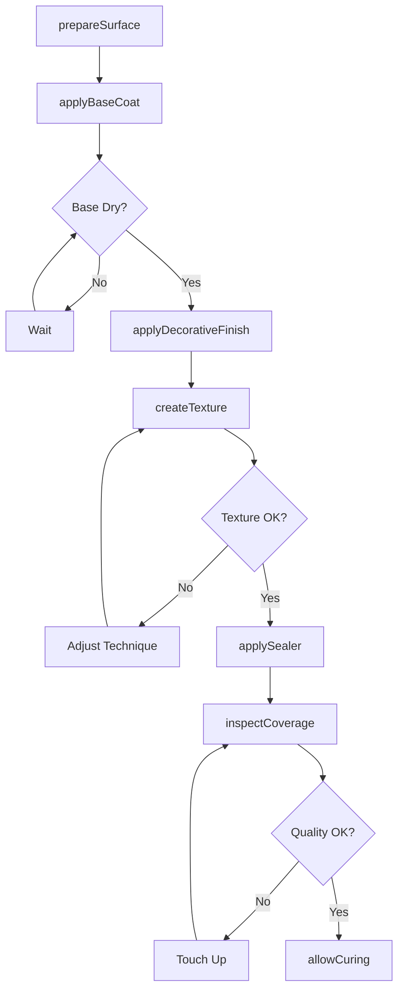
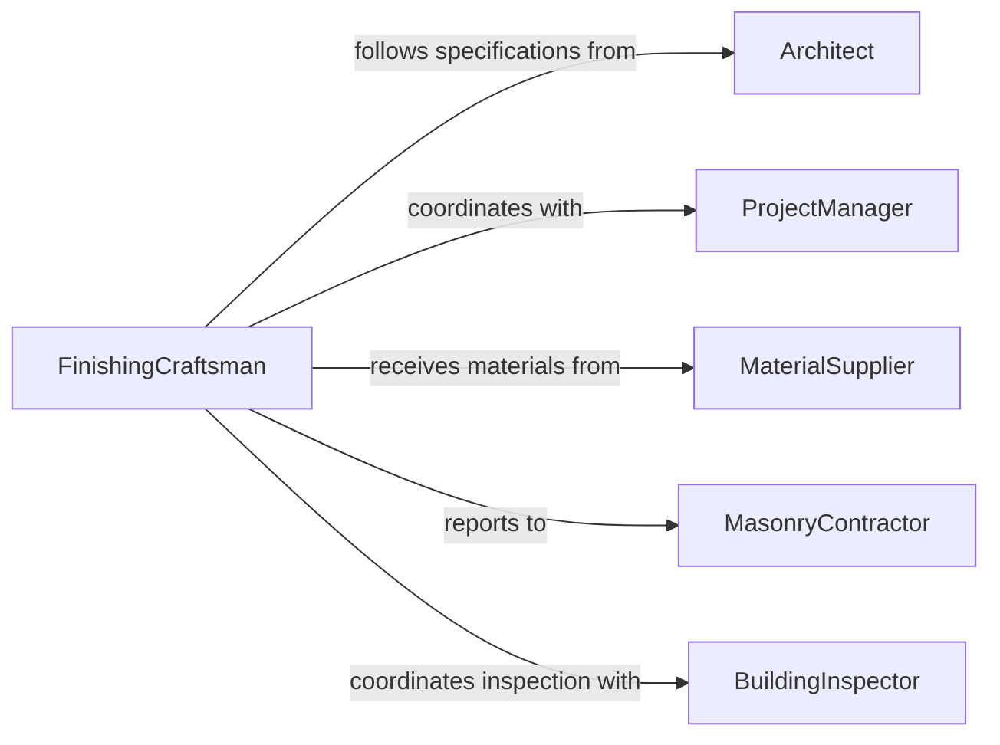

# Apply Decorative Masonry Finishes

> Business-as-Code definition for architectural masonry finishing and surface treatment. Models the complete process of applying decorative treatments to brick, stone, concrete, and block surfaces for aesthetic enhancement and protection in commercial and residential construction.

## Overview

Decorative masonry finishing involves applying specialized coatings, textures, and treatments to enhance appearance while protecting structural surfaces. This definition exposes actions for surface preparation, finish application, and quality verification across construction projects, restoration work, and architectural detailing.

## Actors

| Actor | Description |
|-------|-------------|
| MasonryContractor | Manages masonry finishing projects |
| FinishingCraftsman | Applies decorative treatments to surfaces |
| Architect | Specifies finish types and appearance standards |
| ProjectManager | Coordinates scheduling and quality |
| MaterialSupplier | Provides finishing products and technical support |
| BuildingInspector | Verifies compliance with building codes |

## Roles

| Role | Description |
|------|-------------|
| SurfacePreparationTechnician | Prepares masonry for finish application |
| FinishApplicator | Applies coatings and treatments |
| TextureSpecialist | Creates decorative surface patterns |
| QualityInspector | Verifies finish quality and coverage |

## Entities

| Entity | Description |
|--------|-------------|
| MasonrySurface | Brick, stone, block, or concrete substrate |
| FinishSpecification | Required appearance, texture, and color |
| FinishingMaterial | Coating, stain, or treatment product |
| ApplicationMethod | Technique for applying finish |
| QualityStandard | Acceptance criteria for finished work |
| CuringProtocol | Time and conditions for finish hardening |

## Actions

| Action | Description |
|--------|-------------|
| prepareSurface | Clean and condition masonry for finishing |
| applyBaseCoat | Apply primer or sealer layer |
| applyDecorativeFinish | Add colored or textured coating |
| createTexture | Form decorative surface pattern |
| applySealer | Protect finish with topcoat |
| inspectCoverage | Verify uniform application |
| allowCuring | Monitor finish hardening period |

## Events

| Event | Description |
|-------|-------------|
| surfacePrepared | Masonry cleaned and ready for finishing |
| baseCoatApplied | Primer or sealer layer completed |
| decorativeFinishApplied | Colored or textured coating added |
| textureCreated | Decorative pattern formed |
| sealerApplied | Protective topcoat completed |
| coverageInspected | Quality verified |
| curingCompleted | Finish fully hardened |

## Searches

| Search | Description |
|--------|-------------|
| findProjects | List finishing projects by status or location |
| getSpecifications | Retrieve finish requirements |
| getMaterialData | Access product technical information |
| getQualityRecords | View inspection results |
| getCuringSchedules | Check finish hardening timelines |

## Workflow



## Actor Relationships



## Usage

### Calling Actions

```typescript
import { applyDecorativeMasonryFinishes } from '@headlessly/apply-decorative-masonry-finishes'

const masonry = applyDecorativeMasonryFinishes()

// Prepare exterior brick wall for staining
await masonry.prepareSurface({
  surfaceId: 'WALL-EAST-FACADE',
  substrate: 'clay-brick',
  preparation: ['clean', 'pressure-wash', 'patch-defects'],
  dryTime: 48,
  preparedBy: 'crew-008'
})

// Apply decorative stain finish
await masonry.applyDecorativeFinish({
  surfaceId: 'WALL-EAST-FACADE',
  product: 'STAIN-TERRACOTTA-442',
  method: 'spray-application',
  coats: 2,
  coverage: '200-sqft-per-gallon',
  appliedBy: 'craftsman-042'
})

// Create textured surface pattern
await masonry.createTexture({
  surfaceId: 'COLUMN-DECORATIVE-12',
  technique: 'stipple-finish',
  pattern: 'medium-texture',
  depth: 'shallow',
  createdBy: 'texture-specialist-003'
})

// Inspect final coverage
const inspection = await masonry.inspectCoverage({
  surfaceId: 'WALL-EAST-FACADE',
  criteria: {
    uniformity: 'excellent',
    colorMatch: 'within-tolerance',
    defects: 'none'
  },
  inspectedBy: 'quality-inspector-008'
})
```

### Event-Driven Automation

```typescript
// Alert when curing period complete
masonry.curingCompleted(async ({ surfaceId, finishDate, curingHours }) => {
  await notify({
    to: 'project-manager',
    message: `Masonry finish on ${surfaceId} cured - ready for next phase`,
    priority: 'normal'
  })

  await schedule.update({
    surface: surfaceId,
    status: 'cured',
    nextPhase: 'available'
  })
})

// Log quality issues for warranty tracking
masonry.coverageInspected(async ({ surfaceId, quality, issues }) => {
  if (issues.length > 0) {
    await qualityLog.record({
      surface: surfaceId,
      event: 'coverage-defects',
      issues: issues,
      timestamp: new Date()
    })
  }
})
```
