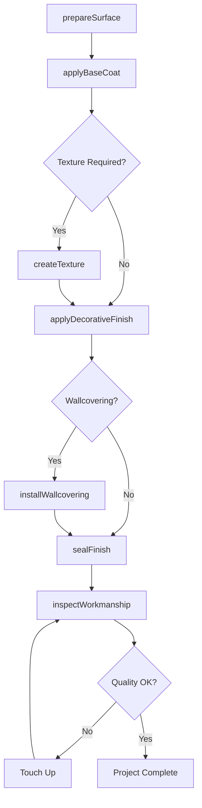
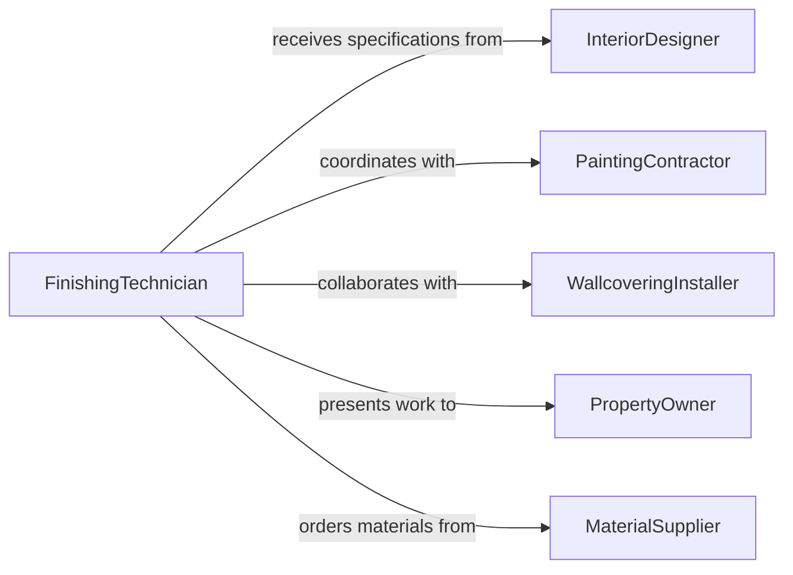

# Apply Decorative Textured Finishes Coverings

> Business-as-Code definition for interior decorative finishing and wall covering installation. Models the complete process of applying textured coatings, specialty finishes, and decorative wall coverings for residential and commercial interiors.

## Overview

Decorative textured finishing involves applying specialized coatings, wallpapers, and surface treatments to create aesthetic interior environments. This definition exposes actions for surface preparation, application techniques, and quality control across painting, wallcovering, and specialty finishing trades.

## Actors

| Actor | Description |
|-------|-------------|
| PaintingContractor | Manages decorative finishing projects |
| FinishingTechnician | Applies textures and specialty coatings |
| WallcoveringInstaller | Hangs wallpaper and fabric coverings |
| InteriorDesigner | Specifies finishes and aesthetic requirements |
| PropertyOwner | Approves finish selections and quality |
| MaterialSupplier | Provides coating products and wallcoverings |

## Roles

| Role | Description |
|------|-------------|
| SurfacePreparationSpecialist | Prepares walls for finish application |
| TextureApplicator | Creates textured wall surfaces |
| FauxFinishArtist | Applies decorative painting techniques |
| QualityInspector | Verifies finish quality and workmanship |

## Entities

| Entity | Description |
|--------|-------------|
| InteriorSurface | Wall, ceiling, or partition to be finished |
| FinishSpecification | Required texture, color, and appearance |
| CoatingProduct | Paint, plaster, or specialty finish material |
| WallCovering | Wallpaper, fabric, or decorative panel |
| ApplicationTechnique | Method for applying finish |
| QualityStandard | Acceptance criteria for completed work |

## Actions

| Action | Description |
|--------|-------------|
| prepareSurface | Clean, repair, and prime walls |
| applyBaseCoat | Apply primer or base layer |
| createTexture | Form decorative surface pattern |
| applyDecorative Finish | Add specialty coating or effect |
| installWallcovering | Hang wallpaper or fabric |
| sealFinish | Apply protective topcoat |
| inspectWorkmanship | Verify quality and appearance |

## Events

| Event | Description |
|-------|-------------|
| surfacePrepared | Walls ready for finishing |
| baseCoatApplied | Primer layer completed |
| textureCreated | Surface pattern formed |
| decorativeFinishApplied | Specialty coating completed |
| wallcoveringInstalled | Wallpaper or fabric hung |
| finishSealed | Protective coat applied |
| workmanshipInspected | Quality verified |

## Searches

| Search | Description |
|--------|-------------|
| findProjects | List finishing jobs by status or location |
| getSpecifications | Retrieve finish requirements |
| getTechniques | Find application methods for finish types |
| getQualityRecords | Access inspection documentation |
| getMaterialOptions | Browse available products and samples |

## Workflow



## Actor Relationships



## Usage

### Calling Actions

```typescript
import { applyDecorativeTexturedFinishesCoverings } from '@headlessly/apply-decorative-textured-finishes-coverings'

const finishing = applyDecorativeTexturedFinishesCoverings()

// Prepare dining room walls for Venetian plaster
await finishing.prepareSurface({
  surfaceId: 'ROOM-DINING-442',
  substrate: 'drywall',
  preparation: ['fill-holes', 'sand-smooth', 'prime'],
  primerType: 'bonding-primer',
  preparedBy: 'prep-crew-008'
})

// Create knockdown texture
await finishing.createTexture({
  surfaceId: 'ROOM-LIVING-305',
  technique: 'knockdown',
  pattern: 'medium-random',
  aggregate: 'fine-sand',
  createdBy: 'texture-tech-042'
})

// Apply metallic faux finish
await finishing.applyDecorativeFinish({
  surfaceId: 'ACCENT-WALL-12',
  technique: 'metallic-faux',
  baseColor: 'charcoal',
  metallicColor: 'copper',
  method: 'trowel-application',
  appliedBy: 'faux-artist-003'
})

// Install designer wallcovering
await finishing.installWallcovering({
  surfaceId: 'MASTER-BEDROOM-WALL',
  product: 'WALLPAPER-DAMASK-8840',
  pattern: 'damask-medallion',
  repeatLength: 24,
  method: 'paste-the-wall',
  installedBy: 'wallcovering-installer-008'
})
```

### Event-Driven Automation

```typescript
// Alert when surface ready for next phase
finishing.surfacePrepared(async ({ surfaceId, prepDate, readyFor }) => {
  await notify({
    to: 'finishing-crew',
    message: `Surface ${surfaceId} prepped and ready for ${readyFor}`,
    priority: 'normal'
  })

  await schedule.update({
    surface: surfaceId,
    status: 'ready-for-finishing'
  })
})

// Log quality issues for rework
finishing.workmanshipInspected(async ({ surfaceId, quality, defects }) => {
  if (defects.length > 0) {
    await reworkLog.record({
      surface: surfaceId,
      event: 'quality-defects',
      issues: defects,
      requiresRework: true,
      timestamp: new Date()
    })
  }
})
```
