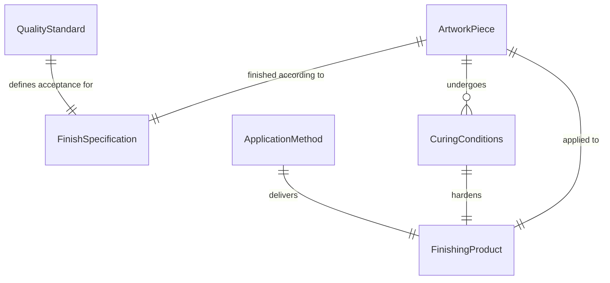
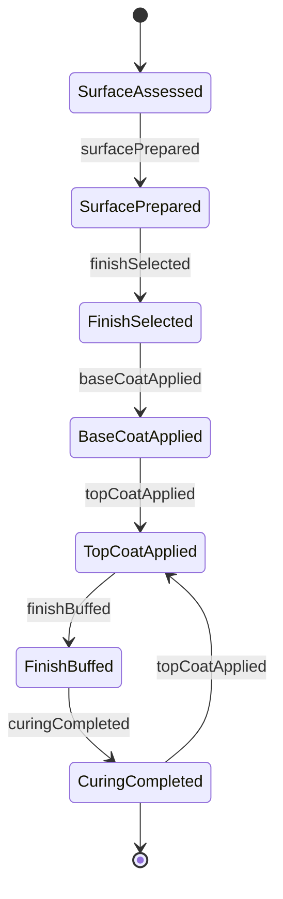
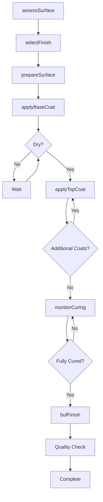
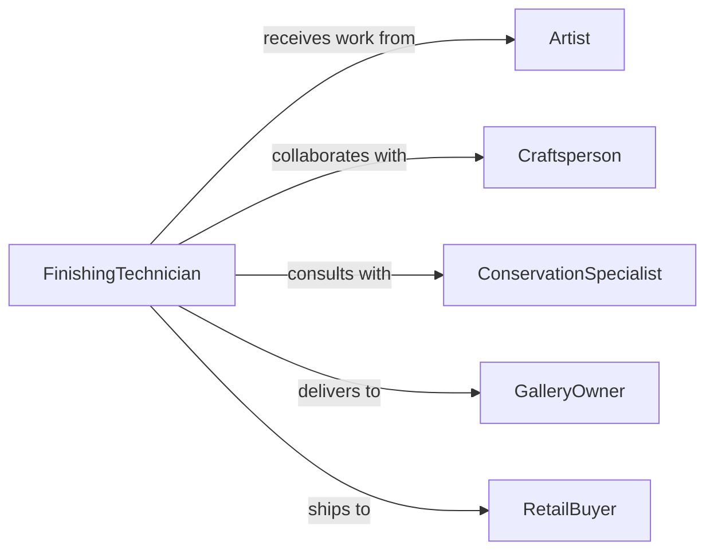

# Apply Finishes Artwork Crafts Displays

> Business-as-Code definition for artistic finishing and protective coating application. Models the complete process of applying sealers, varnishes, and protective treatments to artwork, handcrafted items, and retail displays for preservation and aesthetic enhancement.

## Overview

Artistic finish application involves protecting and enhancing completed artwork, crafts, and display pieces with appropriate coatings and treatments. This definition exposes actions for surface preparation, finish selection, application techniques, and curing procedures across art studios, craft workshops, and retail display production.

## Actors

| Actor | Description |
|-------|-------------|
| Artist | Creates original artwork requiring finishing |
| Craftsperson | Produces handmade items needing protection |
| FinishingTechnician | Applies coatings and sealers to pieces |
| GalleryOwner | Commissions finished artwork for display |
| RetailBuyer | Purchases finished crafts and displays |
| ConservationSpecialist | Advises on archival finishing methods |

## Roles

| Role | Description |
|------|-------------|
| FinishApplicator | Applies protective coatings to artwork |
| SurfacePreparationSpecialist | Prepares pieces for finishing |
| QualityChecker | Verifies finish quality and coverage |
| CuringMonitor | Manages drying and hardening processes |

## Entities

| Entity | Description |
|--------|-------------|
| ArtworkPiece | Original painting, sculpture, or craft item |
| FinishingProduct | Varnish, sealer, wax, or protective coating |
| FinishSpecification | Required sheen, protection level, and appearance |
| ApplicationMethod | Technique for applying finish |
| CuringConditions | Temperature, humidity, and time requirements |
| QualityStandard | Acceptance criteria for finished piece |

## Actions

| Action | Description |
|--------|-------------|
| assessSurface | Evaluate piece for finish compatibility |
| prepareSurface | Clean and condition artwork before coating |
| selectFinish | Choose appropriate product for medium |
| applyBaseCoat | Add initial protective layer |
| applyTopCoat | Add final finish layer |
| bufFinish | Polish surface to desired sheen |
| monitorCuring | Track drying and hardening progress |

## Events

| Event | Description |
|-------|-------------|
| surfaceAssessed | Piece evaluated for finishing |
| surfacePrepared | Artwork cleaned and ready for coating |
| finishSelected | Appropriate product chosen |
| baseCoatApplied | Initial protective layer completed |
| topCoatApplied | Final finish layer added |
| finishBuffed | Surface polished to specification |
| curingCompleted | Finish fully hardened and ready |

## Searches

| Search | Description |
|--------|-------------|
| findPieces | List artwork by status or finish type |
| getFinishOptions | Retrieve compatible products for medium |
| getCuringSchedules | View drying time requirements |
| getQualityRecords | Access quality control documentation |
| getTechniques | Find application methods for finish types |
## Entity Relationships




## State Diagram




## Workflow



## Actor Relationships



## Usage

### Calling Actions

```typescript
import { applyFinishesArtworkCraftsDisplays } from '@headlessly/apply-finishes-artwork-crafts-displays'

const finishing = applyFinishesArtworkCraftsDisplays()

// Assess oil painting for varnish
await finishing.assessSurface({
  pieceId: 'PAINTING-OIL-442',
  medium: 'oil-on-canvas',
  age: 'fully-cured',
  condition: 'excellent',
  assessedBy: 'finish-tech-008'
})

// Select archival varnish for protection
await finishing.selectFinish({
  pieceId: 'PAINTING-OIL-442',
  finishType: 'removable-varnish',
  product: 'GAMVAR-SATIN',
  sheen: 'satin',
  uv-protection: true,
  archival: true
})

// Apply varnish to acrylic painting
await finishing.applyTopCoat({
  pieceId: 'PAINTING-ACRYLIC-305',
  product: 'GOLDEN-POLYMER-VARNISH',
  method: 'brush-application',
  coats: 2,
  dryTimeBetween: 24,
  appliedBy: 'finish-tech-042'
})

// Monitor curing in controlled environment
const curing = await finishing.monitorCuring({
  pieceId: 'PAINTING-OIL-442',
  environment: {
    temperature: 70,
    humidity: 50,
    ventilation: 'good'
  },
  expectedCureTime: 72
})
```

### Event-Driven Automation

```typescript
// Alert when curing complete
finishing.curingCompleted(async ({ pieceId, finishDate, curingHours }) => {
  await notify({
    to: 'artist',
    message: `Your artwork ${pieceId} finish has fully cured - ready for display`,
    priority: 'normal'
  })

  await inventory.update({
    piece: pieceId,
    status: 'finished',
    readyForDisplay: true
  })
})

// Schedule quality inspection after base coat
finishing.baseCoatApplied(async ({ pieceId, product, dryTime }) => {
  await schedule({
    task: 'quality-inspection',
    piece: pieceId,
    delay: dryTime,
    assignTo: 'quality-team'
  })
})
```
