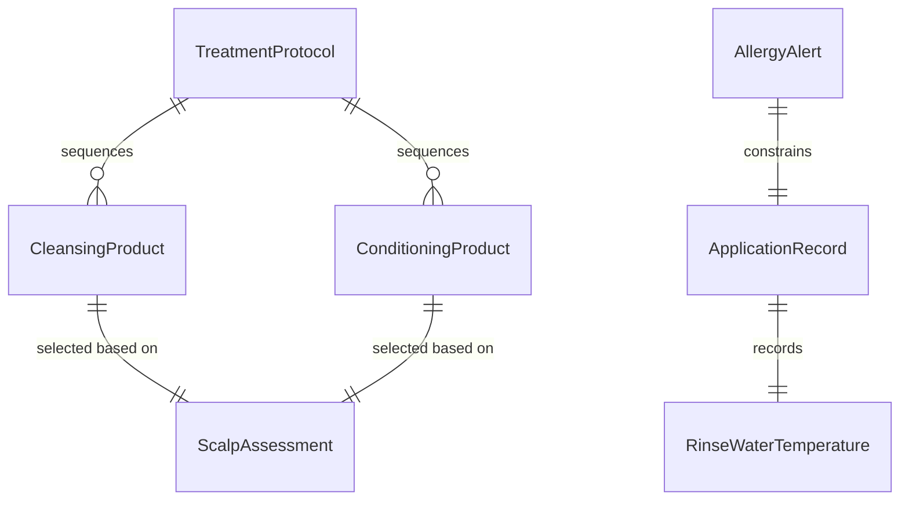
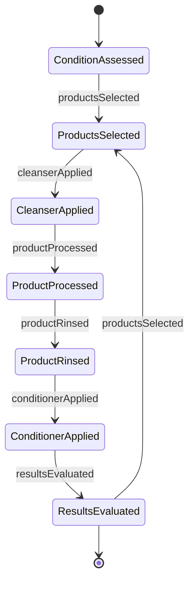
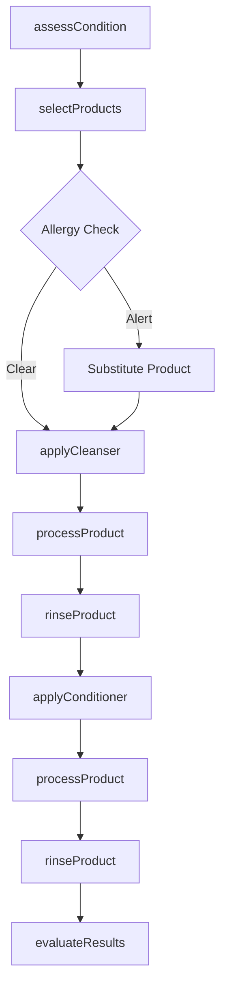
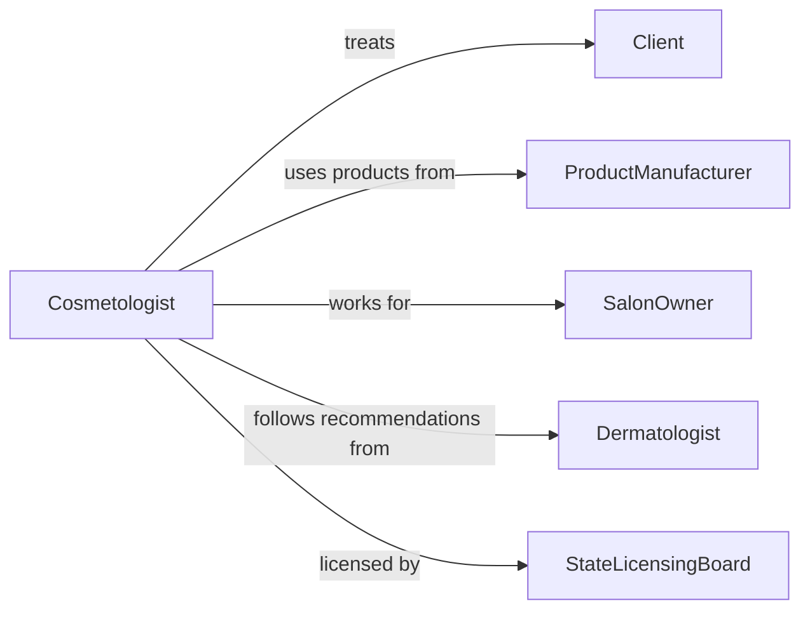

# Apply Cleansing or Conditioning Agents to Client Hair, Scalp, or Skin

> Business-as-Code definition for cleansing and conditioning agent application. Models the client assessment, product selection, application technique, processing, rinsing, and post-treatment evaluation for shampoo, conditioner, scalp treatments, and skin cleansing services in salon, spa, and clinical settings.

## Overview

Applying cleansing or conditioning agents to client hair, scalp, or skin involves assessing the client's hair or skin type, selecting appropriate products, applying shampoos, conditioners, masks, or cleansers using proper technique, allowing products to process for the required duration, rinsing thoroughly, and evaluating the results. This definition covers salon shampoo and conditioning services, deep conditioning and keratin treatments, scalp detox and exfoliation therapies, esthetician skin cleansing protocols, and barber pre-shave preparation.

## Actors

| Actor | Description |
|-------|-------------|
| Client | Receives cleansing or conditioning treatment on hair, scalp, or skin |
| ProductManufacturer | Formulates and supplies professional cleansing and conditioning products |
| SalonOwner | Provides the service environment and selects product lines to offer |
| Dermatologist | Recommends medicated or therapeutic products for specific conditions |
| StateLicensingBoard | Regulates cosmetology and esthetician practice standards |

## Roles

| Role | Description |
|------|-------------|
| Cosmetologist | Applies cleansing and conditioning products to client hair and scalp |
| Esthetician | Performs skin cleansing and conditioning treatments on the face and body |
| Shampooist | Specializes in shampoo and conditioning services at the salon basin |
| ProductEducator | Trains staff on product formulations, application methods, and safety |

## Entities

| Entity | Description |
|--------|-------------|
| CleansingProduct | A shampoo, cleanser, or wash used to remove soil, oil, and product buildup |
| ConditioningProduct | A conditioner, mask, or treatment that restores moisture and strength |
| ScalpAssessment | An evaluation of scalp condition including oiliness, dryness, and sensitivity |
| ApplicationRecord | A log of products applied, processing times, and client reactions |
| TreatmentProtocol | A standardized sequence of products and techniques for a specific service |
| AllergyAlert | A documented sensitivity or allergy to specific ingredients |
| RinseWaterTemperature | The water temperature used during product rinsing for optimal results |

## Actions

| Action | Description |
|--------|-------------|
| assessCondition | Evaluate the client's hair, scalp, or skin type and current condition |
| selectProducts | Choose appropriate cleansing and conditioning products based on the assessment |
| applyCleanser | Work the cleansing product into hair, scalp, or skin using proper technique |
| processProduct | Allow the product to sit for the required duration to achieve desired results |
| rinseProduct | Remove the product with water at the appropriate temperature |
| applyConditioner | Distribute conditioning or treatment product from mid-lengths to ends or across the skin |
| evaluateResults | Assess the hair, scalp, or skin after treatment to confirm desired outcome |

## Events

| Event | Description |
|-------|-------------|
| conditionAssessed | Client's hair, scalp, or skin condition has been evaluated |
| productsSelected | Appropriate cleansing and conditioning products have been chosen |
| cleanserApplied | Cleansing product has been worked into the treatment area |
| productProcessed | Product has completed its required processing time |
| productRinsed | Product has been thoroughly removed with water |
| conditionerApplied | Conditioning or treatment product has been distributed and processed |
| resultsEvaluated | Post-treatment condition has been assessed and documented |

## Searches

| Search | Description |
|--------|-------------|
| findClientHistory | Retrieve past cleansing and conditioning services for a specific client |
| getProductRecommendations | Look up products suitable for a given hair or skin type and condition |
| findAllergyAlerts | Check for documented ingredient sensitivities before product selection |
| getProtocolsByType | Retrieve treatment protocols by hair type, skin type, or condition |
| findProductInventory | Check stock levels of professional cleansing and conditioning products |
## Entity Relationships




## State Diagram




## Workflow



## Actor Relationships



## Usage

### Calling Actions

```typescript
import { applyCleansingConditioningAgentsClient } from '@headlessly/apply-cleansing-conditioning-agents-client'

const treatments = applyCleansingConditioningAgentsClient()

// Assess and select products
await treatments.assessCondition({
  clientId: 'CLT-2024-08821',
  area: 'hair-and-scalp',
  hairType: 'color-treated-fine',
  scalpCondition: 'slightly-dry',
  concerns: ['color-fading', 'lack-of-volume']
})

await treatments.selectProducts({
  clientId: 'CLT-2024-08821',
  cleanser: 'sulfate-free-color-protect-shampoo',
  conditioner: 'lightweight-volumizing-conditioner',
  treatment: 'bond-repair-mask',
  processingTime: { mask: 10, unit: 'minutes' }
})

// Apply and process
await treatments.applyCleanser({
  clientId: 'CLT-2024-08821',
  technique: 'emulsify-at-scalp-work-through-lengths',
  waterTemp: 'warm',
  latherCount: 2
})
```

### Event-Driven Automation

```typescript
// Track product consumption for reordering
treatments.cleanserApplied(async ({ productId, quantityMl }) => {
  await inventory.recordUsage({
    productId,
    quantity: quantityMl,
    unit: 'ml',
    date: new Date().toISOString()
  })
})

// Recommend home care products after service
treatments.resultsEvaluated(async ({ clientId, hairType, concerns }) => {
  await retail.generateRecommendation({
    clientId,
    basedOn: { hairType, concerns },
    category: 'home-care-regimen'
  })
})
```
