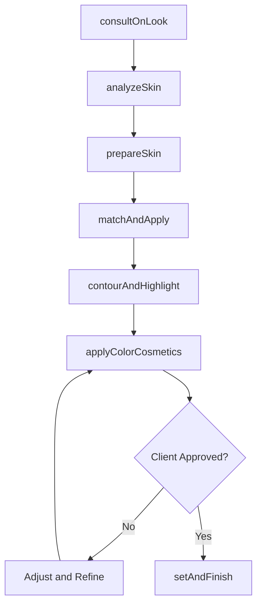
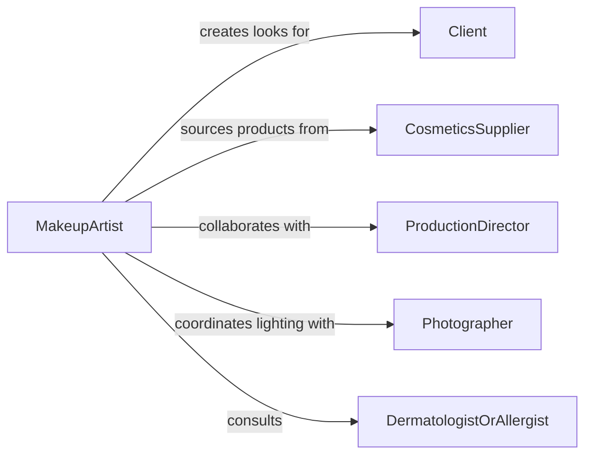

# Apply Makeup to Alter or Enhance Appearance

> Business-as-Code definition for makeup application services. Models the client consultation, skin preparation, color matching, product application, contouring, finishing, and documentation for cosmetic, theatrical, special effects, bridal, and editorial makeup in salon, studio, and on-location settings.

## Overview

Applying makeup to alter or enhance appearance involves consulting with clients or production teams on the desired look, analyzing skin tone and type, preparing the skin surface, selecting and matching foundation, concealer, and color cosmetics, applying products in sequence from base through eyes, lips, and cheeks, contouring and highlighting for dimension, and setting the finished look for durability. This definition covers bridal and event makeup, editorial and fashion photography makeup, theatrical and stage performance makeup, special effects and prosthetic makeup, and everyday cosmetic enhancement services.

## Actors

| Actor | Description |
|-------|-------------|
| Client | Requests makeup application for an event, production, or personal enhancement |
| CosmeticsSupplier | Provides foundations, pigments, brushes, and professional makeup products |
| ProductionDirector | Specifies character looks and continuity requirements for film or theater |
| Photographer | Collaborates on makeup that photographs well under specific lighting |
| DermatologistOrAllergist | Advises on products safe for sensitive or reactive skin |

## Roles

| Role | Description |
|------|-------------|
| MakeupArtist | Designs and applies makeup looks tailored to the client and setting |
| SpecialEffectsArtist | Creates prosthetic, wound, aging, or fantasy effects using makeup and appliances |
| KeyMakeupArtist | Leads the makeup department on set and maintains continuity across scenes |
| MakeupAssistant | Prepares the kit, cleans brushes, and supports the lead artist during application |

## Entities

| Entity | Description |
|--------|-------------|
| MakeupLook | A defined combination of products and techniques achieving a specific appearance |
| FaceChart | A visual diagram documenting product placement, colors, and techniques used |
| SkinAnalysis | An assessment of skin tone, undertone, texture, and sensitivities |
| ProductKit | The organized collection of cosmetics, brushes, and tools for a session |
| ContinuityPhoto | A reference image ensuring consistent makeup across multiple sessions or scenes |
| ColorPalette | A curated selection of shades matched to the client's skin tone and desired look |
| ApplicationSequence | The ordered steps from primer through setting spray for a complete look |

## Actions

| Action | Description |
|--------|-------------|
| consultOnLook | Discuss the desired makeup style, occasion, and any skin concerns |
| analyzeSkin | Evaluate skin tone, undertone, texture, and product sensitivities |
| prepareSkin | Cleanse, moisturize, and prime the face to create a smooth application surface |
| matchAndApply | Select foundation and concealer shades and apply the base layer |
| contourAndHighlight | Sculpt facial features using light and shadow products |
| applyColorCosmetics | Apply eyeshadow, liner, mascara, blush, and lip products |
| setAndFinish | Lock the makeup in place with setting powder and setting spray |

## Events

| Event | Description |
|-------|-------------|
| lookConsulted | The desired makeup style and requirements have been established |
| skinAnalyzed | Skin tone, type, and sensitivities have been assessed |
| skinPrepared | The face has been cleansed, moisturized, and primed |
| baseApplied | Foundation and concealer have been matched and applied |
| contourCompleted | Contouring and highlighting have sculpted the desired facial dimension |
| colorCosmeticsApplied | Eye, cheek, and lip products have been applied |
| lookFinished | The makeup has been set and is ready for the occasion |

## Searches

| Search | Description |
|--------|-------------|
| findClientProfiles | Locate client records with skin analysis, preferences, and past looks |
| getFaceCharts | Retrieve documented face charts by client, event, or production |
| findProductsBySkinType | Look up cosmetics suitable for a specific skin type and sensitivity |
| getContinuityPhotos | Access reference photos from previous sessions for consistency |
| findAvailableArtists | List makeup artists available for a given date, location, and specialty |

## Workflow



## Actor Relationships



## Usage

### Calling Actions

```typescript
import { applyMakeupAlterEnhanceAppearance } from '@headlessly/apply-makeup-alter-enhance-appearance'

const makeup = applyMakeupAlterEnhanceAppearance()

// Consult and analyze
await makeup.consultOnLook({
  clientId: 'CLT-2024-10552',
  occasion: 'bridal-ceremony',
  style: 'soft-glam-natural',
  references: ['IMG-001.jpg', 'IMG-002.jpg'],
  waterproof: true,
  lashPreference: 'individual-clusters'
})

await makeup.analyzeSkin({
  clientId: 'CLT-2024-10552',
  skinType: 'combination',
  undertone: 'warm-olive',
  concerns: ['redness-on-cheeks', 'oily-t-zone'],
  allergies: ['carmine-free']
})

// Apply base and color
await makeup.matchAndApply({
  clientId: 'CLT-2024-10552',
  foundation: { brand: 'professional-line', shade: 'warm-sand-340', finish: 'satin' },
  concealer: { shade: 'light-medium-warm', areas: ['under-eye', 'chin', 'nose-bridge'] },
  technique: 'stipple-and-blend'
})
```

### Event-Driven Automation

```typescript
// Document the look for continuity or future reference
makeup.lookFinished(async ({ clientId, faceChart, productsUsed }) => {
  await portfolio.saveLook({
    clientId,
    faceChart,
    productsUsed,
    photos: await camera.captureSet({ angles: ['front', 'left', 'right'] }),
    date: new Date().toISOString()
  })
})

// Restock kit after session
makeup.colorCosmeticsApplied(async ({ productsUsed }) => {
  for (const product of productsUsed) {
    if (product.remainingPercent < 20) {
      await purchasing.reorder({
        product: product.id,
        quantity: 1,
        priority: 'standard'
      })
    }
  }
})
```
