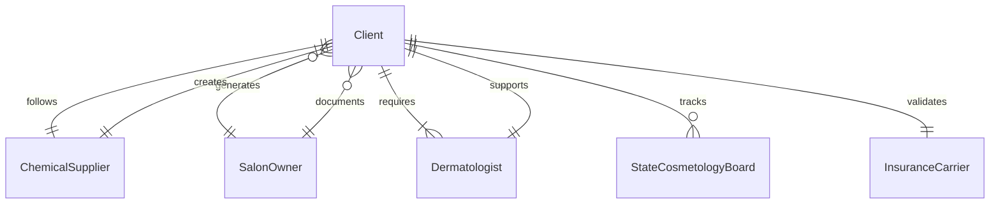
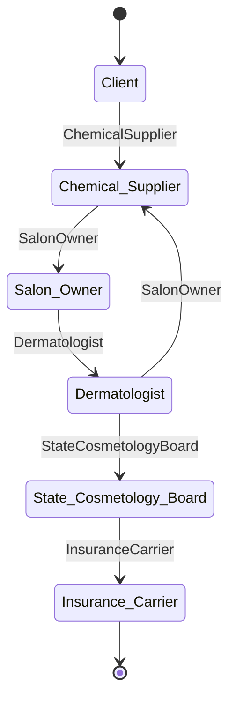
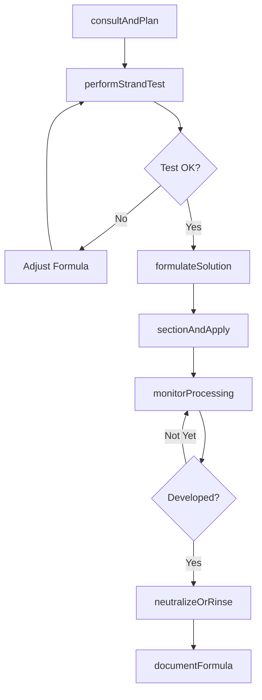
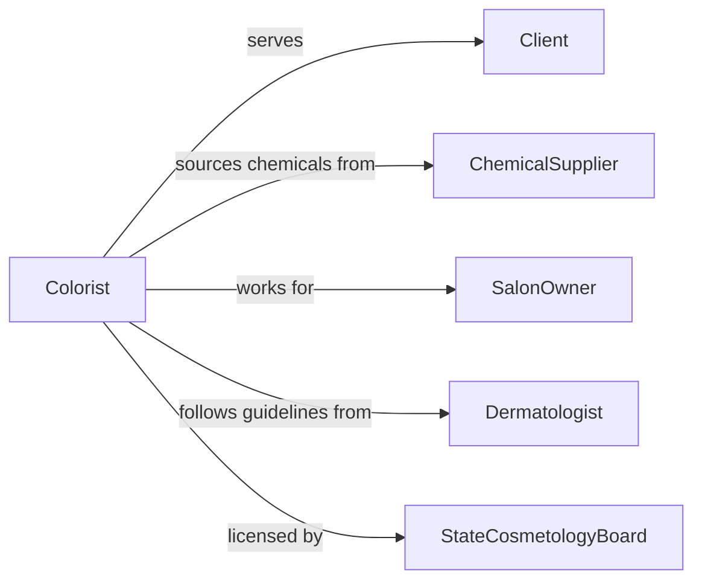

# Apply Solutions to Hair for Therapeutic or Cosmetic Purposes

> Business-as-Code definition for therapeutic and cosmetic hair solution application. Models the consultation, strand testing, formulation, sectioning, application, processing, neutralization, and aftercare for hair color, chemical straightening, permanent waving, and scalp therapy treatments.

## Overview

Applying solutions to hair for therapeutic or cosmetic purposes involves consulting with clients on desired results, performing strand and patch tests, formulating chemical mixtures to specification, sectioning hair for even application, applying the solution with timing control, neutralizing or rinsing at the correct stage, and providing aftercare guidance. This definition covers hair coloring and bleaching services, permanent wave and relaxer applications, keratin smoothing treatments, scalp therapy and medicated rinse protocols, and toner and gloss applications.

## Actors

| Actor | Description |
|-------|-------------|
| Client | Seeks hair color, texture, or therapeutic treatment services |
| ChemicalSupplier | Provides professional hair color, relaxers, perming solutions, and treatments |
| SalonOwner | Operates the service environment and manages chemical inventory |
| Dermatologist | Prescribes medicated scalp solutions for therapeutic conditions |
| StateCosmetologyBoard | Regulates chemical service licensing and safety standards |
| InsuranceCarrier | Provides liability coverage for chemical service reactions and claims |

## Roles

| Role | Description |
|------|-------------|
| Colorist | Formulates and applies hair color, bleach, toners, and glosses |
| ChemicalServiceSpecialist | Performs permanent waves, relaxers, and keratin treatments |
| Trichologist | Applies therapeutic scalp solutions for hair loss and scalp conditions |
| AssistantStylist | Mixes formulations, monitors processing times, and assists with rinsing |

## Entities

| Entity | Description |
|--------|-------------|
| ChemicalFormulation | A mixed solution of color, developer, relaxer, or waving lotion at specific ratios |
| StrandTest | A preliminary test on a small section of hair to predict processing results |
| PatchTest | An allergy screening applied behind the ear or inner arm before full application |
| ProcessingTimer | A tracked duration controlling how long the solution remains on the hair |
| NeutralizingAgent | A product that stops the chemical reaction and stabilizes the result |
| ColorFormula | A recorded recipe of shade, developer volume, and additives for client replication |
| AftercarePlan | Post-treatment instructions for maintaining results and hair health |

## Actions

| Action | Description |
|--------|-------------|
| consultAndPlan | Discuss desired outcome, assess hair condition, and plan the service approach |
| performStrandTest | Apply the solution to a small hair section to verify processing time and result |
| formulateSolution | Mix chemical products to the precise ratio and strength for the treatment |
| sectionAndApply | Part the hair into sections and apply the solution evenly from roots to ends |
| monitorProcessing | Check the hair at intervals to assess development and prevent over-processing |
| neutralizeOrRinse | Apply neutralizer or rinse the solution at the optimal processing stage |
| documentFormula | Record the exact formulation and timing for future reference and replication |

## Events

| Event | Description |
|-------|-------------|
| consultationCompleted | Client goals, hair assessment, and service plan have been finalized |
| strandTestPassed | Strand test confirms the solution achieves the desired result safely |
| solutionFormulated | Chemical mixture has been prepared to specification |
| solutionApplied | Product has been distributed evenly through all hair sections |
| processingMonitored | Development has been checked and progress confirmed on track |
| solutionNeutralized | Chemical reaction has been stopped and hair stabilized |
| formulaDocumented | Formulation details have been recorded for the client file |

## Searches

| Search | Description |
|--------|-------------|
| findClientFormulas | Retrieve saved color or chemical formulas for a returning client |
| getProcessingGuidelines | Look up recommended timing and developer volumes by product line |
| findAllergyHistory | Check client records for prior patch test results or sensitivity flags |
| getServiceLog | Retrieve chemical treatment history for a client by date or service type |
| findProductCompatibility | Verify that selected products are safe to layer or combine |
## Entity Relationships




## State Diagram




## Workflow



## Actor Relationships



## Usage

### Calling Actions

```typescript
import { applySolutionsHairTherapeuticCosmetic } from '@headlessly/apply-solutions-hair-therapeutic-cosmetic'

const hairSolutions = applySolutionsHairTherapeuticCosmetic()

// Consult and strand test
await hairSolutions.consultAndPlan({
  clientId: 'CLT-2024-09135',
  service: 'full-highlight-with-toner',
  currentLevel: '6N-medium-brown',
  targetResult: '9A-light-ash-blonde',
  hairCondition: 'virgin-medium-texture'
})

await hairSolutions.formulateSolution({
  clientId: 'CLT-2024-09135',
  lightener: 'clay-based-bleach',
  developer: '30-volume',
  ratio: '1:2',
  additive: 'bond-protector-2ml',
  toner: { shade: '9A', developer: '10-volume', ratio: '1:1' }
})

// Apply and monitor
await hairSolutions.sectionAndApply({
  clientId: 'CLT-2024-09135',
  technique: 'foil-highlights',
  placement: 'babylights-with-face-frame',
  startingPoint: 'nape-working-up'
})
```

### Event-Driven Automation

```typescript
// Alert when processing time is near completion
hairSolutions.solutionApplied(async ({ clientId, estimatedMinutes }) => {
  await timers.set({
    clientId,
    alertAt: estimatedMinutes - 5,
    message: `Check processing for client ${clientId} - 5 minutes remaining`
  })
})

// Save formula for future visits
hairSolutions.formulaDocumented(async ({ clientId, formula, result }) => {
  await clientFiles.saveFormula({
    clientId,
    formula,
    result,
    date: new Date().toISOString(),
    photoReference: true
  })
})
```
