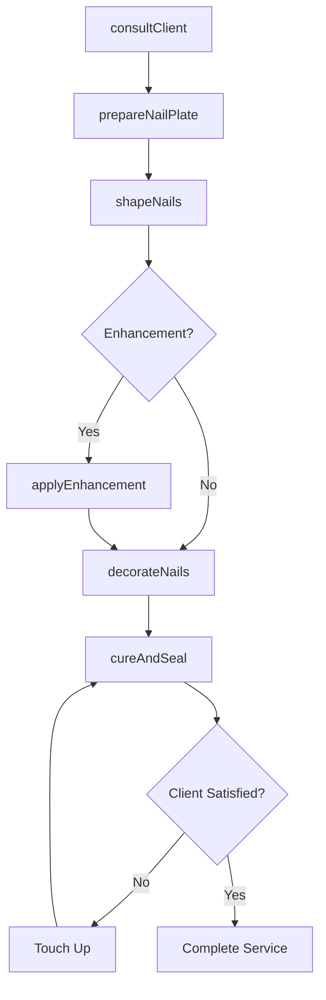
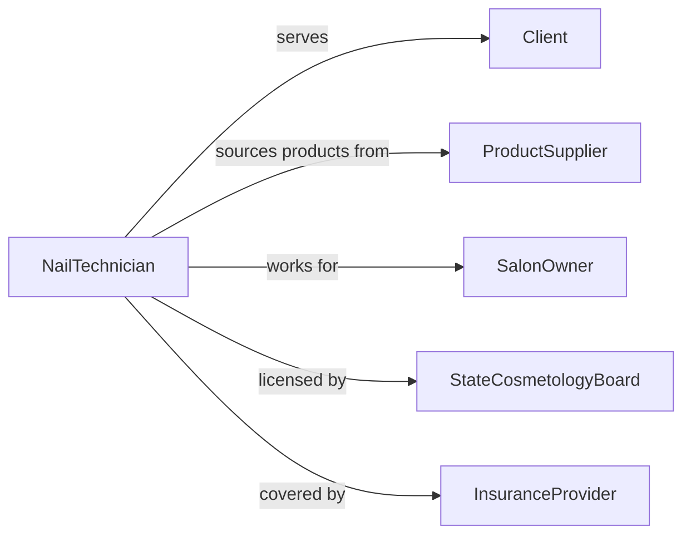

# Treat Nails by Shaping, Decorating, or Augmenting

> Business-as-Code definition for nail treatment services. Models the consultation, preparation, shaping, application of enhancements, decorating, and finishing of natural and artificial nails in salon, spa, and mobile service environments.

## Overview

Treating nails by shaping, decorating, or augmenting involves consulting with clients on desired styles, preparing the natural nail plate, filing and shaping to the requested profile, applying gel, acrylic, or dip powder extensions, executing nail art or decorative finishes, and sealing with top coats or UV/LED curing. This definition covers manicure and pedicure shaping services, acrylic and gel nail extensions, nail art and embellishment applications, dip powder overlay systems, and press-on or tip overlay installations.

## Actors

| Actor | Description |
|-------|-------------|
| Client | Requests nail treatment services and selects desired styles |
| ProductSupplier | Provides nail polishes, gels, acrylics, tools, and embellishments |
| SalonOwner | Operates the nail service establishment and sets pricing |
| StateCosmetologyBoard | Licenses nail technicians and enforces sanitation standards |
| InsuranceProvider | Covers professional liability for nail service providers |

## Roles

| Role | Description |
|------|-------------|
| NailTechnician | Shapes, decorates, and augments nails per client requests |
| NailArtist | Creates intricate designs, patterns, and embellishments on nails |
| SalonReceptionist | Schedules appointments and manages client check-in |
| SanitationCoordinator | Ensures tools and workstations meet hygiene and sterilization standards |

## Entities

| Entity | Description |
|--------|-------------|
| NailService | A specific treatment being performed on a client's nails |
| NailShape | The filed profile of the nail such as square, oval, almond, coffin, or stiletto |
| NailEnhancement | An artificial overlay or extension applied to the natural nail |
| NailArtDesign | A decorative pattern, decal, or embellishment applied to the nail surface |
| ProductFormula | A specific gel, acrylic, dip powder, or polish used during the service |
| AppointmentRecord | A booking capturing client preferences, service type, and technician assignment |
| SanitationLog | A record of tool sterilization and workstation cleaning between clients |

## Actions

| Action | Description |
|--------|-------------|
| consultClient | Discuss desired nail shape, length, color, and design with the client |
| prepareNailPlate | Clean, push back cuticles, buff, and dehydrate the natural nail surface |
| shapeNails | File nails to the requested profile and length |
| applyEnhancement | Build gel, acrylic, or dip powder extensions onto the natural nail |
| decorateNails | Apply nail art, decals, foils, gems, or hand-painted designs |
| cureAndSeal | Cure under UV or LED lamp and apply top coat for durability |
| removeEnhancement | Soak off or file down existing artificial nail product for a new application |

## Events

| Event | Description |
|-------|-------------|
| clientConsulted | Client preferences for shape, color, and design have been recorded |
| nailPlatePrepared | Natural nails have been cleaned, buffed, and dehydrated |
| nailsShaped | Nails have been filed to the requested profile |
| enhancementApplied | Artificial product has been built onto the nail plate |
| nailsDecorated | Art, embellishments, or decorative finishes have been applied |
| serviceCured | Top coat has been cured and sealed for durability |
| enhancementRemoved | Previous artificial product has been safely removed |

## Searches

| Search | Description |
|--------|-------------|
| findAppointments | Locate nail service bookings by client, technician, or date |
| getServiceHistory | Retrieve past nail treatments for a specific client |
| findProductUsage | Track consumption of gels, acrylics, and polishes by service or period |
| getDesignCatalog | Browse available nail art designs by style, complexity, or season |
| findAvailableSlots | List open appointment times by technician and service type |

## Workflow



## Actor Relationships



## Usage

### Calling Actions

```typescript
import { treatNailsShapingDecoratingAugmenting } from '@headlessly/treat-nails-shaping-decorating-augmenting'

const nails = treatNailsShapingDecoratingAugmenting()

// Consult and prepare
await nails.consultClient({
  clientId: 'CLT-2024-04210',
  desiredShape: 'almond',
  length: 'medium',
  color: 'french-ombre',
  enhancements: ['gel-extension'],
  art: ['chrome-accent-ring-finger']
})

await nails.prepareNailPlate({
  clientId: 'CLT-2024-04210',
  cuticleWork: 'push-and-trim',
  dehydrator: 'nail-prep-solution',
  primer: 'acid-free-bonding'
})

// Apply enhancement and decorate
await nails.applyEnhancement({
  clientId: 'CLT-2024-04210',
  type: 'hard-gel-extension',
  form: 'dual-form',
  builder: 'cover-pink-gel',
  shape: 'almond'
})
```

### Event-Driven Automation

```typescript
// Track product usage for inventory management
nails.enhancementApplied(async ({ clientId, productFormula, quantityUsed }) => {
  await inventory.deduct({
    product: productFormula,
    quantity: quantityUsed,
    serviceDate: new Date().toISOString()
  })
})

// Send aftercare instructions post-service
nails.serviceCured(async ({ clientId, serviceType }) => {
  await messaging.send({
    to: clientId,
    template: 'nail-aftercare',
    variables: { serviceType, rebookWeeks: serviceType === 'gel-extension' ? 3 : 2 }
  })
})
```
