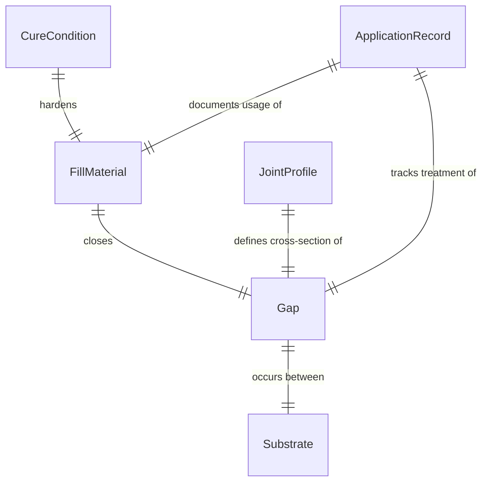
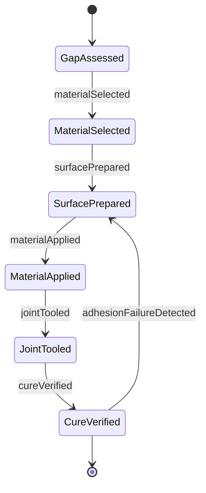
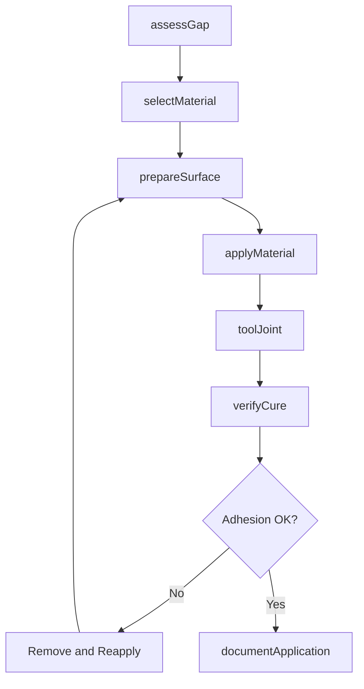
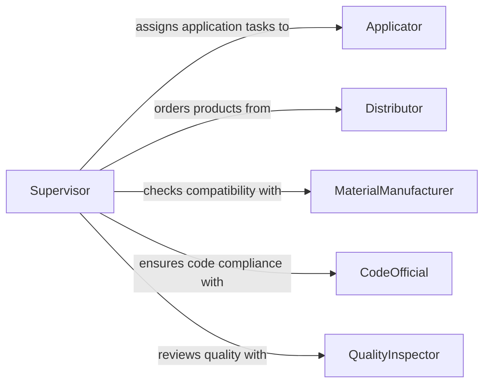

# Apply Material Fill Gaps Surfaces

> Business-as-Code definition for applying material to fill gaps in surfaces. Models the process of selecting, preparing, and applying filler compounds to close gaps between adjacent surfaces in construction and manufacturing.

## Overview

Applying material to fill gaps in surfaces involves using caulk, grout, joint compound, foam, or other filler products to close spaces between building components, panels, flooring sections, or assembled parts. This activity addresses both functional requirements such as thermal insulation, air sealing, and moisture prevention, as well as aesthetic finish quality. Workers must select the appropriate material based on gap width, substrate type, exposure conditions, and movement tolerance.

## Actors

| Actor | Description |
|-------|-------------|
| MaterialManufacturer | Produces caulks, grouts, joint compounds, and gap-filling products |
| BuildingOwner | Specifies performance requirements for gap treatment |
| Distributor | Supplies fill materials and application tools to the jobsite |
| CodeOfficial | Enforces building code requirements for fire-stopping and air barriers |
| SubstrateManufacturer | Provides compatibility guidance for fill material adhesion |

## Roles

| Role | Description |
|------|-------------|
| Applicator | Selects and applies gap-filling material to surfaces |
| Supervisor | Oversees application quality and material usage |
| QualityInspector | Tests adhesion, fill depth, and finish of applied material |
| Estimator | Calculates material quantities based on gap measurements |

## Entities

| Entity | Description |
|--------|-------------|
| Gap | A space between two adjacent surfaces requiring filling |
| FillMaterial | The product used to close the gap (caulk, grout, foam, compound) |
| Substrate | The surface material on either side of the gap |
| ApplicationRecord | Documentation of material applied, location, and conditions |
| JointProfile | The cross-section specification of the filled gap |
| CureCondition | Temperature and humidity parameters required for proper material curing |

## Actions

| Action | Description |
|--------|-------------|
| assessGap | Measure gap dimensions and evaluate substrate conditions |
| selectMaterial | Choose the appropriate fill product based on gap characteristics |
| prepareSurface | Clean and prime adjacent surfaces to ensure adhesion |
| applyMaterial | Dispense fill material into the gap using the specified method |
| toolJoint | Shape and smooth the applied material to the specified profile |
| verifyCure | Check that the fill material has cured to the required hardness |
| documentApplication | Record material, location, conditions, and quality results |

## Events

| Event | Description |
|-------|-------------|
| gapAssessed | Gap dimensions and substrate conditions have been evaluated |
| materialSelected | The appropriate fill product has been chosen for the application |
| surfacePrepared | Adjacent surfaces have been cleaned and primed for adhesion |
| materialApplied | Fill material has been dispensed into the gap |
| jointTooled | The applied material has been shaped to the specified profile |
| cureVerified | The fill material has reached the required hardness |
| adhesionFailureDetected | The fill material has separated from the substrate |

## Searches

| Search | Description |
|--------|-------------|
| findGaps | Retrieve gaps by location, size range, or fill status |
| getApplicationRecords | List completed fill applications by area, date, or material type |
| getMaterialInventory | Check available fill materials by product, quantity, and expiration |
## Entity Relationships




## State Diagram




## Workflow



## Actor Relationships



## Usage

### Calling Actions

```typescript
import { applyMaterialFillGapsSurfaces } from '@headlessly/apply-material-fill-gaps-surfaces'

const gapFill = applyMaterialFillGapsSurfaces()

// Assess a gap between wall panels
const gap = await gapFill.assessGap({
  locationId: 'floor-3-north-wall-joint-007',
  width: 0.375,
  depth: 0.75,
  length: 96,
  substrates: ['concrete', 'steel-stud-track']
})

// Select and apply the appropriate material
const material = await gapFill.selectMaterial({
  gapId: gap.id,
  requirements: ['fire-rated', 'flexible', 'paintable'],
  movementCapability: 25
})

await gapFill.applyMaterial({
  gapId: gap.id,
  fillMaterialId: material.id,
  method: 'caulk-gun',
  backerRod: true
})

// Tool the joint to a concave profile
await gapFill.toolJoint({
  gapId: gap.id,
  profile: 'concave',
  toolType: 'plastic-spoon'
})
```

### Event-Driven Automation

```typescript
// Alert supervisor on adhesion failure
gapFill.adhesionFailureDetected(async ({ gapId, locationId }) => {
  await notify({
    to: 'site-supervisor',
    message: `Adhesion failure at ${locationId}, gap ${gapId} requires rework`
  })
})

// Schedule inspection when cure is verified
gapFill.cureVerified(async ({ gapId, locationId }) => {
  await scheduleInspection({
    type: 'gap-fill-quality',
    locationId,
    gapId,
    priority: 'normal'
  })
})
```
