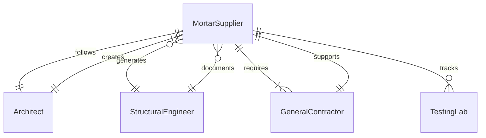
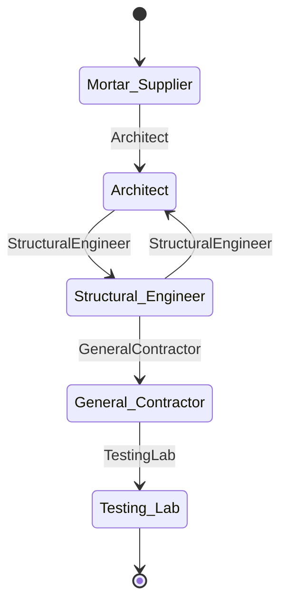
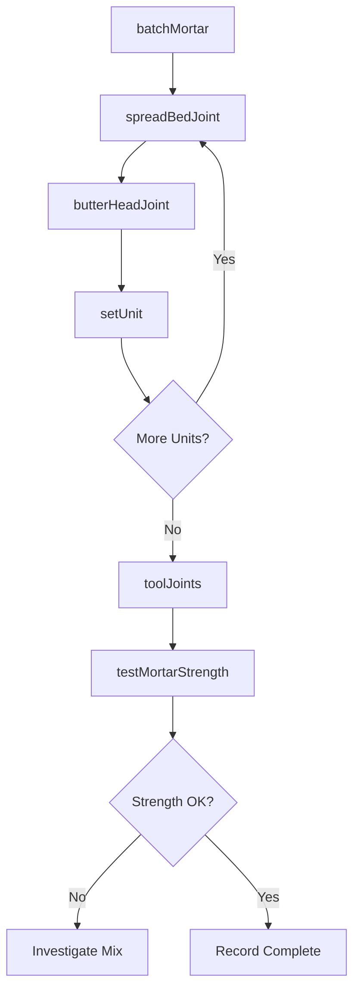
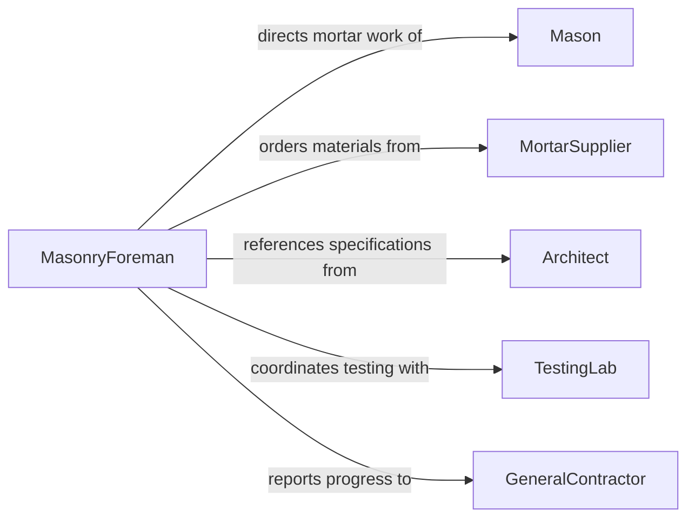

# Apply Mortar

> Business-as-Code definition for applying mortar. Models the process of mixing, spreading, and finishing mortar to bond masonry units, fill joints, and create durable connections in brick, block, and stone construction.

## Overview

Applying mortar involves mixing cement, sand, lime, and water to produce a workable paste, then spreading it onto masonry units to bond bricks, blocks, or stones together. Masons apply mortar to bed joints and head joints using trowels, then tool the joints to achieve the specified profile and weather resistance. Proper mortar application is critical to the structural strength, weather resistance, and visual appearance of masonry walls, chimneys, foundations, and paving.

## Actors

| Actor | Description |
|-------|-------------|
| MortarSupplier | Provides cement, lime, sand, and pre-mixed mortar products |
| Architect | Specifies mortar type, color, and joint profile for the project |
| StructuralEngineer | Defines mortar strength requirements based on structural loads |
| GeneralContractor | Coordinates masonry work within the overall construction schedule |
| TestingLab | Performs mortar cube tests to verify compressive strength |

## Roles

| Role | Description |
|------|-------------|
| Mason | Applies mortar to masonry units and tools joints to specification |
| MortarMixer | Batches and mixes mortar to the prescribed proportions |
| MasonryForeman | Supervises mortar application quality and crew productivity |
| QualityTester | Collects mortar samples and coordinates strength testing |

## Entities

| Entity | Description |
|--------|-------------|
| MortarBatch | A mixed quantity of mortar with tracked proportions and time |
| MortarType | The ASTM classification of the mortar (Type M, S, N, O, K) |
| BedJoint | The horizontal mortar layer between courses of masonry |
| HeadJoint | The vertical mortar joint between adjacent masonry units |
| JointProfile | The finished shape of the mortar joint (concave, V-cut, flush, raked) |
| CubeTest | A compressive strength test performed on a mortar sample |

## Actions

| Action | Description |
|--------|-------------|
| batchMortar | Measure and combine mortar ingredients to the specified mix design |
| spreadBedJoint | Apply mortar to the horizontal surface to receive the next course |
| butterHeadJoint | Apply mortar to the end of a masonry unit for the vertical joint |
| setUnit | Press a masonry unit into the mortar bed and align to course line |
| toolJoints | Shape mortar joints to the specified profile using a jointing tool |
| testMortarStrength | Collect samples and submit for compressive strength testing |
| retemperMortar | Add water to restore workability within the allowable time window |

## Events

| Event | Description |
|-------|-------------|
| mortarBatched | A new mortar batch has been mixed and is ready for use |
| bedJointSpread | Mortar has been applied to the horizontal bed surface |
| headJointButtered | Mortar has been applied to a masonry unit end |
| unitSet | A masonry unit has been pressed into the mortar bed |
| jointsTooled | Mortar joints have been shaped to the specified profile |
| mortarStrengthTested | Compressive test results have been received for a batch |
| mortarExpired | A mortar batch has exceeded its usable working time |

## Searches

| Search | Description |
|--------|-------------|
| findMortarBatches | Retrieve mortar batches by date, mix type, or project area |
| getCubeTestResults | Get compressive strength test results by batch or date range |
| getJointProgress | Check joint completion status by wall section or elevation |
## Entity Relationships




## State Diagram




## Workflow



## Actor Relationships



## Usage

### Calling Actions

```typescript
import { applyMortar } from '@headlessly/apply-mortar'

const mortar = applyMortar()

// Batch a new mortar mix
const batch = await mortar.batchMortar({
  mortarType: 'Type-S',
  mixDesign: { cement: 1, lime: 0.5, sand: 4.5 },
  quantity: 3,
  unit: 'cubic-feet',
  projectArea: 'south-wall-section-A'
})

// Spread bed joint and set masonry units
await mortar.spreadBedJoint({
  batchId: batch.id,
  wallSectionId: 'south-wall-section-A',
  courseNumber: 8,
  thickness: 0.375
})

await mortar.setUnit({
  batchId: batch.id,
  unitType: 'modular-brick',
  position: { course: 8, index: 1 },
  headJointWidth: 0.375
})

// Tool the joints after initial set
await mortar.toolJoints({
  wallSectionId: 'south-wall-section-A',
  courseRange: { start: 6, end: 8 },
  profile: 'concave'
})
```

### Event-Driven Automation

```typescript
// Discard expired mortar batches
mortar.mortarExpired(async ({ batchId, mortarType, age }) => {
  await notify({
    to: 'masonry-foreman',
    message: `Mortar batch ${batchId} (${mortarType}) has exceeded ${age} minutes - discard and remix`
  })
})

// Track strength test results
mortar.mortarStrengthTested(async ({ batchId, compressiveStrength, requirement }) => {
  if (compressiveStrength < requirement) {
    await notify({
      to: 'quality-team',
      message: `Batch ${batchId} failed: ${compressiveStrength} psi vs ${requirement} psi required`
    })
  }
})
```
