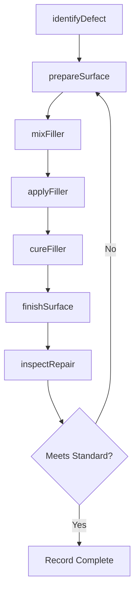
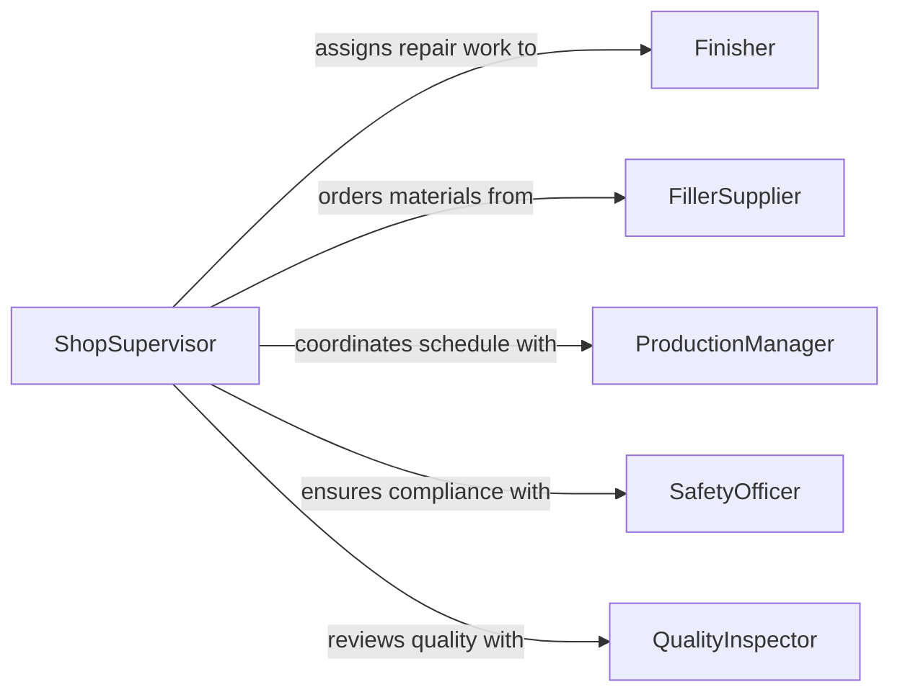

# Fill Cracks Imperfections Holes Products

> Business-as-Code definition for filling cracks, imperfections, or holes in products or workpieces. Models the repair and finishing process of applying filler compounds to restore surfaces to specification.

## Overview

Filling cracks, imperfections, or holes in products or workpieces involves identifying surface defects and applying appropriate filler materials such as putty, epoxy, wood filler, body filler, or patching compounds to restore the workpiece to its intended condition. This activity is critical in manufacturing, woodworking, automotive body repair, and finishing operations where surface quality directly affects product appearance and structural performance. Proper filling requires selecting the correct compound, preparing the defect area, applying material, and finishing the surface to match surrounding areas.

## Actors

| Actor | Description |
|-------|-------------|
| FillerSupplier | Provides putty, epoxy, patching compounds, and related materials |
| Customer | Specifies surface quality requirements and finish standards |
| ProductionManager | Schedules repair and finishing work within production timelines |
| SafetyOfficer | Ensures proper ventilation and PPE use during chemical application |
| EquipmentVendor | Supplies application tools, mixing equipment, and sanding devices |

## Roles

| Role | Description |
|------|-------------|
| Finisher | Identifies defects and applies filler material to workpieces |
| QualityInspector | Evaluates filled surfaces against finish standards |
| ShopSupervisor | Prioritizes defect repair and manages workflow |
| MaterialPrepper | Mixes filler compounds and prepares defect areas for filling |

## Entities

| Entity | Description |
|--------|-------------|
| Defect | A crack, hole, void, or surface imperfection requiring filling |
| FillerMaterial | The compound applied to fill a defect (putty, epoxy, resin) |
| Workpiece | The product or part containing the defect being repaired |
| RepairRecord | Documentation of the defect, material used, and repair outcome |
| SurfaceStandard | The finish quality specification the filled area must meet |
| MixBatch | A prepared quantity of filler compound with tracked proportions |

## Actions

| Action | Description |
|--------|-------------|
| identifyDefect | Locate and classify cracks, holes, or imperfections on the workpiece |
| prepareSurface | Clean, sand, or etch the defect area to promote filler adhesion |
| mixFiller | Combine filler components in the correct ratio for the application |
| applyFiller | Spread or inject filler material into the defect cavity |
| cureFiller | Allow or accelerate the filler to harden to working consistency |
| finishSurface | Sand, scrape, or tool the filled area to match the surrounding surface |
| inspectRepair | Evaluate the filled area against the surface quality standard |

## Events

| Event | Description |
|-------|-------------|
| defectIdentified | A crack, hole, or imperfection has been located and classified |
| surfacePrepared | The defect area has been cleaned and readied for filler application |
| fillerMixed | Filler compound has been prepared in the correct proportions |
| fillerApplied | Filler material has been spread or injected into the defect |
| fillerCured | The filler has hardened sufficiently for finishing operations |
| surfaceFinished | The filled area has been sanded and blended with surroundings |
| repairRejected | The filled surface does not meet the required quality standard |

## Searches

| Search | Description |
|--------|-------------|
| findDefects | Retrieve identified defects by workpiece, type, or severity |
| getRepairRecords | List completed repairs by product, date, or inspector |
| getFillerInventory | Check available filler materials by type, quantity, and shelf life |

## Workflow



## Actor Relationships



## Usage

### Calling Actions

```typescript
import { fillCracksImperfectionsHolesProducts } from '@headlessly/fill-cracks-imperfections-holes-products'

const filling = fillCracksImperfectionsHolesProducts()

// Identify a defect on a workpiece
const defect = await filling.identifyDefect({
  workpieceId: 'cabinet-door-042',
  type: 'crack',
  location: { face: 'front', x: 12.5, y: 8.0 },
  severity: 'moderate',
  dimensions: { length: 3.25, width: 0.03, depth: 0.125 }
})

// Apply filler to the defect
await filling.applyFiller({
  defectId: defect.id,
  fillerMaterial: 'wood-filler-oak',
  method: 'putty-knife',
  mixBatchId: 'batch-2026-0205-01'
})

// Inspect the completed repair
const result = await filling.inspectRepair({
  defectId: defect.id,
  surfaceStandard: 'furniture-grade-A',
  checks: ['flush', 'color-match', 'adhesion']
})
```

### Event-Driven Automation

```typescript
// Re-queue workpiece when repair is rejected
filling.repairRejected(async ({ defectId, workpieceId, reason }) => {
  await notify({
    to: 'shop-supervisor',
    message: `Repair rejected on ${workpieceId}: ${reason}`
  })
})

// Update production tracking when filler has cured
filling.fillerCured(async ({ defectId, workpieceId }) => {
  await updateProductionStatus({
    workpieceId,
    stage: 'ready-for-finishing',
    defectId
  })
})
```
