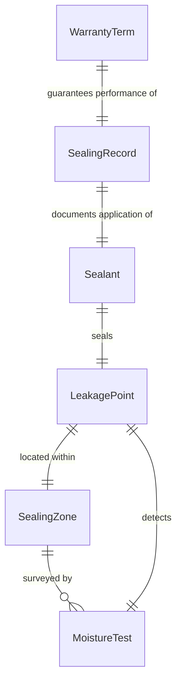
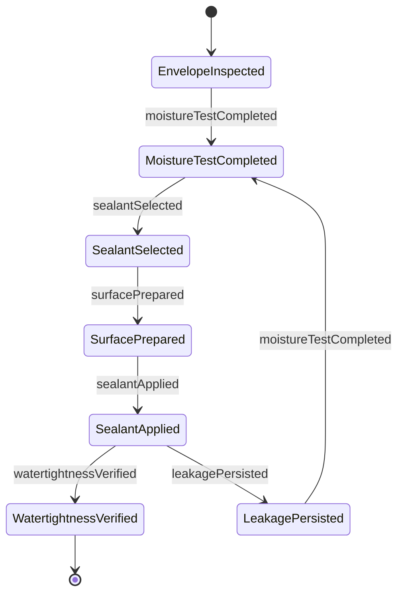
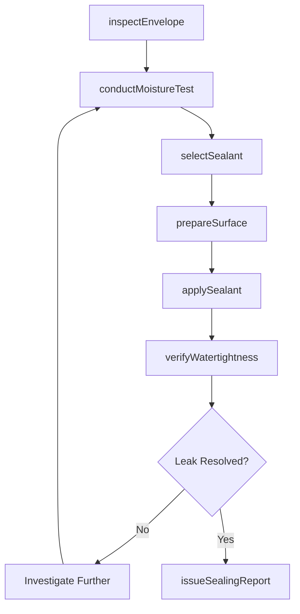
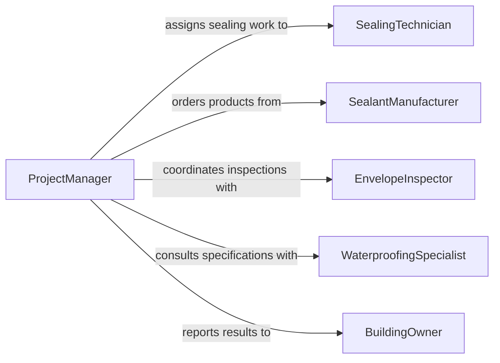

# Seal Gaps Cracks Prevent Leakage

> Business-as-Code definition for sealing gaps or cracks to prevent leakage or moisture intrusion. Models the weatherproofing and waterproofing process of identifying vulnerable joints and applying sealants to protect structures from water, air, and vapor infiltration.

## Overview

Sealing gaps or cracks to prevent leakage or moisture intrusion involves inspecting building envelopes, piping penetrations, roofing systems, and structural joints to identify areas vulnerable to water or air infiltration. Workers apply sealants, membranes, flashing, and weatherstripping to create continuous barriers against moisture and drafts. This activity is essential for maintaining building integrity, energy efficiency, and occupant comfort across new construction, renovation, and maintenance projects.

## Actors

| Actor | Description |
|-------|-------------|
| SealantManufacturer | Produces caulks, membranes, tapes, and waterproofing products |
| BuildingOwner | Defines performance expectations for moisture control |
| Weatherization Contractor | Performs energy audits and identifies infiltration points |
| RoofingSupplier | Provides flashing, membranes, and roof sealant products |
| InsuranceAdjuster | Assesses moisture damage claims and recommends remediation |

## Roles

| Role | Description |
|------|-------------|
| SealingTechnician | Applies sealants and weatherproofing materials to identified gaps |
| EnvelopeInspector | Identifies leakage points through visual inspection and testing |
| ProjectManager | Coordinates sealing work within the overall construction schedule |
| WaterproofingSpecialist | Specifies sealant systems for below-grade and wet-area applications |

## Entities

| Entity | Description |
|--------|-------------|
| LeakagePoint | An identified gap, crack, or penetration vulnerable to moisture |
| Sealant | The material applied to close the gap (silicone, polyurethane, butyl) |
| SealingZone | A defined area of the building envelope being addressed |
| MoistureTest | A test performed to detect active leakage or infiltration |
| SealingRecord | Documentation of sealant type, location, and application conditions |
| WarrantyTerm | The guaranteed performance period for the applied sealant system |

## Actions

| Action | Description |
|--------|-------------|
| inspectEnvelope | Survey the structure to identify gaps, cracks, and penetration points |
| conductMoistureTest | Perform water testing or infrared scanning to detect active leaks |
| selectSealant | Choose the appropriate sealant based on substrate and exposure |
| prepareSurface | Clean, dry, and prime the joint surfaces for sealant adhesion |
| applySealant | Dispense sealant material into the gap or over the crack |
| verifyWatertightness | Test the sealed area to confirm no further leakage |
| issueSealingReport | Document all sealed locations, materials, and test results |

## Events

| Event | Description |
|-------|-------------|
| envelopeInspected | The building envelope survey has been completed |
| moistureTestCompleted | Leak detection testing has been performed and results recorded |
| sealantSelected | The appropriate sealant product has been chosen |
| surfacePrepared | Joint surfaces have been cleaned and primed for application |
| sealantApplied | Sealant material has been dispensed into the identified gap |
| watertightnessVerified | The sealed area has passed leakage testing |
| leakagePersisted | Post-sealing testing detected continued moisture intrusion |

## Searches

| Search | Description |
|--------|-------------|
| findLeakagePoints | Retrieve identified leakage points by zone, severity, or status |
| getSealingRecords | List completed sealing work by location, date, or sealant type |
| getWarrantyItems | Find sealed joints approaching or past their warranty expiration |
| getMoistureTestResults | Retrieve test results by zone, date, or pass/fail status |
## Entity Relationships




## State Diagram




## Workflow



## Actor Relationships



## Usage

### Calling Actions

```typescript
import { sealGapsCracksPreventLeakage } from '@headlessly/seal-gaps-cracks-prevent-leakage'

const sealing = sealGapsCracksPreventLeakage()

// Inspect the building envelope for leakage points
const inspection = await sealing.inspectEnvelope({
  sealingZoneId: 'zone-exterior-windows-floor-2',
  method: 'visual-and-infrared',
  inspector: 'envelope-inspector-chen'
})

// Conduct moisture testing on identified points
const test = await sealing.conductMoistureTest({
  leakagePointId: inspection.leakagePoints[0].id,
  testType: 'hose-spray',
  duration: 15,
  pressure: 'standard'
})

// Apply sealant to the confirmed leakage point
await sealing.applySealant({
  leakagePointId: test.leakagePointId,
  sealant: 'silicone-s795-clear',
  method: 'bead-application',
  jointWidth: 0.25,
  jointDepth: 0.25
})

// Verify the seal is watertight
await sealing.verifyWatertightness({
  leakagePointId: test.leakagePointId,
  testType: 'hose-spray',
  duration: 15
})
```

### Event-Driven Automation

```typescript
// Escalate when leakage persists after sealing
sealing.leakagePersisted(async ({ leakagePointId, sealingZoneId }) => {
  await notify({
    to: 'waterproofing-specialist',
    message: `Persistent leakage at point ${leakagePointId} in ${sealingZoneId} after sealing attempt`
  })
})

// Schedule warranty tracking when seal is verified
sealing.watertightnessVerified(async ({ leakagePointId, sealant }) => {
  await createWarrantyRecord({
    leakagePointId,
    sealantProduct: sealant,
    warrantyYears: 10,
    startDate: new Date().toISOString()
  })
})
```
