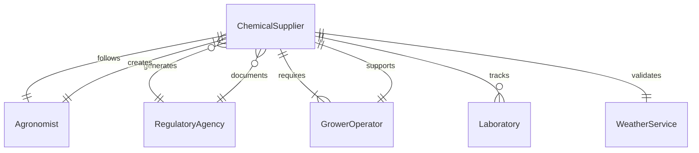
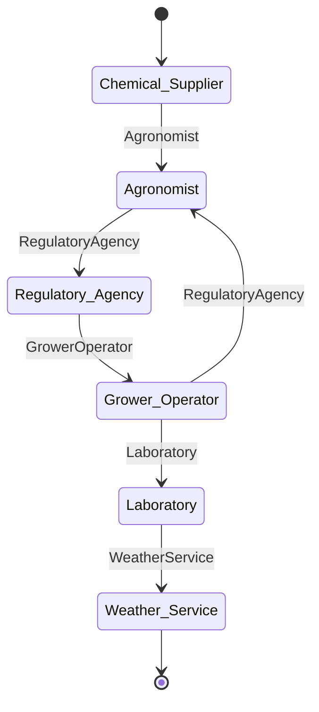
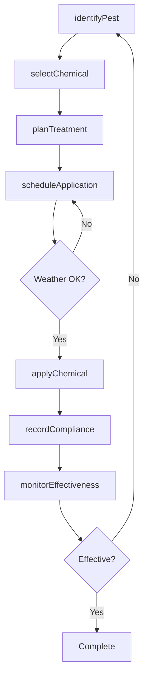
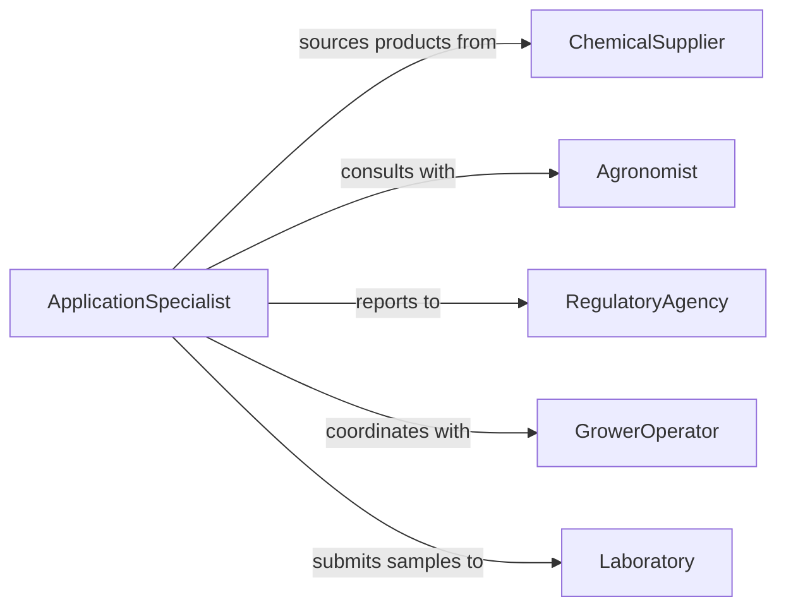

# Apply Chemical Solutions Plants Protect

> Business-as-Code definition for agricultural chemical application. Models plant protection programs from pest identification through treatment application and monitoring.

## Overview

Chemical application to plants encompasses pest control, disease prevention, and growth enhancement through precise delivery of agricultural chemicals. This definition provides actions for treatment planning, application scheduling, and effectiveness monitoring to ensure optimal plant health while maintaining safety and regulatory compliance.

## Actors

| Actor | Description |
|-------|-------------|
| ChemicalSupplier | Provides pesticides, fungicides, and growth regulators |
| Agronomist | Recommends treatment protocols based on plant conditions |
| RegulatoryAgency | Enforces chemical usage and safety standards |
| GrowerOperator | Manages crops and authorizes treatment schedules |
| Laboratory | Tests soil, tissue, and pest samples |
| WeatherService | Provides conditions for optimal application timing |

## Roles

| Role | Description |
|------|-------------|
| ApplicationSpecialist | Plans and executes chemical treatments |
| PestScout | Monitors fields for pests and disease |
| ComplianceOfficer | Ensures regulatory adherence |
| InventoryManager | Tracks chemical stock and usage rates |

## Entities

| Entity | Description |
|--------|-------------|
| TreatmentPlan | Schedule and protocol for chemical applications |
| Application | A specific chemical treatment event |
| ChemicalProduct | Pesticide, fungicide, or growth regulator |
| TargetPest | Insect, disease, or growth condition being addressed |
| TreatmentArea | Field or zone receiving application |
| SafetyRecord | Documentation of protective measures and exposure |

## Actions

| Action | Description |
|--------|-------------|
| planTreatment | Create a chemical application schedule |
| identifyPest | Determine target pest or disease |
| selectChemical | Choose appropriate product for treatment |
| scheduleApplication | Set timing based on weather and plant stage |
| applyChemical | Execute treatment application |
| monitorEffectiveness | Assess treatment results and pest reduction |
| recordCompliance | Document application for regulatory reporting |

## Events

| Event | Description |
|-------|-------------|
| treatmentPlanned | Application schedule has been created |
| pestIdentified | Target pest or disease has been confirmed |
| chemicalSelected | Product chosen for upcoming application |
| applicationScheduled | Treatment timing has been set |
| chemicalApplied | Treatment has been completed |
| effectivenessMonitored | Post-treatment assessment is complete |
| complianceRecorded | Regulatory documentation has been filed |

## Searches

| Search | Description |
|--------|-------------|
| findTreatments | List applications by crop, date, or chemical |
| getPests | Retrieve pest pressure data by area |
| getChemicals | Find products by target pest or active ingredient |
| getCompliance | Access regulatory records for audit |
## Entity Relationships




## State Diagram




## Workflow



## Actor Relationships



## Usage

### Calling Actions

```typescript
import { applyChemicalSolutionsPlantsProtect } from '@headlessly/apply-chemical-solutions-plants-protect'

const treatments = applyChemicalSolutionsPlantsProtect()

// Identify pest and plan treatment
const pest = await treatments.identifyPest({
  area: 'North Field Block 3',
  observation: 'Aphid infestation on corn',
  severity: 'moderate'
})

const chemical = await treatments.selectChemical({
  targetPest: pest.id,
  cropType: 'corn',
  growthStage: 'V6'
})

// Schedule and apply treatment
const plan = await treatments.planTreatment({
  chemicalId: chemical.id,
  area: 'North Field Block 3',
  dosage: 2.5,
  unit: 'gallons per acre'
})

await treatments.scheduleApplication({
  planId: plan.id,
  preferredDate: '2026-06-15',
  weatherConstraints: { maxWindSpeed: 10, noRainForecast: 24 }
})
```

### Event-Driven Automation

```typescript
// Monitor weather and reschedule if needed
treatments.applicationScheduled(async ({ planId, scheduledDate }) => {
  const weather = await checkWeather(scheduledDate)
  if (weather.windSpeed > 10) {
    await treatments.scheduleApplication({
      planId,
      preferredDate: findNextCalmDay(scheduledDate)
    })
  }
})

// Auto-report high-risk chemical applications
treatments.chemicalApplied(async ({ chemical, area, dosage }) => {
  if (chemical.riskClass === 'restricted') {
    await treatments.recordCompliance({
      chemicalId: chemical.id,
      area,
      dosage,
      reportTo: 'state-agriculture-department'
    })
  }
})
```
