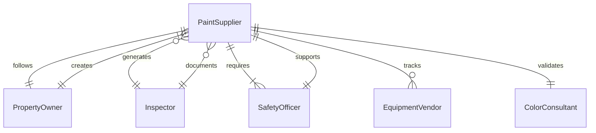
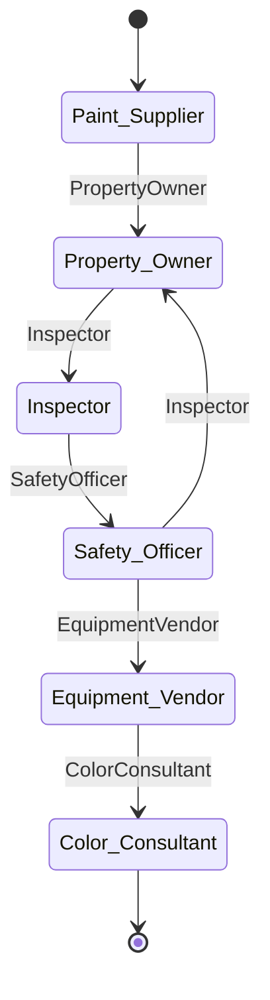
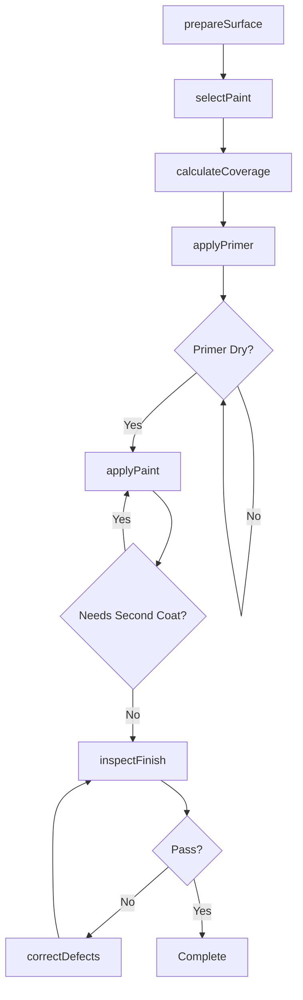
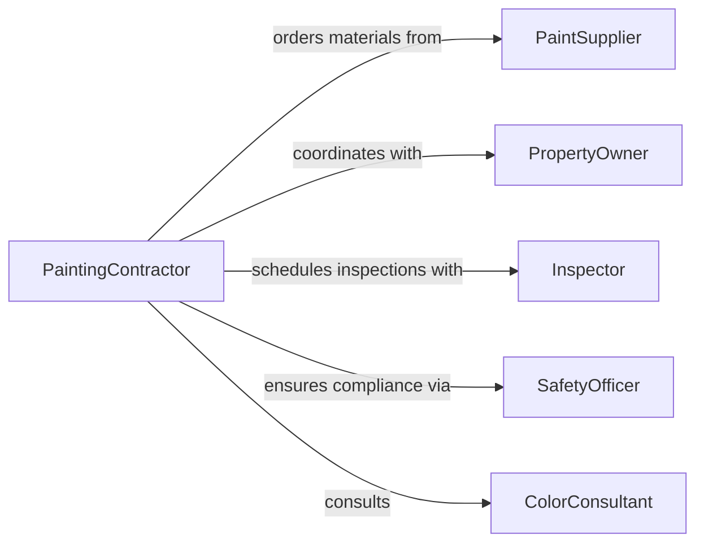

# Apply Paint Surfaces

> Business-as-Code definition for surface painting operations. Models painting workflows from surface preparation through application and quality inspection.

## Overview

Surface painting involves preparing, priming, and coating surfaces with paint to provide protection and aesthetic appearance. This definition supports commercial, industrial, and residential painting operations including material selection, application techniques, and quality control processes.

## Actors

| Actor | Description |
|-------|-------------|
| PaintSupplier | Provides paint, primers, and coating materials |
| PropertyOwner | Authorizes painting work and approves colors |
| Inspector | Verifies surface preparation and finish quality |
| SafetyOfficer | Ensures proper ventilation and protective equipment |
| EquipmentVendor | Supplies sprayers, brushes, and application tools |
| ColorConsultant | Advises on color selection and specifications |

## Roles

| Role | Description |
|------|-------------|
| PaintingContractor | Oversees painting projects and crew |
| SurfacePreparationTechnician | Prepares surfaces for coating |
| Painter | Applies paint and finishes |
| QualityInspector | Checks coverage, uniformity, and defects |

## Entities

| Entity | Description |
|--------|-------------|
| PaintJob | A painting project with scope and timeline |
| Surface | Wall, ceiling, or equipment to be painted |
| Coating | Paint, primer, or finish material |
| ColorSpecification | Selected color and sheen requirements |
| ApplicationMethod | Spray, brush, or roller technique |
| InspectionReport | Quality assessment of completed work |

## Actions

| Action | Description |
|--------|-------------|
| prepareSurface | Clean, sand, and prime surface for painting |
| selectPaint | Choose paint type, color, and finish |
| calculateCoverage | Estimate material quantities needed |
| applyPrimer | Apply base coat to prepared surface |
| applyPaint | Execute painting using specified method |
| inspectFinish | Assess coverage, texture, and quality |
| correctDefects | Touch up areas failing inspection |

## Events

| Event | Description |
|-------|-------------|
| surfacePrepared | Surface is ready for primer or paint |
| paintSelected | Paint type and color have been chosen |
| coverageCalculated | Material quantities have been estimated |
| primerApplied | Base coat has been applied |
| paintApplied | Paint coat has been applied |
| finishInspected | Quality check has been completed |
| defectsCorrected | Touch-ups have been finished |

## Searches

| Search | Description |
|--------|-------------|
| findJobs | List painting projects by status or location |
| getSurfaces | Retrieve surfaces by preparation status |
| getCoatings | Find paint products by type or color |
| getInspections | Access quality reports and defect logs |
## Entity Relationships




## State Diagram




## Workflow



## Actor Relationships



## Usage

### Calling Actions

```typescript
import { applyPaintSurfaces } from '@headlessly/apply-paint-surfaces'

const painting = applyPaintSurfaces()

// Prepare and select paint for a room
await painting.prepareSurface({
  surface: 'Conference Room A - Walls',
  cleanMethod: 'wash-and-sand',
  defects: ['small holes', 'minor cracks']
})

const paint = await painting.selectPaint({
  colorCode: 'SW7015',
  finish: 'eggshell',
  type: 'latex-interior'
})

// Calculate materials and apply
const coverage = await painting.calculateCoverage({
  surfaceArea: 1200,
  coats: 2,
  paintId: paint.id
})

await painting.applyPrimer({
  surface: 'Conference Room A - Walls',
  primer: 'latex-bonding-primer',
  method: 'roller'
})

await painting.applyPaint({
  surface: 'Conference Room A - Walls',
  paintId: paint.id,
  method: 'roller',
  coats: 2
})
```

### Event-Driven Automation

```typescript
// Auto-schedule inspection after paint dries
painting.paintApplied(async ({ surface, timestamp }) => {
  const dryTime = 4 * 60 * 60 * 1000
  setTimeout(async () => {
    await painting.inspectFinish({ surface })
  }, dryTime)
})

// Alert on inspection failure
painting.finishInspected(async ({ surface, passed, defects }) => {
  if (!passed) {
    await notify({
      to: 'painting-supervisor',
      message: `Surface ${surface} failed inspection: ${defects.join(', ')}`
    })
  }
})
```
