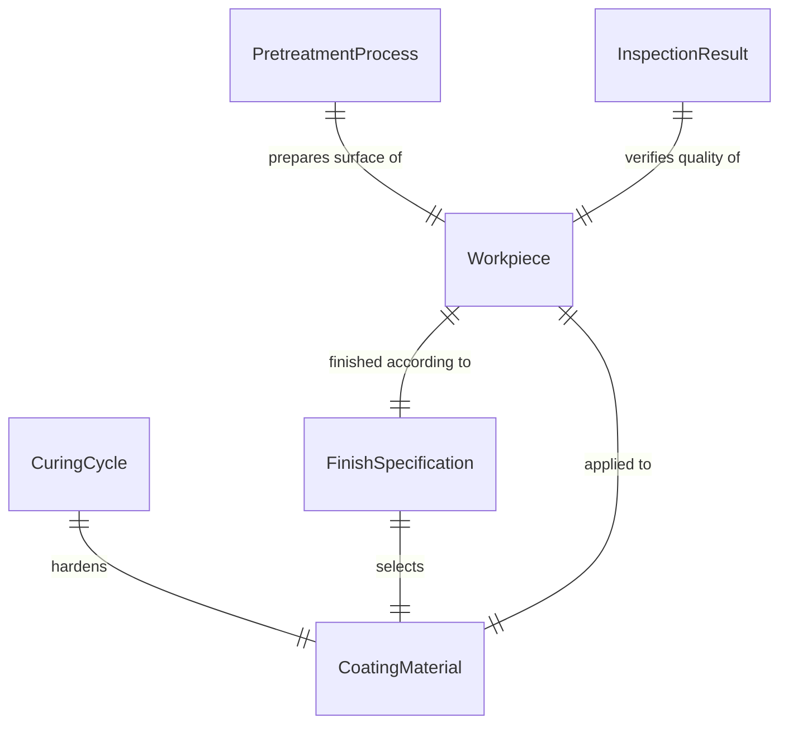
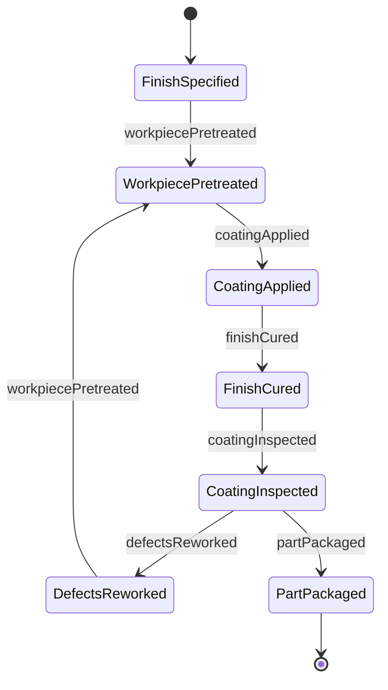
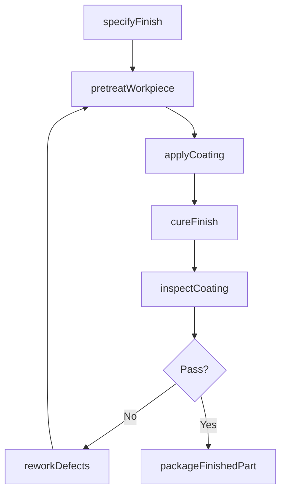
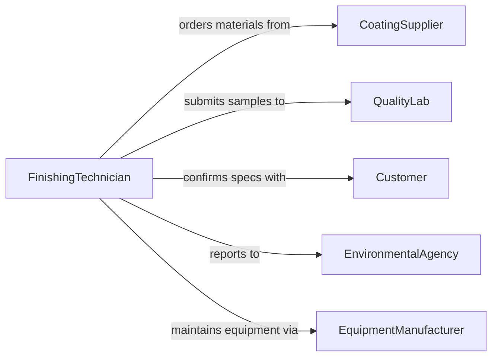

# Apply Protective Decorative Finishes Workpieces

> Business-as-Code definition for manufacturing finish application. Models coating and finishing workflows from workpiece preparation through curing and quality verification.

## Overview

Protective and decorative finishing of manufactured workpieces provides corrosion resistance, aesthetic appeal, and functional properties through coatings such as powder coating, anodizing, electroplating, and specialty finishes. This definition supports industrial finishing operations with process control, quality assurance, and environmental compliance.

## Actors

| Actor | Description |
|-------|-------------|
| CoatingSupplier | Provides powder coatings, plating chemicals, and specialty finishes |
| QualityLab | Tests coating adhesion, thickness, and durability |
| Customer | Specifies finish requirements and approves samples |
| EnvironmentalAgency | Regulates emissions and waste from finishing processes |
| EquipmentManufacturer | Supplies spray booths, ovens, and plating tanks |
| PretreatmentChemicalSupplier | Provides cleaners, etchants, and conversion coatings |

## Roles

| Role | Description |
|------|-------------|
| FinishingTechnician | Operates coating equipment and processes |
| QualityControl | Inspects finish quality and thickness |
| ProcessEngineer | Develops finishing specifications and parameters |
| MaterialHandler | Moves workpieces through finishing stages |

## Entities

| Entity | Description |
|--------|-------------|
| Workpiece | Part or product to receive finish |
| FinishSpecification | Required coating type, thickness, and appearance |
| CoatingMaterial | Powder, paint, or plating solution |
| PretreatmentProcess | Cleaning, etching, or conversion coating step |
| CuringCycle | Temperature and time profile for finish hardening |
| InspectionResult | Measurement of coating thickness and quality |

## Actions

| Action | Description |
|--------|-------------|
| specifyFinish | Define coating type and performance requirements |
| pretreatWorkpiece | Clean and prepare surface for coating |
| applyCoating | Execute coating application process |
| cureFinish | Heat or chemically harden applied coating |
| inspectCoating | Measure thickness, adhesion, and appearance |
| reworkDefects | Strip and recoat workpieces failing inspection |
| packageFinishedPart | Protect and prepare for shipment |

## Events

| Event | Description |
|-------|-------------|
| finishSpecified | Coating requirements have been defined |
| workpiecePretreated | Surface preparation is complete |
| coatingApplied | Finish has been applied to workpiece |
| finishCured | Coating has been hardened |
| coatingInspected | Quality measurements are complete |
| defectsReworked | Failed parts have been refinished |
| partPackaged | Finished workpiece is ready for shipment |

## Searches

| Search | Description |
|--------|-------------|
| findWorkpieces | List parts by finish status or specification |
| getFinishes | Retrieve coating types and specifications |
| getInspections | Access quality data and defect rates |
| getRework | Find parts requiring refinishing |
## Entity Relationships




## State Diagram




## Workflow



## Actor Relationships



## Usage

### Calling Actions

```typescript
import { applyProtectiveDecorativeFinishesWorkpieces } from '@headlessly/apply-protective-decorative-finishes-workpieces'

const finishing = applyProtectiveDecorativeFinishesWorkpieces()

// Specify and apply powder coating to parts
const spec = await finishing.specifyFinish({
  workpieceType: 'aluminum-bracket-A325',
  coating: 'polyester-powder',
  color: 'RAL9005-black',
  thickness: { min: 60, max: 100, unit: 'microns' }
})

await finishing.pretreatWorkpiece({
  workpieceId: 'WP-12458',
  process: 'iron-phosphate-conversion',
  rinseStages: 3
})

await finishing.applyCoating({
  workpieceId: 'WP-12458',
  coating: 'polyester-powder-RAL9005',
  method: 'electrostatic-spray',
  voltage: 60
})

// Cure and inspect
const cure = await finishing.cureFinish({
  workpieceId: 'WP-12458',
  temperature: 190,
  duration: 12,
  unit: 'minutes'
})

const inspection = await finishing.inspectCoating({
  workpieceId: 'WP-12458',
  measurements: ['thickness', 'adhesion', 'gloss']
})
```

### Event-Driven Automation

```typescript
// Auto-rework if coating thickness is out of spec
finishing.coatingInspected(async ({ workpieceId, thickness, spec }) => {
  if (thickness < spec.min || thickness > spec.max) {
    await finishing.reworkDefects({
      workpieceId,
      reason: 'thickness-out-of-spec',
      stripMethod: 'chemical'
    })
  }
})

// Track oven utilization for curing cycles
finishing.finishCured(async ({ temperature, duration, timestamp }) => {
  await recordMetric({
    type: 'cure-oven-usage',
    temperature,
    duration,
    timestamp
  })
})
```
