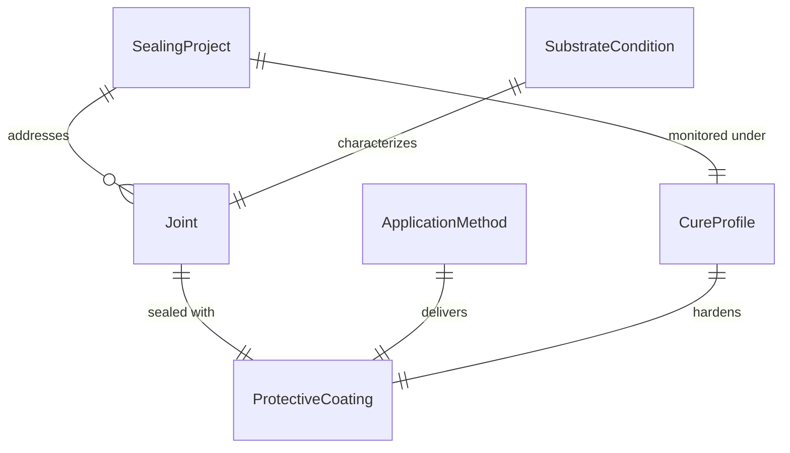
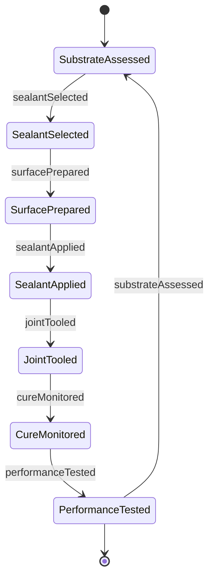
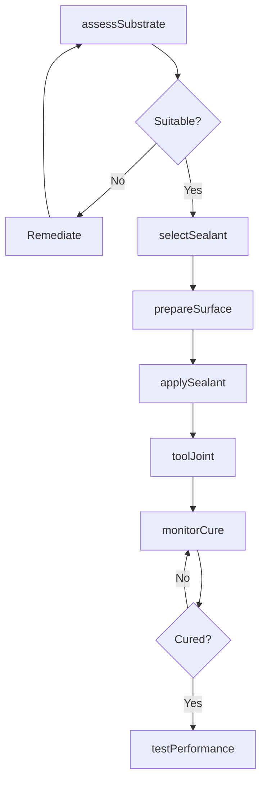
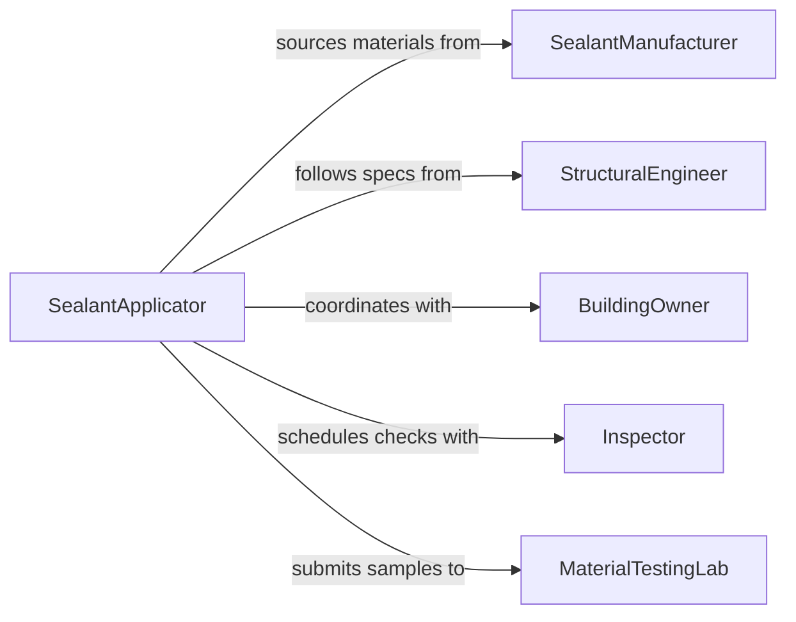

# Apply Sealants Protective Coatings

> Business-as-Code definition for sealant and protective coating application. Models waterproofing, corrosion protection, and sealing workflows from surface assessment through curing and performance testing.

## Overview

Sealant and protective coating application prevents water intrusion, corrosion, and environmental damage to structures, equipment, and assemblies. This definition supports operations across construction, manufacturing, and maintenance environments with material selection, application techniques, and long-term performance tracking.

## Actors

| Actor | Description |
|-------|-------------|
| SealantManufacturer | Supplies sealants, waterproofing membranes, and coatings |
| StructuralEngineer | Specifies sealing requirements for joints and surfaces |
| BuildingOwner | Authorizes waterproofing and protection projects |
| Inspector | Verifies proper application and coverage |
| MaterialTestingLab | Tests adhesion, flexibility, and weathering resistance |
| ToolSupplier | Provides caulking guns, spray equipment, and applicators |

## Roles

| Role | Description |
|------|-------------|
| SealantApplicator | Executes sealing and coating work |
| SurfaceInspector | Assesses substrate condition before application |
| QualityTechnician | Tests cure rates and coating properties |
| MaintenancePlanner | Schedules resealing based on warranty periods |

## Entities

| Entity | Description |
|--------|-------------|
| SealingProject | A waterproofing or protection initiative |
| Joint | Gap or seam requiring sealant |
| ProtectiveCoating | Corrosion barrier or weatherproofing layer |
| SubstrateCondition | Surface cleanliness, moisture, and temperature |
| ApplicationMethod | Gun, spray, trowel, or roller technique |
| CureProfile | Time and environmental conditions for proper hardening |

## Actions

| Action | Description |
|--------|-------------|
| assessSubstrate | Evaluate surface condition for sealant compatibility |
| selectSealant | Choose material based on joint type and exposure |
| prepareSurface | Clean, dry, and prime substrate |
| applySealant | Execute sealing or coating application |
| toolJoint | Shape and smooth sealant bead |
| monitorCure | Track hardening under ambient conditions |
| testPerformance | Verify adhesion and weatherproofing effectiveness |

## Events

| Event | Description |
|-------|-------------|
| substrateAssessed | Surface evaluation is complete |
| sealantSelected | Material has been chosen for application |
| surfacePrepared | Substrate is ready for sealant |
| sealantApplied | Sealing or coating has been executed |
| jointTooled | Sealant bead has been shaped |
| cureMonitored | Hardening progress has been checked |
| performanceTested | Adhesion and weatherproofing verified |

## Searches

| Search | Description |
|--------|-------------|
| findProjects | List sealing work by location or status |
| getJoints | Retrieve joints by sealant type or condition |
| getCoatings | Find protective coatings by application or material |
| getTests | Access performance test results and failures |
## Entity Relationships




## State Diagram




## Workflow



## Actor Relationships



## Usage

### Calling Actions

```typescript
import { applySealantsProtectiveCoatings } from '@headlessly/apply-sealants-protective-coatings'

const sealing = applySealantsProtectiveCoatings()

// Assess and prepare expansion joint
const assessment = await sealing.assessSubstrate({
  location: 'Building A - Expansion Joint E12',
  surfaceType: 'concrete',
  moisture: 'dry',
  temperature: 68
})

const sealant = await sealing.selectSealant({
  jointType: 'expansion',
  movement: '+/- 25%',
  exposure: 'exterior-weathering',
  substrateType: 'concrete'
})

await sealing.prepareSurface({
  location: 'Building A - Expansion Joint E12',
  cleaning: 'wire-brush-and-vacuum',
  primer: 'concrete-bonding-primer'
})

// Apply and tool sealant
await sealing.applySealant({
  location: 'Building A - Expansion Joint E12',
  sealantId: sealant.id,
  depth: 0.5,
  width: 1.0,
  unit: 'inches'
})

await sealing.toolJoint({
  location: 'Building A - Expansion Joint E12',
  profile: 'concave',
  tool: 'radius-tooling'
})
```

### Event-Driven Automation

```typescript
// Monitor environmental conditions during cure
sealing.sealantApplied(async ({ location, sealantId, timestamp }) => {
  const interval = setInterval(async () => {
    const weather = await checkWeather(location)
    await sealing.monitorCure({
      location,
      temperature: weather.temperature,
      humidity: weather.humidity,
      timestamp: new Date()
    })
  }, 3600000)
})

// Alert on premature exposure to water
sealing.cureMonitored(async ({ location, cureProgress, weather }) => {
  if (cureProgress < 0.5 && weather.precipitation > 0) {
    await notify({
      to: 'project-manager',
      message: `Uncured sealant at ${location} exposed to rain`
    })
  }
})
```
