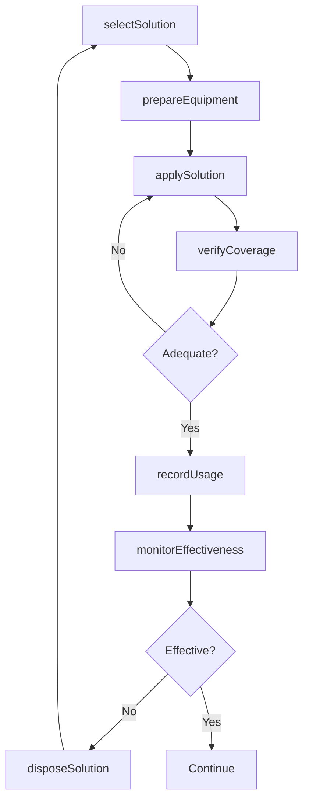
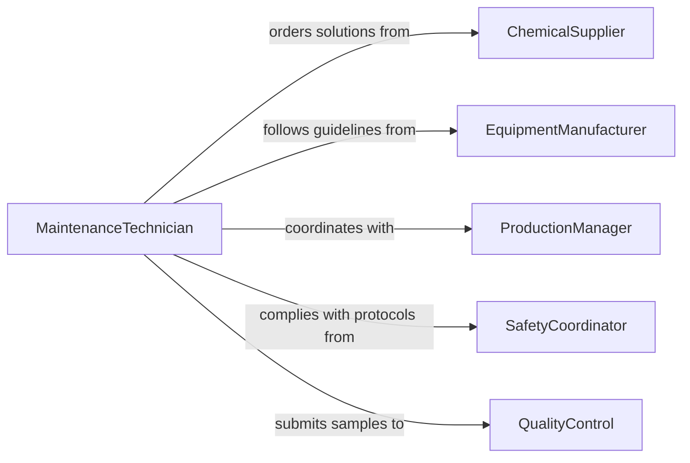

# Apply Solutions Production Equipment

> Business-as-Code definition for production equipment solution application. Models cleaning, lubrication, and release agent workflows from equipment assessment through application and performance verification.

## Overview

Application of solutions to production equipment includes release agents, lubricants, cleaners, and anti-corrosion treatments that enable efficient manufacturing while protecting machinery. This definition supports scheduled maintenance, production setup, and equipment protection with tracking of solution usage and effectiveness.

## Actors

| Actor | Description |
|-------|-------------|
| ChemicalSupplier | Provides mold release, lubricants, and cleaning solutions |
| EquipmentManufacturer | Recommends approved solutions for machinery |
| ProductionManager | Authorizes solution usage and downtime |
| SafetyCoordinator | Ensures proper handling and ventilation |
| QualityControl | Verifies solution does not contaminate products |
| WasteTreatmentProvider | Handles disposal of used solutions |

## Roles

| Role | Description |
|------|-------------|
| MaintenanceTechnician | Applies solutions during equipment service |
| ProductionOperator | Uses release agents and lubricants during runs |
| CleaningSpecialist | Executes equipment cleaning protocols |
| InventoryCoordinator | Tracks solution consumption and reordering |

## Entities

| Entity | Description |
|--------|-------------|
| Equipment | Machine or tool requiring solution application |
| Solution | Release agent, lubricant, cleaner, or protectant |
| ApplicationSchedule | Timing and frequency of solution use |
| ApplicationRecord | Documentation of solution usage |
| PerformanceMetric | Effectiveness measurement for solution |
| SafetyProcedure | Protective measures for solution handling |

## Actions

| Action | Description |
|--------|-------------|
| selectSolution | Choose appropriate solution for equipment and purpose |
| prepareEquipment | Ready machinery for solution application |
| applySolution | Execute application using approved method |
| verifyCoverage | Check solution has reached all required surfaces |
| monitorEffectiveness | Track solution performance during production |
| recordUsage | Document solution type, quantity, and timing |
| disposeSolution | Properly handle spent or contaminated solution |

## Events

| Event | Description |
|-------|-------------|
| solutionSelected | Appropriate solution has been identified |
| equipmentPrepared | Machinery is ready for application |
| solutionApplied | Solution has been applied to equipment |
| coverageVerified | Application completeness has been confirmed |
| effectivenessMonitored | Performance data has been collected |
| usageRecorded | Solution consumption has been documented |
| solutionDisposed | Waste solution has been handled properly |

## Searches

| Search | Description |
|--------|-------------|
| findEquipment | List machinery by solution schedule or status |
| getSolutions | Retrieve solutions by type or equipment |
| getRecords | Access application history and usage data |
| getMetrics | Find performance data for solution effectiveness |

## Workflow



## Actor Relationships



## Usage

### Calling Actions

```typescript
import { applySolutionsProductionEquipment } from '@headlessly/apply-solutions-production-equipment'

const equipment = applySolutionsProductionEquipment()

// Select and apply mold release agent
const solution = await equipment.selectSolution({
  equipmentId: 'injection-molder-5',
  purpose: 'mold-release',
  materialCompatibility: 'polypropylene'
})

await equipment.prepareEquipment({
  equipmentId: 'injection-molder-5',
  cleaning: 'wipe-residue',
  coolingTime: 30,
  unit: 'minutes'
})

await equipment.applySolution({
  equipmentId: 'injection-molder-5',
  solutionId: solution.id,
  method: 'spray',
  coverage: 'mold-cavities-and-cores'
})

// Verify and record
const coverage = await equipment.verifyCoverage({
  equipmentId: 'injection-molder-5',
  inspectionPoints: ['cavity-1', 'cavity-2', 'cavity-3', 'cavity-4']
})

await equipment.recordUsage({
  equipmentId: 'injection-molder-5',
  solutionId: solution.id,
  quantity: 250,
  unit: 'ml',
  timestamp: new Date()
})
```

### Event-Driven Automation

```typescript
// Auto-schedule next application based on usage
equipment.solutionApplied(async ({ equipmentId, solutionId, timestamp }) => {
  const solution = await getSolution(solutionId)
  const nextApplication = new Date(timestamp.getTime() + solution.intervalMs)
  await scheduleTask({
    type: 'apply-solution',
    equipmentId,
    solutionId,
    scheduledFor: nextApplication
  })
})

// Alert when solution effectiveness degrades
equipment.effectivenessMonitored(async ({ equipmentId, metric, threshold }) => {
  if (metric.performance < threshold) {
    await notify({
      to: 'maintenance-team',
      message: `Equipment ${equipmentId} solution performance below ${threshold}`
    })
  }
})
```
